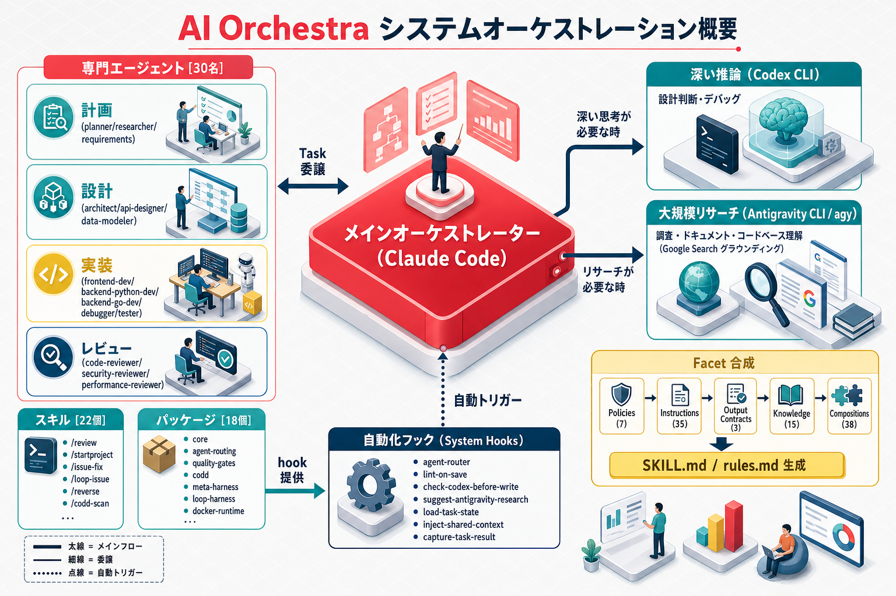
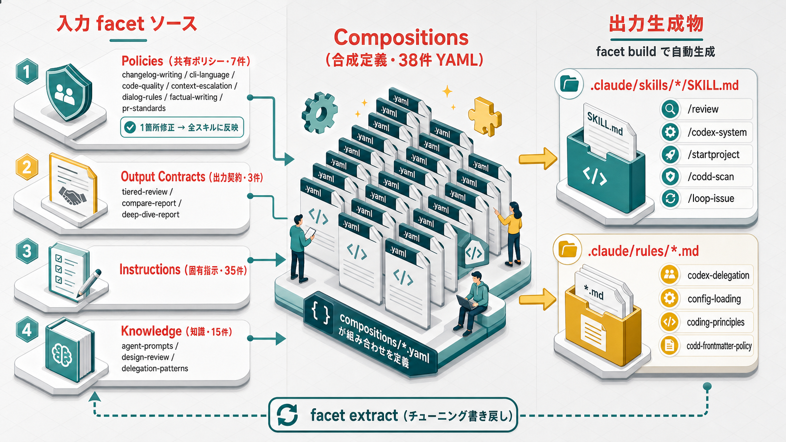

# AI Orchestra

Claude Code用のマルチエージェントオーケストレーションシステム

## 設計思想

AI Orchestra は AI コーディングの実行基盤を 3 つの層で組み立て、さらに「変更しても壊れない」ための整合性層を加えた 4 層で捉える。

| 層                    | 役割                     | AI Orchestra での実体                                                                                                    |
| --------------------- | ------------------------ | ------------------------------------------------------------------------------------------------------------------------ |
| **Prompt**            | 何を指示するか           | facets（policies / instructions / output-contracts）から合成する Skill・Rule                                             |
| **Context**           | 何を踏まえるか           | `CLAUDE.md` / `AGENTS.md` テンプレート、config の階層上書き、`.claude/context/` のセッション間共有                       |
| **Harness**           | どう実行するか           | hooks、agent-routing（28 エージェント）、packages 配布、外部 CLI（Codex / Antigravity）協調                              |
| **Coherence（CoDD）** | 変更が入っても整合を保つ | `packages/codd`：各ドキュメントの `codd:` フロントマターで依存を宣言し、`scan` で依存グラフ構築・`validate` で不整合検出 |

最初の 3 層が「一度うまく動かす」ための基盤であるのに対し、**CoDD（Coherence-Driven Development / 整合性駆動開発）** は「要件や設計が変わったとき、波及先の成果物まで整合を保つ」ことを扱うレイヤー。AI Orchestra ではこれを独立パッケージ `packages/codd`（essential プリセット）として配布レールに載せ、導入先プロジェクトが生成するドキュメントまで整合性管理の対象にする。

CoDD の中核は次の 3 点:

- **依存グラフ構築** — ドキュメント先頭の `codd:` ブロックが依存を宣言し、`scan` がグラフ（`.claude/codd/graph.jsonl`）を組み立てる。
- **変更影響分析** — 上流を変更したとき、どの下流に波及するかをグラフから辿る（Phase 1 はドリフト検出として素朴に、信頼度スコアによる本格分析は Phase 2）。
- **整合性維持** — `validate` がリンク切れ・重複・循環・孤立・ドリフトを検出し、追従漏れをガードレールとして可視化する。

> 本節は [CoDD の提唱記事](https://zenn.dev/shio_shoppaize/articles/shogun-codd-coherence) の概念を、AI Orchestra の用語（facet / hook / `packages/codd`・scan/validate）に合わせて再構成したもので、原文の転載ではない。実装の詳細は [整合性レイヤー設計](docs/design/codd-coherence-layer.md) と [要件: 整合性ガードレール](docs/requirements/coherence-guardrail.md) を参照。

## アーキテクチャ



```
Claude Code (Orchestrator)
    │
    ├── Codex CLI            # `cli-tools.yaml` の設定に応じて利用（役割は config-driven）
    ├── Antigravity CLI (agy) # `cli-tools.yaml` の設定に応じて利用（役割は config-driven）
    │
    ├── $AI_ORCHESTRA_DIR/packages/
    │   ├── core/                     # 共通ユーティリティ
    │   ├── audit/                    # 監査ログ・KPI・ダッシュボード
    │   ├── codex-suggestions/        # Codex 相談提案
    │   ├── codex-harness/            # Codex CLI 向け repo-local ハーネス（hooks/rules/schemas + 非対話 run/review）
    │   ├── antigravity-suggestions/  # Antigravity リサーチ提案
    │   ├── quality-gates/      # 品質ゲート
    │   ├── codd/              # ドキュメント整合性レイヤー（scan/validate）
    │   ├── docker-runtime/    # ハーネス共通 Docker/broker ライフサイクル
    │   ├── skill-evolution/   # スキル自己改善ループ（二軸テレメトリ + オフライン反復）
    │   ├── git-workflow/     # Git/GitHub ワークフロー
    │   ├── cocoindex/          # MCP サーバー自動プロビジョニング
    │   └── tmux-monitor/       # tmux リアルタイム監視（opt-in）
    │
    └── 28 Specialized Agents
        ├── Planning: planner, researcher, requirements
        ├── Design: architect, api-designer, data-modeler, auth-designer, spec-writer
        ├── Implementation: frontend-dev, backend-*-dev, ai-*, debugger, tester
        └── Review: code-reviewer, security-reviewer, performance-reviewer, ...
```

### 仕組み

- **Hooks**: `$AI_ORCHESTRA_DIR` 環境変数で直接参照（シンボリックリンク不要）
- **Agents/Config**: SessionStart hook (`sync-orchestra.py`) で `$AI_ORCHESTRA_DIR` から `.claude/` に差分コピー
- **Skills/Rules**: `facets/` の composition 定義から `facet build` で SKILL.md / ルール .md を自動生成
- **CLI Scripts**: `$AI_ORCHESTRA_DIR/packages/{pkg}/scripts/` を直接実行

`$AI_ORCHESTRA_DIR` は「配布元リポジトリへのポインタ」であり、hook は起動のたびにこのパスを直接実行する。  
通常は `~/.claude/settings.json` の `env.AI_ORCHESTRA_DIR` がメインディレクトリ（安定版 main）を指す。

### 開発・検証フロー（メンテナ向け）

feature 開発は `git worktree add` で別ディレクトリに切り出す。メインディレクトリは **常に main 固定**で、ここではブランチを切り替えない。

```bash
# feature ブランチを worktree で作成
git worktree add ../ai-orchestra-feat-X -b feature/X origin/main
```

検証時は `AI_ORCHESTRA_DIR` と `OCHE_ROOT` の **2 変数を同時に**インライン上書きして起動する。  
この起動セッションだけ feature 版の hooks/skills/agents で動き、ウィンドウを閉じれば次回起動から安定版（main）に自動復帰する。

```bash
# 検証用プロジェクトのディレクトリで実行
OCHE_ROOT=~/ghq/.../ai-orchestra-feat-X \
AI_ORCHESTRA_DIR=~/ghq/.../ai-orchestra-feat-X claude
```

> **注意**: `AI_ORCHESTRA_DIR`（hooks/sync が参照）と `OCHE_ROOT`（手動 `orche` コマンド）は独立して解決される。片方だけ上書きすると `orche sync` 実行時に安定版から sync され検証環境が汚染される。2 変数は必ず同時に指定すること。  
> 2 変数の同時指定を 1 コマンドに集約する `orche-validate <worktree>` wrapper の追加を推奨する。

検証後、PR を main へ squash merge して worktree を削除する:

```bash
gh pr create --base main --title "feat: X"
# squash merge 後
git worktree remove ../ai-orchestra-feat-X
```

---

## セットアップ

### 1. インストール

```bash
# uv（推奨）
uv tool install orchex

# pip
pip install orchex

# pipx
pipx install orchex
```

### 2. プロジェクトへのセットアップ

```bash
# チームメンバー向け: 最低限のパッケージを一括インストール
orchex setup essential --project /path/to/project

# 管理者・開発者向け: 全パッケージを一括インストール
orchex setup all --project /path/to/project

# 事前確認（dry-run）
orchex setup essential --project /path/to/project --dry-run
```

プリセットは `presets.json` で定義されています:

- **essential** — core, agent-routing, audit, quality-gates, codd
- **all** — 全パッケージ（tmux-monitor を除く）

> **テンプレートのプレースホルダーについて**: 配布される `CLAUDE.md` / `AGENTS.md` には `<YOUR_PROJECT_NAME>` などの `<YOUR_...>` 形式のプレースホルダーが含まれています。セットアップ後にプロジェクト固有の内容に書き換えてください。
> `AGENTS.md` は `codex-suggestions` パッケージがインストール済みの場合のみ配布されます（Codex CLI と Antigravity CLI が共用。`antigravity.md` セクションを合成）。

### 2b. 個別インストール

```bash
# 個別にパッケージをインストールする場合
orchex install core --project /path/to/project
orchex install tmux-monitor --project /path/to/project
```

> **tmux-monitor はオプションパッケージ**（tmux でサブエージェントを監視したい人向け）。`setup all` には含まれないため、必要な場合は上記のように明示的にインストールする。

orchex が内部で以下を実行:

1. `~/.claude/settings.json` に `env.AI_ORCHESTRA_DIR` を設定
2. `.claude/orchestra.json` にパッケージ情報を記録
3. `.claude/settings.local.json` に hooks を登録（`$AI_ORCHESTRA_DIR/packages/...` 参照）
4. `sync-orchestra.py` の SessionStart hook を登録（初回のみ）
5. agents/rules の初回同期を実行（skills は facet build で `.claude/skills/` に直接生成）

### セットアップ完了条件

以下をすべて満たしたらセットアップ完了です:

- `~/.claude/settings.json` に `env.AI_ORCHESTRA_DIR` が設定されている
- `.claude/settings.local.json` に AI Orchestra の hooks が登録されている
- `.claude/orchestra.json` が存在し、インストール済みパッケージが記録されている
- Claude Code 次回起動時に SessionStart hook が走り `.claude/` 配下へ差分同期される

### 3. 管理コマンド

```bash
# バージョン確認
orchex --version
```

全ログの役割・参照先は `docs/reference/logging.md` を参照。

### 4. パッケージ管理コマンド

```bash
# プリセットで一括セットアップ
orchex setup essential --project .
orchex setup all --project .

# パッケージ一覧
orchex list

# プロジェクトでの導入状況
orchex status --project .

# インストール / アンインストール
orchex install <package> --project .
orchex uninstall <package> --project .

# 一時的な有効化 / 無効化（hooks の登録/解除のみ）
orchex enable <package> --project .
orchex disable <package> --project .

# パッケージ内スクリプトの一覧表示
orchex scripts
orchex scripts --package audit

# CLAUDE.md / AGENTS.md テンプレート管理
orchex context build
orchex context check
orchex context sync --project /path/to/project
orchex context sync --project /path/to/project --force

# 注意: AGENTS.md は codex-suggestions パッケージがインストール済みの場合のみ配布されます
#       （Codex CLI / Antigravity CLI 共用。codex.md + antigravity.md のセクション合成）
# 注意: 旧 .gemini/GEMINI.md（生成物のみ）は context sync 時に自動削除されます

# パッケージ内スクリプトの実行（-- 以降はスクリプトにパススルー）
orchex run audit dashboard
orchex run audit log-viewer --project /path/to/project -- --last 10

# codex-harness: .codex/ へ hash 保護付き配布 + 非対話 run / read-only レビュー
orchex install codex-harness --project /path/to/project
orchex run codex-harness codex_run -- "<task>"
orchex run codex-harness codex_review -- --base main
# 設計資料: docs/design/codex-cli-harness.md

# dry-run（変更内容を表示のみ）
orchex setup essential --project . --dry-run
orchex install <package> --project . --dry-run
```

### 5. ファセット管理コマンド

スキル・ルールをファセット（Policy / Output Contract / Instruction）から自動生成・管理する。配下ディレクトリの役割は [facets/README.md](facets/README.md)、仕組み全体は [Facet システム解説](docs/guides/facet-system.md) を参照。



```bash
# 全 composition をビルド（SKILL.md / ルール .md を生成）
orchex facet build --project .

# 単一 composition をビルド
orchex facet build --name review --project .

# 外部 CLI 向けに生成（.agents/skills/ に出力。Codex CLI / Antigravity CLI(agy) 共用）
orchex facet build --target codex --project .

# 生成済みファイルから instruction をソースに書き戻す（チューニング反映）
orchex facet extract --name review --project .

# 全件書き戻し
orchex facet extract --project .
```

**運用フロー:**

```
facets/policies/*.md         ← 共有ルール（1箇所修正 → 全スキル・ルールに反映）
facets/output-contracts/*.md ← 共有出力形式
facets/instructions/*.md     ← スキル・ルール固有の手順
facets/knowledge/*.md        ← スキルに同梱する参考資料
facets/scripts/*             ← スキルに同梱するスクリプト
facets/compositions/**/*.yaml ← 組み立て定義（skills/ と rules/ に分類）

    ↓ facet build

.claude/skills/{name}/SKILL.md       ← 生成物（Claude Code 用）
.claude/skills/{name}/references/    ← 知識ファイル（knowledge から配布）
.claude/skills/{name}/scripts/       ← スクリプト（scripts から配布）
.claude/rules/{name}.md              ← 生成物（Claude Code 用）
.agents/skills/{name}/SKILL.md       ← 生成物（Codex CLI / Antigravity CLI 共用）
```

**チューニング後の反映:**

```
/config-tune 等で SKILL.md を直接編集
    ↓
orchex facet extract --name {name}   ← instruction をソースに書き戻し
    ↓
次回 facet build で変更が保持される
```

SessionStart 時に `facet build` が自動実行されるため、通常は手動ビルド不要。

### 自動管理されるファイル

- `.gitignore` — `orchex install` 時に AI Orchestra 用ブロックを追加（`.claude/docs/`, `.claude/logs/`, `.claude/state/` 等）

### 開発者向け: ソースからのインストール

```bash
git clone https://github.com/yoshihiko555/ai-orchestra.git
cd ai-orchestra
uv tool install -e .
```

---

## 使い方

### エージェント一覧

| カテゴリ         | エージェント                                                                                                |
| ---------------- | ----------------------------------------------------------------------------------------------------------- |
| コア             | `planner` `researcher` `requirements`                                                                       |
| 設計             | `architect` `api-designer` `data-modeler` `auth-designer` `spec-writer`                                     |
| 実装             | `frontend-dev` `backend-python-dev` `backend-go-dev`                                                        |
| AI/ML            | `ai-architect` `ai-dev` `prompt-engineer` `rag-engineer`                                                    |
| テスト・デバッグ | `debugger` `tester`                                                                                         |
| レビュー（実装） | `code-reviewer` `security-reviewer` `performance-reviewer`                                                  |
| レビュー（設計） | `spec-reviewer` `architecture-reviewer` `ux-reviewer`                                                       |
| ドキュメント     | `docs-writer`                                                                                               |
| ユーティリティ   | `general-purpose` `specialized-mcp-builder` `support-executive-summary-generator` `testing-reality-checker` |

### エージェントの呼び出し

```
Task(subagent_type="planner", prompt="このタスクを分解して")
Task(subagent_type="code-reviewer", prompt="このコードをレビューして")
```

### スキル一覧

| スキル                | 用途                                                          |
| --------------------- | ------------------------------------------------------------- |
| `/review`             | コード・セキュリティ・設計レビュー（スマート選定 + 並列実行） |
| `/startproject`       | マルチエージェント協調で新規開発を開始                        |
| `/issue-create`       | GitHub Issue の作成と計画策定                                 |
| `/issue-fix`          | Issue ベースの計画→実装→テスト→レビューフロー                 |
| `/codex-system`       | `cli-tools.yaml` に基づく Codex 利用ガイド（config-driven）   |
| `/antigravity-system` | Antigravity CLI（agy）でのリサーチ・マルチモーダル処理        |
| `/checkpointing`      | セッションコンテキストの保存・復元                            |
| `/preflight`          | 実装計画の策定                                                |
| `/design`             | 設計テンプレート                                              |
| `/design-tracker`     | 設計記録                                                      |
| `/task-state`         | Plans.md の作成・更新                                         |
| `/release-readiness`  | マージ前の最終チェック                                        |
| `/tdd`                | テスト駆動開発ワークフロー                                    |

### レビュースキル

```
/review              # スマート選定（変更内容に応じて 2-3 名を自動選定）
/review all          # 全 6 レビュアー並列実行
/review code         # コードレビューのみ
/review security     # セキュリティレビューのみ
/review impl         # 実装系（code + security + performance）
/review design       # 設計系（spec + architecture）
```

---

## 構成

```
ai-orchestra/
├── facets/           # ファセットプロンプティング基盤（スキル・ルールの部品化）
│   ├── policies/          # 共有 Policy（dialog-rules, cli-language, code-quality, factual-writing）
│   ├── output-contracts/  # 共有 Output Contract（tiered-review, compare-report, deep-dive-report）
│   ├── instructions/      # スキル・ルール固有の instruction
│   ├── knowledge/         # スキルに同梱する参考資料（references/ に配布）
│   ├── scripts/           # スキルに同梱するユーティリティスクリプト（scripts/ に配布）
│   └── compositions/      # 組み立て定義 YAML（facet build で SKILL.md / ルール .md を生成）
│       ├── skills/        # スキル系 composition
│       └── rules/         # ルール系 composition
├── packages/         # パッケージ（hooks・scripts・agents・config）— 詳細は packages/README.md
│   ├── core/              # 共通基盤ライブラリ + hooks
│   ├── agent-routing/     # 28 エージェント定義 + ルーティング hooks
│   ├── audit/             # 監査ログ・KPI・ダッシュボード
│   ├── codex-suggestions/ # Codex 相談提案 hooks
│   ├── codex-harness/     # Codex CLI 向け repo-local ハーネス（hooks/rules/schemas + 非対話 run/review スクリプト）
│   ├── antigravity-suggestions/ # Antigravity リサーチ提案 hooks
│   ├── quality-gates/     # 品質ゲート hooks
│   ├── docker-runtime/    # ハーネス共通 Docker/broker ライフサイクル
│   ├── skill-evolution/  # スキル自己改善ループ（テレメトリ hooks + オフライン CLI）
│   ├── git-workflow/    # Git/GitHub ワークフロー（Issue・PR・開発フロー）
│   ├── cocoindex/         # cocoindex MCP サーバーの自動プロビジョニング
│   └── tmux-monitor/      # tmux サブエージェント監視（opt-in）
├── scripts/          # 管理CLI（エントリポイント + lib/ 共有ライブラリ）
├── templates/        # テンプレート（エージェント・スキル・プロジェクト）
├── tests/            # Python 単体テスト
├── docs/             # 公開ドキュメント（guides / reference / design / adr）
├── taskfiles/        # Task CLI 用タスク定義
└── Taskfile.yml      # メインタスクファイル
```

---

## 更新フロー

```bash
# PyPI からの更新
uv tool upgrade orchex

# 開発版の更新（ソースインストール時）
cd ai-orchestra && git pull
```

| 変更内容                 | 操作                                                |
| ------------------------ | --------------------------------------------------- |
| 全般                     | `uv tool upgrade orchex`（PyPI 経由）               |
| Hook スクリプト修正      | アップグレード後、即反映                            |
| Skills/Agents/Rules 修正 | アップグレード後、次回 Claude Code 起動時に自動同期 |
| 新フックイベント追加     | アップグレード + `orchex install` 再実行            |

### リリース手順（メンテナ向け）

ブランチは main 一本。stage を経由しない（ADR-022）。

```bash
# 1. リリース用 worktree を作成
git worktree add ../ai-orchestra-release -b release/vX.Y.Z origin/main

# 2. CHANGELOG.md の Unreleased を vX.Y.Z セクションへフラッシュしてコミット
#    （../ai-orchestra-release 内で編集）

# 3. リリース PR を作成して squash merge
task release VERSION=vX.Y.Z

# 4. マージ確認 → main を pull → タグ push → GitHub Actions が Release 生成
task release:complete VERSION=vX.Y.Z
```
