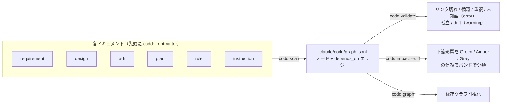

---
codd:
  node_id: "design:codd-coherence-layer"
  kind: design
  status: draft
  depends_on:
    - id: "req:coherence-guardrail"
      relation: derives_from
  owner: ai-orchestra
---

# CODD 整合性レイヤー 設計ドキュメント

**作成日**: 2026-06-24
**ステータス**: draft（設計フェーズ。Codex レビュー反映済み）
**対象**: `feat/codd` ブランチ

---

## 1. 背景と目的

[CODD（Coherence-Driven Development）](https://zenn.dev/shio_shoppaize/articles/shogun-codd-coherence) は、
設計書・コード・テストの**整合性（coherence）**を保ちながら開発を駆動する方法論。
依存関係をドキュメントのフロントマターに宣言し、`scan` で依存グラフを構築、変更時に
影響範囲を自動特定する（参考実装: [yohey-w/codd-dev](https://github.com/yohey-w/codd-dev)）。

AI Orchestra にこの思想を取り込む目的は2段階ある。

1. **AI Orchestra 自身**のドキュメント（指示書・ルール・設計・ADR）の整合性を保つ。
2. **最重要**: AI Orchestra を導入した**各プロジェクトが生成するドキュメント**を、すべて
   CODD の思想に則って管理されるようにする。`/design` などのスキルが生成する成果物が
   依存グラフを持ち、整合性をガードレールで検知できる状態を「配布物」として届ける。

> AI Orchestra は packages/facets/hooks を導入先へ配る基盤を既に持つ。本機能はその配布
> レーンに「整合性パッケージ」を載せることで、新しい配布機構を作らずに全導入先へ展開する。

---

## 2. CODD からの借用範囲（思想のみ）

codd-dev のコードは使わず、以下の**設計思想だけ**を AI Orchestra の流儀（package / facet /
skill / hook）で独自実装する。

| 借用する思想                              | AI Orchestra での実装                           |
| ----------------------------------------- | ----------------------------------------------- |
| フロントマターで依存を宣言（SSOT 1箇所）  | 各 `.md` 先頭に `codd:` ブロック                |
| `scan` で依存グラフを構築                 | `packages/codd` の Python スクリプト            |
| `validate` で不整合を検出                 | リンク切れ・孤立・ドリフト・循環・欠落の検出    |
| 信頼度3帯域（Green/Amber/Gray）の影響分析 | **Phase 2（実装済み）**: `codd impact`（4.5.1） |
| hook / CI への組み込み                    | **Phase 2 以降**（既存 manifest hooks レール）  |

---

## 3. スコープ

### 3.1 In Scope（Phase 1）

- フロントマター規約（CODD スキーマ）の定義（**1ファイル=1ノード**）
- `packages/codd/` パッケージ新設し、**essential プリセットに追加**（常時有効）
- 依存グラフ構築（`scan`）と整合性検証（`validate`）
- ドキュメント生成スキル（`design` / `design-tracker` / `task-state`）が
  CODD フロントマターを生成するよう改修
- AI Orchestra 自身のドキュメントでドッグフード

### 3.2 Out of Scope（別Issue 登録）

| 項目                                                                                           | 理由                                       | 移管先                          |
| ---------------------------------------------------------------------------------------------- | ------------------------------------------ | ------------------------------- |
| ~~impact 分析（Green/Amber/Gray 信頼度スコア）~~ → **Phase 2 で実装済み（Issue #94 / 4.5.1）**             | —                                           | 完了                             |
| ~~hook 自動配線（PostToolUse scan / pre-commit validate）の導入先展開~~ → **Issue #95 で実装済み（4.8.1）** | —                                           | 完了                             |
| 実 git pre-commit hook（PreToolUse 代替ではない本物の git hook）の配布                                     | 既存 pre-commit 環境との衝突・uninstall 時の原状回復を避けるため、Issue #95 では PreToolUse (Bash) の `git commit` 検出方式で代替した | Issue: codd-real-git-hook-distribution |
| CI（PR に verdict 投稿）                                                                                   | impact 分析に依存                           | Issue: codd-ci-guardrail         |
| ~~コード ⇔ ドキュメントのトレーサビリティ~~ → **Phase 3 で opt-in 実装済み（Issue #98 / 4.3.1）** | —                                            | 完了                             |
| ノードのサブ粒度化（1ファイル内 FT-xxx 単位のノード）                                                      | parser/validate が複雑化                    | Issue: codd-subnode-granularity  |

---

## 4. アーキテクチャ

### 4.0 全体パイプライン（図解）

各ドキュメント先頭の `codd:` frontmatter を SSOT とし、`scan` で依存グラフ（`graph.jsonl`）を構築、
`validate` / `impact` / `graph` で利用する。


<details>
<summary>Mermaid ソース（パイプライン）</summary>



</details>

依存は各 doc の `codd:` ブロック1箇所が SSOT（`derives_from` / `refines` / `implements` /
`references` / `supersedes`）。

### 4.1 パッケージ構成

```
packages/codd/
  manifest.json          # SSOT。depends=[core]、skills/config/scripts を宣言
  lib/
    codd_common.py       # フロントマター parser + グラフモデル（共通ライブラリ。hook ではない）
  scripts/
    codd.py              # CLI: scan / validate / graph（orchex run / skill から呼ぶ）
  config/
    codd.yaml            # スコープ glob・kind/relation 定義・検査レベル・graph 保存先
  tests/
    test_codd_graph.py
```

facet composition で配布されるスキル / ルール:

- `facets/compositions/skills/codd-scan.yaml` → `/codd-scan`
- `facets/compositions/skills/codd-validate.yaml` → `/codd-validate`
- `facets/compositions/rules/codd-frontmatter-policy.yaml` → フロントマター記法の運用ルール

> facet モデルは composition 名 = skill 名。2スキルは 2 composition に分ける（H-2）。
> skill / rule の正本は `facets/` ソースのみ。`.agents/skills/` は build 生成物なので直接編集しない（L-2）。

### 4.2 フロントマター規約（CODD スキーマ）

各対象ドキュメントの先頭に以下を埋め込む。**正本はこのフロントマター1箇所**（二重管理なし）。
**1ファイル = 1ノード**とし、複数 ID を含む集約ファイルもファイル全体で1ノードとする（4.3）。

```yaml
---
codd:
  node_id: "design:codd-coherence-layer" # 一意ID。形式は <kind>:<file-slug>
  kind: design # requirement|design|adr|plan|rule|instruction
  status: draft # kind ごとに語彙が異なる（下表）
  depends_on:
    - id: "req:coherence-guardrail" # 参照先 node_id（実在必須）
      relation: derives_from # 関係種別（4.4 参照）
  owner: ai-orchestra # 任意。責任主体
---
```

- parser は**ドキュメント先頭の YAML frontmatter ブロックのみ**を読む。本文中のコードブロック内 `---` や YAML 例は無視する（M-1）。
- `status` の語彙は kind 依存（M-2）:

| kind                                             | status 語彙                                                        |
| ------------------------------------------------ | ------------------------------------------------------------------ |
| adr                                              | `proposed` / `accepted` / `rejected` / `superseded` / `deprecated` |
| requirement / design / plan / rule / instruction | `draft` / `active` / `deprecated`                                  |

この5プロパティで scan/validate の全検査が成立する（4.5 で検証）。
将来 `doc_links.yaml` 方式が必要になっても、parser に読み取り口を1つ足すだけで後付けできる
（Phase 1 では作らない）。

### 4.3 node_id 体系（1ファイル=1ノード）

`node_id` は `<kind>:<file-slug>`（file-slug = 拡張子を除いたファイル名 or 安定スラッグ）。

| kind        | node_id 例                               | 由来（1ファイル1ノード）                                                   |
| ----------- | ---------------------------------------- | -------------------------------------------------------------------------- |
| requirement | `req:feature-list`, `req:non-functional` | `docs/requirements/*.md`（FT 群を含む集約ファイル全体で1ノード）           |
| design      | `design:architecture`, `design:API-001`  | `docs/architecture/*.md`, `docs/api/API-001.md`（個別設計は元々1ファイル） |
| adr         | `adr:ADR-20260624-010`                   | `docs/adr/ADR-*.md`                                                        |
| plan        | `plan:codd-coherence-layer`              | `.claude/Plans.md`（プロジェクト単位で1ノード）                            |
| rule        | `rule:config-loading`                    | `.claude/rules/*.md`                                                       |
| instruction | `instruction:claude-md`                  | `templates/context/*.md`                                                   |

> ファイル内の FT-001 等の細粒度 ID は Phase 1 ではノード化しない（別Issue: codd-subnode-granularity）。

### 4.3.1 code / test ノード（コード⇔ドキュメントのトレーサビリティ / Issue #98）

`code` / `test` kind をノード語彙へ追加し、ソースファイルからも `implements` / `references` 等の
depends_on を宣言できるようにする。doc frontmatter との違いは次の3点。

1. **opt-in スコープ**: `codd.yaml` の新設 `code_scope.include`（既定: 空リスト）に glob を
   追加したファイルのみが走査対象になる。未設定プロジェクトは挙動が変わらない。
   `code_scope.exclude` も `include` と同じ `Path.glob()` で解決するが、末尾を `/**`
   ではなく `/**/*` にする（`Path.glob("**/.venv/**")` は Python 3.12 ではディレクトリの
   みを返し、実装の `_glob_relpaths()` にある `is_file()` フィルタで除外候補として拾えず
   実質無効になるため。既定 exclude 3 件はいずれも `/**/*` 形式）。`include` / `exclude`
   は文字列またはリストで書ける（単一文字列は単要素リスト扱い。YAML でリスト記法
   `- ` を書き忘れて文字イテレートされる誤動作を防ぐ。`scope.include` / `scope.exclude`
   にも同じ正規化を適用し、doc scope とコード scope の扱いを一貫させる）。空文字列
   （`""`）は「対象なし」を表す既存設定との後方互換のため空リストとして扱うが、
   リスト**内**の空文字列要素（例: `["", "src/**/*.py"]`）も同様に除去する
   （除去しないと `[""]` のまま `Path.glob("")` に渡り `ValueError` になる）。`../*.py` の
   ような相対パスでプロジェクトルート外に解決される glob マッチは黙って除外する
   （`Path.glob` はルート外のパスもそのまま解決してしまうため）。root 内へ戻ってくる
   相対 glob（`../proj/src/**/*.py`、root == proj）は `os.path.normpath` によるドット
   記法のレキシカルな畳み込みだけで root 相対へ正規化し、通常パターンで見つかる同一
   ファイルとの重複登録を防ぐ。root 内部のシンボリックリンクにマッチした場合は、
   解決先パスではなくリンク自体の論理パスを登録する（`git diff` が返すパスと
   `path_to_id` を一致させるため。シンボリックリンクの解決先が root 外の場合のみ
   従来どおり除外する）。走査対象言語（Python /
   `//` 系）に対応しない拡張子のファイルは、読み込み前に除外する（画像等が混在ディレクトリ
   glob にマッチしても UTF-8 テキストとして復号しようとしない）。
2. **1行の軽量注釈**: doc の YAML frontmatter 全体を書く代わりに、`codd:<key> <value>` の
   1行注釈を並べる。`key` は予約語（`node_id` / `kind` / `status` / `owner`）または
   relation 名（`implements` 等）で、value は対象 node_id。`node_id` を省略すると
   `<kind>:<file-stem>` から自動導出し、`kind` を省略するとパス規約
   （`tests/` 配下や `test_*` / `*_test` ファイル名）から `test` / `code` を推定する。
   `codd:kind` を明示する場合、ソース注釈では `code` / `test` のみ有効（requirement /
   design 等のドキュメント語彙は使えない。誤った値は `malformed_annotation` として
   報告したうえで推定 kind へフォールバックする）。relation 名の注釈（例:
   `codd:implements`）に参照先 value が無い場合は依存として黙って除外せず、
   `malformed_annotation` 検査（既定 error、4.5 参照）として報告する（予約語のみは
   value 省略を許容する。owner を書かない等）。`codd:` で始まりながら
   `codd:<key>` / `codd:<key> <value>` の文法に一致しない行（`codd:node-id`
   のようなハイフン混じりの key、`codd:node_id=value` のような `=` 区切り等の
   タイプミス）も同様に `malformed_annotation` として報告する（`codd:` で始まらない
   通常のコメント行は従来通り無視する）。予約語（`node_id` / `kind` / `status` /
   `owner`）が同一ファイル内で複数回指定された場合、採用値は最初の 1 件のみだが、
   重複自体も `malformed_annotation` として報告する（例: 正しい `codd:kind code` の
   後に禁止された `codd:kind requirement` が続いても、最初の truthy 値だけを見る
   構築ロジックでは検証をすり抜けてしまうため）。抽出前に先頭 BOM（U+FEFF）を取り除く
   （BOM が残ると Python は `ast.parse` が構文エラーになり、`//` 系言語は先頭行の
   コメント判定に失敗し、注釈が無言でスキップされるため）。
   言語別の抽出領域:
   - Python: `ast.parse` + `ast.get_docstring` でモジュール docstring のみを対象にする
     （本文コード中の文字列リテラルを誤って注釈と解釈しない）。実装は `ast.parse` の
     代わりに `tokenize` で先頭トークンのみ読む軽量版だが、結果は
     `ast.get_docstring(clean=False)` と一致させる（`("""...""")` のような丸括弧付き
     docstring も認識し、`"""..."""  + "suffix"` のような文字列連結式は docstring
     として誤抽出しない）。先頭の文（docstring）の終端が判明した時点で `tokenize` を
     打ち切り、以降のトークンは読まない（全トークンを事前にリスト化すると、大規模
     ファイルほど不要な CPU/メモリを消費するうえ、docstring より後方にある未閉じ
     文字列等の構文エラーが `TokenError` として伝播し、有効な先頭注釈まで失って
     しまうため）。モジュール先頭からインデントされた不正な Python（`ast.parse`
     なら `IndentationError` になるケース）は、最初の有意トークンが `INDENT` に
     なることで判定し、docstring として誤って取り込まない。ファイル読み込みは
     PEP 263 の宣言済みエンコーディング（先頭2行の coding cookie / BOM）を
     `tokenize.detect_encoding` で尊重する（固定 UTF-8 だと Latin-1 等の有効な
     Python ファイルが `UnicodeDecodeError` になるため）。`impact` の削除上流検出で
     `git show <ref>:<path>` から旧内容を取得する際も、working tree と同じ PEP 263
     規約でコミット時点のバイト列を復号する（旧内容を固定 UTF-8 でしか読まないと、
     Latin-1 等を宣言していた Python ファイルの削除が誤検出/例外になるため）。
   - `//` 系言語（TS/JS/Go/Java/Rust/C 系。`.mjs` / `.cjs` / `.mts` / `.cts` を含む）:
     ファイル先頭から連続する行コメントのみを対象にする（shebang 行はスキップ）。
   - **復号失敗のスキップ**: `//` 系ファイルが UTF-16 保存等で UTF-8 として復号できない、
     または Python ファイルの coding cookie が不正で `tokenize.detect_encoding` が
     `SyntaxError` / `LookupError` を投げる場合、working tree 側の読み込み
     （`_read_source_text`）は削除上流検出の `_decode_ref_source` と同じ規約で `None` を
     返し、`scan_code_nodes` は当該ファイルを注釈が無いものとして黙ってスキップする
     （復号不能ファイル1件で `scan`/`validate`/`impact` 全体がトレースバックで落ちるのを
     防ぐ）。
3. **信頼度（confidence）**: doc frontmatter 由来の depends_on は既定 confidence 1.0（人手
   レビュー済みの確定宣言）。コード注釈由来の depends_on は `codd.yaml` の `inline_confidence`
   （既定 0.7）を使う。`impact` のエッジ重みは `relation 重み × confidence`（4.5.1 参照）になり、
   低信頼リンクは下流影響の判定に比例して弱く反映される。`inline_confidence` は有限な
   `[0, 1]` へ正規化され、範囲外の有限値（例: `-0.1`）は境界にクランプ、NaN/Inf のような
   非有限値は既定値（0.7）へフォールバックする（範囲外/非有限値がそのままエッジ重みに
   流れ込むと、負値やNaNで誤って Gray 判定になったり `graph.jsonl` の JSON 出力が壊れたり
   するため）。doc frontmatter 側の `depends_on[].confidence` も同じ正規化を受ける。
   `bool` は `int` のサブクラスで `float(False) == 0.0` / `float(True) == 1.0` が例外なく
   通ってしまうため、数値設定として明示的に拒否する（`inline_confidence: false` が
   全エッジ重みゼロの一斉 Gray 化に化けるのを防ぐ）。`inline_confidence` / doc の
   `confidence` はいずれも bool を不正値として既定値へフォールバックし、`impact.*`
   （decay・thresholds・weights 等）は bool 混入を config エラー（4.6 参照）として拒否する。
   `CoddConfig`（`codd_common.py`）はこの3フィールド（`code_include` / `code_exclude` /
   `inline_confidence`）に既定値（空リスト / `DEFAULT_INLINE_CONFIDENCE`）を持たせ、
   Issue #98 追加前の全フィールドだけでも直接コンストラクタ呼び出しで構築できる
   （`codd_common.py` を共有ライブラリとして直接使う既存連携の後方互換を壊さないため）。

注釈が無いコードファイルは doc scope の `missing_frontmatter`（warning）とは異なり黙って
スキップする。コードベース全体への注釈強制はせず、追跡したいファイルにだけ opt-in で
付与する運用を想定するため。code/test ノードは他の kind と同じグラフに統合され、
dangling / duplicate / cycle / unknown / orphan / drift の各検査を特別扱いなしで受ける。
`impact` の削除上流検出（4.5.1）も doc scope 同様に code_scope 内の注釈付きファイル削除を
対象にする（旧内容からコード注釈を再抽出し、現グラフに node_id が残っているかで判定）。

### 4.4 relation（関係種別）

| relation       | 意味                 | 典型的な向き         |
| -------------- | -------------------- | -------------------- |
| `derives_from` | 上流から派生         | design → requirement |
| `refines`      | 詳細化               | 詳細設計 → 基本設計  |
| `implements`   | 実装関係             | plan/code → design   |
| `references`   | 参照（弱い依存）     | 任意 → 任意          |
| `supersedes`   | 置換（旧版を無効化） | 新ADR → 旧ADR        |

### 4.5 整合性検査ルール（scan / validate）

`scan` がフロントマターを収集してグラフを構築し、`validate` が以下を検査する。

| 検査                       | 条件                                                 | 既定レベル |
| -------------------------- | ---------------------------------------------------- | ---------- |
| **dangling**（リンク切れ） | `depends_on.id` が既存 node_id に存在しない          | error      |
| **duplicate**              | 同一 node_id が複数ドキュメントに存在                | error      |
| **cycle**（循環依存）      | depends_on を辿ると循環する                          | error      |
| **unknown**                | 未定義の kind / relation / status を使用             | error      |
| **malformed_annotation**（Issue #98） | code_scope の注釈が不正（relation 注釈の参照先 value 欠落、`codd:kind` にソース非対応の値、`codd:<key>` 文法違反等） | error      |
| **missing_frontmatter**    | scope 内なのに `codd:` ブロックが無い（H-5）         | warning    |
| **orphan**（孤立）         | 被参照ゼロ かつ 参照ゼロ（`roots` 指定 kind は除外） | warning    |
| **drift**（ドリフト疑い）  | 上流ノードの最終コミット時刻が下流より新しい         | warning    |

- **drift の時刻ソース**（H-3）: `git log -1 --format=%ct -- <path>`（最終コミット時刻）を用いる。
  未コミット（ワーキングツリーのみ）の場合はファイルシステム mtime にフォールバックする。
  git はファイル mtime を履歴保持しないため、必ずコミット時刻 or 内容で判定する。
  ノードごとに `git status` / `git log` を個別起動すると 1,000 ノード規模で著しく
  遅いため、`batch_commit_times()` が `git status --porcelain -z`（dirty 判定）と
  `git log -z --name-only`（コミット時刻）をそれぞれ 1 回にまとめて実行する
  （判定規約は単発の `commit_time()` と同一。Issue #98 レビュー対応）。`git log` は
  `-z` で NUL 区切り取得することで `core.quotePath`（既定 true）による非 ASCII
  パスの引用（8 進エスケープ）を回避する（引用されたままだと `rel_paths` の
  キーと一致せず、クリーンな追跡ファイルでも常に mtime フォールバックへ落ちる）。
  `--root` が git リポジトリルート以外（サブディレクトリ）を指す場合は、
  `git rev-parse --show-prefix` で得た prefix を使って `git status` / `git log` が
  返すリポジトリルート相対パスを `--root` 相対へ正規化してから突き合わせる。
  `git status` はリポジトリ全体（`--root` の外を含む）の dirty パスを返すため、
  prefix 配下に無いパスは正規化せず破棄する（破棄せず素通りさせると、prefix 外の
  dirty ファイルが `--root` 内ノードと偶然同じ相対名を持った場合に、clean な
  ノードまで誤って dirty 扱いされてしまう）。部分履歴 clone（shallow clone 等）
  では、対象パスの無制限 `git log` が最新 timestamp を出力した後、古い履歴
  （欠けた tree）の走査中に nonzero で終了することがある。`_log_commit_times()`
  は stdout が空でなければ nonzero 終了でも取得できた分の timestamp を使う
  （0 件扱いで mtime へ全面フォールバックしない）。
- **missing_frontmatter** は Phase 1 では warning。将来 essential 運用が定着したら error 昇格を検討。
- drift は「上流を変えたのに下流が追従していないかもしれない」という**素朴な Amber 相当**。
  信頼度スコアによる本格的な impact 分析は Phase 2。

### 4.5.1 impact 分析（信頼度3帯域 / Issue #94）

`impact` は変更 diff から下流ドキュメントへの影響を **Green（自動更新可）/ Amber（要確認）/
Gray（参考）** に分類する。Phase 1 の素朴な drift（コミット時刻比較）を、宣言された依存関係を
証拠とした信頼度スコアへ発展させたもの。

```bash
codd impact --diff <ref> [--json]   # 既定 ref = HEAD
```

**手順:**

1. `git diff --name-status <ref>` で変更/削除ファイルを取得し、frontmatter の `node_id` にマップ。
2. `depends_on` の逆引き（`incoming`）を単純パスで辿り、変更ノードに依存する下流を列挙
   （サイクル安全・`max_hops` で打ち切り）。
3. 各経路を信頼度スコア化し、ノードごとに最良値を採って帯域へ分類。

**信頼度スコア:**

| 要素          | 反映                                                                          |
| ------------- | ----------------------------------------------------------------------------- |
| relation 強度 | `derives_from`/`refines`/`implements`=1.0、`supersedes`=0.6、`references`=0.3 |
| 距離減衰      | `decay^(hops-1)`（既定 decay=0.5）                                            |
| パススコア    | `min(経路上の重み) × decay^(hops-1)`（最弱リンクが信頼度を決める）            |
| ノードスコア  | 全経路・全起点の最大値（最良証拠が勝つ）                                      |
| 件数ボーナス  | amber 以上の経路を持つ複数起点が裏付ける場合のみ加点（水増し防止）            |

**帯域分類（補正込み）:**

- `score >= green_threshold`（0.8）→ Green / `>= amber_threshold`（0.4）→ Amber / それ未満 → Gray。
- **Corroboration rule**: Green は「直接の強依存（1 hop・強 relation）= 事実」か、
  「裏付け起点 ≥ `corroboration_min_origins`（2）」のみ許す。多段単一経路（推論的）は Amber 上限。
- **co_changed cap**: 下流ノード自身が同一 diff で変更済みなら Amber 上限にフラグ表示する
  （スコアは下げず、破壊的変更を Gray に隠さない）。
- 削除された上流ファイルは dangling 注意として別建てで報告する。削除済みパスは
  `Path.glob` が使えないため、scope glob を segment-aware な正規表現へ変換した
  `_scope_pattern_to_regex` で判定する。`*`/`**`/`?` に加えて文字クラス（`[seq]` /
  `[!seq]`）も `Path.glob` と同じ意味に解釈し（通常走査の `collect_files` と削除後
  判定とで glob 解釈が食い違わないようにする）、閉じ `]` が無い場合は fnmatch と
  同様リテラル `[` として扱う。不正な文字範囲（`lo > hi`。例: `[z-a]`、`[ab-a]`）は
  `_char_class_to_regex` が CPython `fnmatch.translate()` と同一のアルゴリズムで
  正規化し、範囲部分だけを除去して他の有効なリテラル文字は保持する（`[ab-a]` は
  リテラル `a` にマッチし、クラス全体が空になる `[z-a]` のみ「常に非マッチ」）。
  文字クラス以外の未知の要因による `re.error` はクラッシュせず「常に非マッチ」の
  防御的フォールバックへ倒す。`../proj/src/**/*.py`（root == proj）のように root 外へ
  出て同じ root 内へ戻るパターンも、通常走査側（`_glob_relpaths()`）と同じ
  レキシカルな正規化（`os.path.normpath`、ファイルシステムへはアクセスしない）を
  適用してから判定する。正規化しないと削除済みパスの判定で通常パターンと別名扱い
  になり、scan と impact 判定の解釈が食い違う。`src/**.py` のような不正な再帰
  glob（`**` がパスセグメント全体を占めていない）による `Path.glob()` の
  `ValueError` は `_glob_relpaths()` が捕捉し、パターンを含む分かりやすい
  `ValueError` へ変換して再送出する。`main()` は config 読み込みだけでなく
  scan/validate/impact のコマンド実行全体を同じ try/except で包むため、この
  ValueError も `[codd] ERROR: ...`（非ゼロ終了）として整形される。
- symlink はスコープ内の走査（scan、working tree）でも、ref 側の旧内容取得
  （`git show <ref>:<path>`）でも一貫して dereference する。scan は working tree の
  symlink をリンク先の内容ごと登録するため、リンク先だけを変更した場合も
  `git diff` はリンク先のパスを返す。node.path（symlink 自身）しか見ないと変更が
  検出されないため、リンク先の root 相対パスも `changed_paths` の突合対象に加える。
  `alias.py -> links/current.py -> v1.py` のような中継 symlink チェーンでは、
  `_symlink_target_relpath()` が 1 hop 先のみを `os.readlink` で解決し、
  `_symlink_chain_relpaths()` がそれを繰り返し呼んでチェーン上の全 hop
  （`links/current.py` も）を突合対象へ加える（`Path.resolve()` で最終ターゲット
  だけを一気に解決すると、中間リンクだけの retarget を見逃す）。
  一方 `git show <ref>:<path>` は symlink blob の中身（リンク先パス文字列）を
  そのまま返してしまうため、`git ls-tree` でモード（`120000` = symlink）を判定
  しながらリンク先を辿ってから内容を取得する（辿らないと、削除された symlink
  ノードの旧 node_id を frontmatter として復元できず、dangling 化を見逃す）。ref
  側のリンク先文字列は `strip()` せずそのまま解決する（先頭/末尾に有意な空白を
  含むファイル名を指す symlink でも working tree と同じパスに解決するため）。
  code_scope 内の symlink で、alias 自体は変更されずリンク先だけが削除されて
  壊れた symlink になった場合（`git diff` の changed/deleted どちらにも alias
  自身は現れない）は `_broken_code_symlink_relpaths()` が検出し、ref 側の旧内容
  から node_id を回収して deleted_upstream の検出対象に含める。
- code_scope 内のコードファイルは、削除だけでなく **ファイルが残ったまま**
  `codd:` 注釈の削除や node_id 変更で旧コードノードが消失するケースも dangling
  注意として同じ集合に含める。`changed_paths`（削除されていない変更ファイル）の
  code_scope 該当分についても ref 時点の内容から旧注釈を再抽出し、現グラフから
  消えていれば報告する（`compute_impact_result`）。
- drift 検査（`batch_commit_times` / `_log_commit_times`）の一括 `git log` は
  各ノードパスを `:(literal)` を前置した pathspec として渡す。前置しないと、
  `:(bad.md` のような git pathspec magic 構文と衝突する正当なファイル名が1つ
  あるだけで `fatal: Invalid pathspec magic` により一括呼び出し全体が失敗し、
  同じバッチ内の他の clean node まで commit time ではなく working-tree mtime で
  比較されてしまう（drift 判定が不安定になる）。

**設計判断（codd-dev 比較 / ADR-026 D3）:** CODD は依存宣言を frontmatter に限定するため、証拠源は
relation 種別とグラフ距離のみ。codd-dev の Noisy-OR・エビデンス種別分類（static/inferred/human 等）は
コード静的解析由来の多様な証拠を確率合成する設計であり、本レイヤーには証拠源が無く適用しない。
Corroboration rule と testimony cap（co_changed）の思想のみ借用した。`must_review` エッジは将来フェーズ。

### 4.6 config（codd.yaml）

```yaml
# .claude/config/codd/codd.yaml
scope:
  include:
    - "docs/**/*.md"
    - ".claude/rules/*.md"
    - ".claude/Plans.md"
    - "templates/context/*.md"
  exclude:
    - "docs/adr/_template.md"
    - "docs/adr/DECISIONS.md"
# code_scope は opt-in（既定 include: []）。追加すると code/test ノードを抽出する（4.3.1）。
code_scope:
  include: []
  exclude:
    - "**/__pycache__/**/*" # 末尾は /**/* にする（Python 3.12 の Path.glob 対策、4.3.1）
    - "**/node_modules/**/*"
    - "**/.venv/**/*"
inline_confidence: 0.7 # code_scope 由来 depends_on の既定信頼度（4.3.1）
kinds: [requirement, design, adr, plan, rule, instruction, code, test] # scope と整合（H-4）
relations: [derives_from, refines, implements, references, supersedes]
roots: [requirement, instruction] # 被参照ゼロを許容する最上流 kind
graph_store:
  format: jsonl # 小〜中規模。規模拡大時に SQLite を検討（L-3 決定）
  path: ".claude/codd/graph.jsonl"
checks:
  dangling: error
  duplicate: error
  cycle: error
  unknown: error
  malformed_annotation: error # code_scope の値無し依存注釈（4.3.1 / 4.5）
  missing_frontmatter: warning
  orphan: warning
  drift: warning
```

導入先固有の上書きは `codd.local.yaml`（`config-loading` ルール準拠、同期対象外）。

`scope.include` / `code_scope.include` の型不正（数値・非文字列要素混入）や `impact.*` への
bool 混入は config ロード時に `ValueError` / `TypeError` になる。`scope` / `code_scope` /
`graph_store` / `impact` / `checks` / `impact.relation_weights` に mapping 以外（文字列・
リスト等）を書いた場合も同様に `ValueError` になる（`.get()` / `.items()` の `AttributeError`
を素通りさせない）。`impact.max_hops` / `impact.corroboration_min_origins` に `.inf` /
`.nan` のような非有限値を書いた場合も `int()` の `OverflowError`（`ValueError` のサブクラス
ではない）を素通りさせず `ValueError` にする。`scope.include` 等に空文字列（`""`）を書いた
場合は「対象なし」を表す既存設定との後方互換のため空リストとして扱う（`[""]` にはしない。
`Path.glob("")` の `ValueError` を招くため）。CLI エントリポイント（`main()`）はこれらを
トレースバックとして漏らさず捕捉し、`[codd] ERROR: ...` を stderr へ出力して非ゼロ終了する
（scan/graph/validate/impact 全コマンド共通）。

### 4.7 既存スキルとの統合

ドキュメント生成スキルが CODD フロントマターを**自動で**出力するよう SKILL.md を改修する。
codd は essential（常時有効）のため、**条件分岐は不要**で常にフロントマターを生成してよい（C-1 解決）。

| スキル           | 改修内容                                                                                     |
| ---------------- | -------------------------------------------------------------------------------------------- |
| `design`         | Phase 1-3 の各成果物（ファイル）先頭に `codd:` ブロックを生成。`derives_from` で上流へリンク |
| `design-tracker` | ADR に `codd:` ブロックを付与。`関連:` を `depends_on`（references/supersedes）へ移行        |
| `task-state`     | Plans.md に `plan:` node_id を1つ付け、実装対象の `design:` ノードへ `implements` リンク     |

> 改修対象は facet composition のソース（`facets/compositions/skills/*.yaml` 等）。
> 生成物 `.agents/skills/*/SKILL.md` は直接編集しない（L-2）。

### 4.8 配布モデル（導入先への展開）

`packages/codd/` は **essential プリセット**に含め、`setup essential` で全導入先へ自動導入する
（C-1 / H-1 解決）。install 後、既存レールで以下が導入先 `.claude/` に展開される。

1. `config/codd.yaml` → `.claude/config/codd/codd.yaml`（SessionStart sync）
2. skill/rule → facet build で `.claude/skills/codd-*/`・`.agents/skills/`・`.claude/rules/`
3. scripts → `orchex run codd codd -- scan|validate` で実行可能
4. manifest hooks → `.claude/settings.local.json` に PostToolUse/PreToolUse 自動登録（**実装済み・
   Issue #95**。詳細は 4.8.1）

→ **導入先プロジェクトは essential セットアップだけで、`/design` 等が生成する
ドキュメントが CODD 管理下に入り、`/codd-validate` で整合性を検証できる。**

### 4.8.1 hook 自動配線（Issue #95）

`packages/codd/manifest.json` に以下の hooks を宣言し、既存の同期レール（sync_hooks）経由で
導入先 `.claude/settings.local.json` へ自動登録する（essential プリセットのため全導入先が対象）。

| hook スクリプト                | イベント    | matcher   | 役割                                       |
| ------------------------------ | ----------- | --------- | ------------------------------------------ |
| `codd-scan-postedit.py`        | PostToolUse | `Edit\|Write` | scope 内ファイル編集時に `scan` を実行し、graph を再構築する（常に非ブロック） |
| `codd-validate-precommit.py`   | PreToolUse  | `Bash`    | `git commit` を検出したら `validate` を実行し、警告またはブロックする |

両 hook とも manifest 上で `"timeout": 90`（秒）を宣言し、同期レール（`sync_hooks`）が
導入先 `.claude/settings.local.json` へ登録する際にこの値を反映する。内部のサブプロセス
実行上限（60秒）に余裕を持たせた値。

**pre-commit の代替方式**: 実 git hook（`.git/hooks/pre-commit`）を配布するのではなく、
PreToolUse (Bash) で `git commit` コマンドを検出するアプローチを採る。理由は次の3点。

1. 導入先が既に pre-commit framework 等を運用している場合との衝突を避ける
2. codd の uninstall 時に `.git/hooks/` を書き換えたままにしない（原状回復が容易）
3. 「導入先の commit フローを侵さない」という opt-in 方針と整合する

**既知の制限**: この方式がガードするのは **Claude Code セッション経由の `git commit`** のみ。
手動シェル操作・GUI Git クライアント・CI からの commit は対象外になる。これは上記「導入先の
commit フローを侵さない」という要件の裏返しであり、意図した制限として明記する。実 git hook の
配布機構が必要な場合は Out of Scope（2章）に切り出した別Issue（`codd-real-git-hook-distribution`）
で扱う。

**validate hook の判定基準**: `codd validate` の終了コードが **1** の場合のみ整合性エラー
として `warn`/`block` の分岐に流す。それ以外の非ゼロ終了（例: 設定エラーの exit 2）は
実行失敗とみなし、非ブロックで通過させる（hook が誤って commit を止めないようにするため）。

**対象 root の限定**: Bash コマンド中の `git -C <path> commit` が、現在の検証 root
（プロジェクトルート）以外を指す場合はガード対象外とする（skip）。`cd <path> && git commit`
のような複合コマンドは、root を実行時の cwd で近似判定する（既知の制限。`-C` のような
明示的な path 引数を持たないため厳密な root 解決はできない）。

**working tree 検証の近似**: hook が実行する `validate` は working tree（実ファイル内容）
を対象とし、git の index（ステージング内容）は見ない。部分的な `git add` や
`X && git add && git commit` のような複合コマンドでは、実際に commit される index の内容
と hook が検証した内容が乖離しうる。この解消（index スナップショットに対する検証）は
Issue #338 に切り出し済み。

**二段構えの opt-in**: hook の「登録」は essential プリセットで全導入先に自動展開されるが、
「実動作」は `codd.yaml` の `hooks:` セクションで制御する（config キーは 4.6 の `checks` 等と同じ
`.claude/config/codd/codd.yaml` 配下）。

| キー                       | 型                            | 既定値  | 意味                                                                 |
| -------------------------- | ------------------------------ | ------- | ---------------------------------------------------------------------- |
| `hooks.scan_on_edit`       | bool                            | `false` | scope 内ファイル編集時に `scan` で graph を再構築するか。常に非ブロック |
| `hooks.validate_on_commit` | `"off"` / `warn` / `block`      | `warn`  | `warn` は additionalContext で警告表示のみ。`block` は validate error 検出時に commit を止める（exit 2） |

`hooks.validate_on_commit` の bare `off` は YAML 1.1 仕様上 boolean `False` としてパースされるが、
`normalize_check_level`（`codd-frontmatter-policy.md` と同じ正規化関数）により大文字小文字違いも
含めて `"off"` へ正規化される（`checks.*` の検査レベルと同じ扱い）。

**fail-safe**: codd 未初期化（`codd.yaml` が存在しない）または `enabled: false` のプロジェクトでは、
両 hook とも即座に no-op として終了する。実行時例外が発生した場合も exit 0 でフェイルセーフに倒し、
hook 導入がホスト側の commit/edit フローをブロックしないことを優先する。

### 4.9 ドッグフーディング

AI Orchestra 自身の `.claude/orchestra.json` に `codd` を追加し、最初の導入先とする。
本設計ドキュメント自体が `design:codd-coherence-layer` ノードとしてグラフに載る（フロントマター付与済み）。

---

## 5. フェーズ計画（概要）

詳細タスクは `.claude/Plans.md` を SSOT とする。

- **Phase 1**: フロントマター規約 + `packages/codd`（scan/validate）+ essential 化 + skill 改修 + ドッグフード
- **Phase 2**: impact 分析（Green/Amber/Gray）**実装済み（Issue #94）** + hook 自動配線（PostToolUse scan /
  pre-commit validate 代替）**実装済み（Issue #95 / 4.8.1）**
- **Phase 3**: コード⇔ドキュメントトレース（opt-in・**実装済み（Issue #98 / 4.3.1）**）+ CI verdict（別Issue）

---

## 6. リスクと対策

| リスク                                           | 対策                                                                        |
| ------------------------------------------------ | --------------------------------------------------------------------------- |
| フロントマターのプロパティ不足                   | 5プロパティで全検査が成立することを 4.5 で確認済み。不足時は後方互換で追加  |
| 既存ドキュメントへのフロントマター一括付与コスト | Phase 1 は対象を docs/・.claude/rules/・Plans.md・templates/context/ に限定 |
| drift 検査の誤検知                               | warning 止まり。コミット時刻ベースと明示し、本格判定は Phase 2              |
| essential 化による全導入先への影響               | hook の**登録**は essential で自動展開されるが、**実動作**は `codd.yaml` の `hooks.scan_on_edit`（既定 false）/ `hooks.validate_on_commit`（既定 warn）による二段構え opt-in で制御（Issue #95 / 4.8.1） |
| frontmatter parser の誤検出                      | 先頭ブロックのみ読む実装に限定（M-1）                                       |

---

## 7. 決定事項

- **D1**: codd-dev のコードは使わず、思想のみ借りて独自実装する。
- **D2**: 整合性レイヤーは独立パッケージ `packages/codd/` として実装する。
- **D3**: 依存宣言の正本はドキュメント内フロントマター（`codd:` ブロック）。外部 doc_links.yaml は作らない。
- **D4**: Phase 1 は scan/validate まで。impact 分析・hook 配線・CI・コード⇔ドキュメントは別Issue。
- **D5**: 整合性管理の最重要対象は「導入先プロジェクトが生成するドキュメント」。配布前提で設計する。
- **D6**: codd を essential プリセットに追加し常時有効とする（C-1 解決。facet 条件付きオーバーレイは作らない）。
- **D7**: 1ファイル=1ノード。集約ファイル内の FT-xxx 等の細粒度ノード化は別Issue（C-2 解決）。
- **D8**: graph 保存形式は JSONL（`.claude/codd/graph.jsonl`）。規模拡大時に SQLite を検討（L-3）。
- **D9**（Issue #98）: コード⇔ドキュメントのトレーサビリティは、doc frontmatter と同じ 1行注釈
  ではなく `codd:<key> <value>` の軽量記法を採用し、`code_scope.include`（既定空）による opt-in
  スコープとする。全コードへのフロントマター強制は行わず、注釈の有無で confidence
  （既定 1.0 vs 0.7）を差別化することで、doc の確定宣言とコードの軽量宣言を区別する。

---

## 8. 未解決事項

- ADR の `関連:` 行から `depends_on` への移行を一括変換するか段階移行か（実装時に確定）
- essential 化した場合の既存導入先への frontmatter 一括バックフィル手順（Phase 1 後半で詰める）
