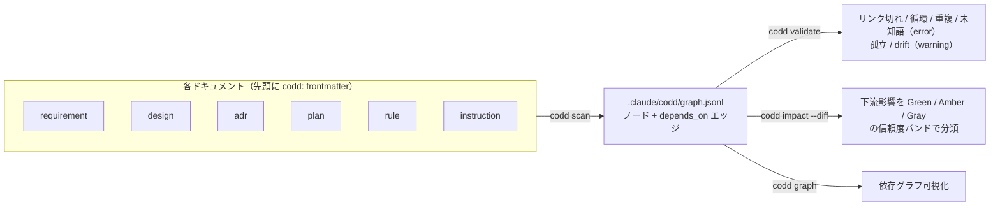

---
codd:
  node_id: "design:codd-coherence-layer"
  kind: design
  status: draft
  depends_on:
    - id: "req:coherence-guardrail"
      relation: derives_from
  owner: ai-orchestra
---

# CODD 整合性レイヤー 設計ドキュメント

**作成日**: 2026-06-24
**ステータス**: draft（設計フェーズ。Codex レビュー反映済み）
**対象**: `feat/codd` ブランチ

---

## 1. 背景と目的

[CODD（Coherence-Driven Development）](https://zenn.dev/shio_shoppaize/articles/shogun-codd-coherence) は、
設計書・コード・テストの**整合性（coherence）**を保ちながら開発を駆動する方法論。
依存関係をドキュメントのフロントマターに宣言し、`scan` で依存グラフを構築、変更時に
影響範囲を自動特定する（参考実装: [yohey-w/codd-dev](https://github.com/yohey-w/codd-dev)）。

AI Orchestra にこの思想を取り込む目的は2段階ある。

1. **AI Orchestra 自身**のドキュメント（指示書・ルール・設計・ADR）の整合性を保つ。
2. **最重要**: AI Orchestra を導入した**各プロジェクトが生成するドキュメント**を、すべて
   CODD の思想に則って管理されるようにする。`/design` などのスキルが生成する成果物が
   依存グラフを持ち、整合性をガードレールで検知できる状態を「配布物」として届ける。

> AI Orchestra は packages/facets/hooks を導入先へ配る基盤を既に持つ。本機能はその配布
> レーンに「整合性パッケージ」を載せることで、新しい配布機構を作らずに全導入先へ展開する。

---

## 2. CODD からの借用範囲（思想のみ）

codd-dev のコードは使わず、以下の**設計思想だけ**を AI Orchestra の流儀（package / facet /
skill / hook）で独自実装する。

| 借用する思想                              | AI Orchestra での実装                           |
| ----------------------------------------- | ----------------------------------------------- |
| フロントマターで依存を宣言（SSOT 1箇所）  | 各 `.md` 先頭に `codd:` ブロック                |
| `scan` で依存グラフを構築                 | `packages/codd` の Python スクリプト            |
| `validate` で不整合を検出                 | リンク切れ・孤立・ドリフト・循環・欠落の検出    |
| 信頼度3帯域（Green/Amber/Gray）の影響分析 | **Phase 2（実装済み）**: `codd impact`（4.5.1） |
| hook / CI への組み込み                    | **Phase 2 以降**（既存 manifest hooks レール）  |

---

## 3. スコープ

### 3.1 In Scope（Phase 1）

- フロントマター規約（CODD スキーマ）の定義（**1ファイル=1ノード**）
- `packages/codd/` パッケージ新設し、**essential プリセットに追加**（常時有効）
- 依存グラフ構築（`scan`）と整合性検証（`validate`）
- ドキュメント生成スキル（`design` / `design-tracker` / `task-state`）が
  CODD フロントマターを生成するよう改修
- AI Orchestra 自身のドキュメントでドッグフード

### 3.2 Out of Scope（別Issue 登録）

| 項目                                                                                           | 理由                                       | 移管先                          |
| ---------------------------------------------------------------------------------------------- | ------------------------------------------ | ------------------------------- |
| ~~impact 分析（Green/Amber/Gray 信頼度スコア）~~ → **Phase 2 で実装済み（Issue #94 / 4.5.1）**             | —                                           | 完了                             |
| hook 自動配線（PostToolUse scan / pre-commit validate）の導入先展開                                        | Phase 1 は手動 `/codd-validate` で価値検証  | Issue: codd-hook-distribution    |
| CI（PR に verdict 投稿）                                                                                   | impact 分析に依存                           | Issue: codd-ci-guardrail         |
| ~~コード ⇔ ドキュメントのトレーサビリティ~~ → **Phase 3 で opt-in 実装済み（Issue #98 / 4.3.1）** | —                                            | 完了                             |
| ノードのサブ粒度化（1ファイル内 FT-xxx 単位のノード）                                                      | parser/validate が複雑化                    | Issue: codd-subnode-granularity  |

---

## 4. アーキテクチャ

### 4.0 全体パイプライン（図解）

各ドキュメント先頭の `codd:` frontmatter を SSOT とし、`scan` で依存グラフ（`graph.jsonl`）を構築、
`validate` / `impact` / `graph` で利用する。


<details>
<summary>Mermaid ソース（パイプライン）</summary>



</details>

依存は各 doc の `codd:` ブロック1箇所が SSOT（`derives_from` / `refines` / `implements` /
`references` / `supersedes`）。

### 4.1 パッケージ構成

```
packages/codd/
  manifest.json          # SSOT。depends=[core]、skills/config/scripts を宣言
  lib/
    codd_common.py       # フロントマター parser + グラフモデル（共通ライブラリ。hook ではない）
  scripts/
    codd.py              # CLI: scan / validate / graph（orchex run / skill から呼ぶ）
  config/
    codd.yaml            # スコープ glob・kind/relation 定義・検査レベル・graph 保存先
  tests/
    test_codd_graph.py
```

facet composition で配布されるスキル / ルール:

- `facets/compositions/skills/codd-scan.yaml` → `/codd-scan`
- `facets/compositions/skills/codd-validate.yaml` → `/codd-validate`
- `facets/compositions/rules/codd-frontmatter-policy.yaml` → フロントマター記法の運用ルール

> facet モデルは composition 名 = skill 名。2スキルは 2 composition に分ける（H-2）。
> skill / rule の正本は `facets/` ソースのみ。`.agents/skills/` は build 生成物なので直接編集しない（L-2）。

### 4.2 フロントマター規約（CODD スキーマ）

各対象ドキュメントの先頭に以下を埋め込む。**正本はこのフロントマター1箇所**（二重管理なし）。
**1ファイル = 1ノード**とし、複数 ID を含む集約ファイルもファイル全体で1ノードとする（4.3）。

```yaml
---
codd:
  node_id: "design:codd-coherence-layer" # 一意ID。形式は <kind>:<file-slug>
  kind: design # requirement|design|adr|plan|rule|instruction
  status: draft # kind ごとに語彙が異なる（下表）
  depends_on:
    - id: "req:coherence-guardrail" # 参照先 node_id（実在必須）
      relation: derives_from # 関係種別（4.4 参照）
  owner: ai-orchestra # 任意。責任主体
---
```

- parser は**ドキュメント先頭の YAML frontmatter ブロックのみ**を読む。本文中のコードブロック内 `---` や YAML 例は無視する（M-1）。
- `status` の語彙は kind 依存（M-2）:

| kind                                             | status 語彙                                                        |
| ------------------------------------------------ | ------------------------------------------------------------------ |
| adr                                              | `proposed` / `accepted` / `rejected` / `superseded` / `deprecated` |
| requirement / design / plan / rule / instruction | `draft` / `active` / `deprecated`                                  |

この5プロパティで scan/validate の全検査が成立する（4.5 で検証）。
将来 `doc_links.yaml` 方式が必要になっても、parser に読み取り口を1つ足すだけで後付けできる
（Phase 1 では作らない）。

### 4.3 node_id 体系（1ファイル=1ノード）

`node_id` は `<kind>:<file-slug>`（file-slug = 拡張子を除いたファイル名 or 安定スラッグ）。

| kind        | node_id 例                               | 由来（1ファイル1ノード）                                                   |
| ----------- | ---------------------------------------- | -------------------------------------------------------------------------- |
| requirement | `req:feature-list`, `req:non-functional` | `docs/requirements/*.md`（FT 群を含む集約ファイル全体で1ノード）           |
| design      | `design:architecture`, `design:API-001`  | `docs/architecture/*.md`, `docs/api/API-001.md`（個別設計は元々1ファイル） |
| adr         | `adr:ADR-20260624-010`                   | `docs/adr/ADR-*.md`                                                        |
| plan        | `plan:codd-coherence-layer`              | `.claude/Plans.md`（プロジェクト単位で1ノード）                            |
| rule        | `rule:config-loading`                    | `.claude/rules/*.md`                                                       |
| instruction | `instruction:claude-md`                  | `templates/context/*.md`                                                   |

> ファイル内の FT-001 等の細粒度 ID は Phase 1 ではノード化しない（別Issue: codd-subnode-granularity）。

### 4.3.1 code / test ノード（コード⇔ドキュメントのトレーサビリティ / Issue #98）

`code` / `test` kind をノード語彙へ追加し、ソースファイルからも `implements` / `references` 等の
depends_on を宣言できるようにする。doc frontmatter との違いは次の3点。

1. **opt-in スコープ**: `codd.yaml` の新設 `code_scope.include`（既定: 空リスト）に glob を
   追加したファイルのみが走査対象になる。未設定プロジェクトは挙動が変わらない。
2. **1行の軽量注釈**: doc の YAML frontmatter 全体を書く代わりに、`codd:<key> <value>` の
   1行注釈を並べる。`key` は予約語（`node_id` / `kind` / `status` / `owner`）または
   relation 名（`implements` 等）で、value は対象 node_id。`node_id` を省略すると
   `<kind>:<file-stem>` から自動導出し、`kind` を省略するとパス規約
   （`tests/` 配下や `test_*` / `*_test` ファイル名）から `test` / `code` を推定する。
   言語別の抽出領域:
   - Python: `ast.parse` + `ast.get_docstring` でモジュール docstring のみを対象にする
     （本文コード中の文字列リテラルを誤って注釈と解釈しない）。
   - `//` 系言語（TS/JS/Go/Java/Rust/C 系）: ファイル先頭から連続する行コメントのみを対象にする
     （shebang 行はスキップ）。
3. **信頼度（confidence）**: doc frontmatter 由来の depends_on は既定 confidence 1.0（人手
   レビュー済みの確定宣言）。コード注釈由来の depends_on は `codd.yaml` の `inline_confidence`
   （既定 0.7）を使う。`impact` のエッジ重みは `relation 重み × confidence`（4.5.1 参照）になり、
   低信頼リンクは下流影響の判定に比例して弱く反映される。

注釈が無いコードファイルは doc scope の `missing_frontmatter`（warning）とは異なり黙って
スキップする。コードベース全体への注釈強制はせず、追跡したいファイルにだけ opt-in で
付与する運用を想定するため。code/test ノードは他の kind と同じグラフに統合され、
dangling / duplicate / cycle / unknown / orphan / drift の各検査を特別扱いなしで受ける。

### 4.4 relation（関係種別）

| relation       | 意味                 | 典型的な向き         |
| -------------- | -------------------- | -------------------- |
| `derives_from` | 上流から派生         | design → requirement |
| `refines`      | 詳細化               | 詳細設計 → 基本設計  |
| `implements`   | 実装関係             | plan/code → design   |
| `references`   | 参照（弱い依存）     | 任意 → 任意          |
| `supersedes`   | 置換（旧版を無効化） | 新ADR → 旧ADR        |

### 4.5 整合性検査ルール（scan / validate）

`scan` がフロントマターを収集してグラフを構築し、`validate` が以下を検査する。

| 検査                       | 条件                                                 | 既定レベル |
| -------------------------- | ---------------------------------------------------- | ---------- |
| **dangling**（リンク切れ） | `depends_on.id` が既存 node_id に存在しない          | error      |
| **duplicate**              | 同一 node_id が複数ドキュメントに存在                | error      |
| **cycle**（循環依存）      | depends_on を辿ると循環する                          | error      |
| **unknown**                | 未定義の kind / relation / status を使用             | error      |
| **missing_frontmatter**    | scope 内なのに `codd:` ブロックが無い（H-5）         | warning    |
| **orphan**（孤立）         | 被参照ゼロ かつ 参照ゼロ（`roots` 指定 kind は除外） | warning    |
| **drift**（ドリフト疑い）  | 上流ノードの最終コミット時刻が下流より新しい         | warning    |

- **drift の時刻ソース**（H-3）: `git log -1 --format=%ct -- <path>`（最終コミット時刻）を用いる。
  未コミット（ワーキングツリーのみ）の場合はファイルシステム mtime にフォールバックする。
  git はファイル mtime を履歴保持しないため、必ずコミット時刻 or 内容で判定する。
- **missing_frontmatter** は Phase 1 では warning。将来 essential 運用が定着したら error 昇格を検討。
- drift は「上流を変えたのに下流が追従していないかもしれない」という**素朴な Amber 相当**。
  信頼度スコアによる本格的な impact 分析は Phase 2。

### 4.5.1 impact 分析（信頼度3帯域 / Issue #94）

`impact` は変更 diff から下流ドキュメントへの影響を **Green（自動更新可）/ Amber（要確認）/
Gray（参考）** に分類する。Phase 1 の素朴な drift（コミット時刻比較）を、宣言された依存関係を
証拠とした信頼度スコアへ発展させたもの。

```bash
codd impact --diff <ref> [--json]   # 既定 ref = HEAD
```

**手順:**

1. `git diff --name-status <ref>` で変更/削除ファイルを取得し、frontmatter の `node_id` にマップ。
2. `depends_on` の逆引き（`incoming`）を単純パスで辿り、変更ノードに依存する下流を列挙
   （サイクル安全・`max_hops` で打ち切り）。
3. 各経路を信頼度スコア化し、ノードごとに最良値を採って帯域へ分類。

**信頼度スコア:**

| 要素          | 反映                                                                          |
| ------------- | ----------------------------------------------------------------------------- |
| relation 強度 | `derives_from`/`refines`/`implements`=1.0、`supersedes`=0.6、`references`=0.3 |
| 距離減衰      | `decay^(hops-1)`（既定 decay=0.5）                                            |
| パススコア    | `min(経路上の重み) × decay^(hops-1)`（最弱リンクが信頼度を決める）            |
| ノードスコア  | 全経路・全起点の最大値（最良証拠が勝つ）                                      |
| 件数ボーナス  | amber 以上の経路を持つ複数起点が裏付ける場合のみ加点（水増し防止）            |

**帯域分類（補正込み）:**

- `score >= green_threshold`（0.8）→ Green / `>= amber_threshold`（0.4）→ Amber / それ未満 → Gray。
- **Corroboration rule**: Green は「直接の強依存（1 hop・強 relation）= 事実」か、
  「裏付け起点 ≥ `corroboration_min_origins`（2）」のみ許す。多段単一経路（推論的）は Amber 上限。
- **co_changed cap**: 下流ノード自身が同一 diff で変更済みなら Amber 上限にフラグ表示する
  （スコアは下げず、破壊的変更を Gray に隠さない）。
- 削除された上流ファイルは dangling 注意として別建てで報告する。

**設計判断（codd-dev 比較 / ADR-026 D3）:** CODD は依存宣言を frontmatter に限定するため、証拠源は
relation 種別とグラフ距離のみ。codd-dev の Noisy-OR・エビデンス種別分類（static/inferred/human 等）は
コード静的解析由来の多様な証拠を確率合成する設計であり、本レイヤーには証拠源が無く適用しない。
Corroboration rule と testimony cap（co_changed）の思想のみ借用した。`must_review` エッジは将来フェーズ。

### 4.6 config（codd.yaml）

```yaml
# .claude/config/codd/codd.yaml
scope:
  include:
    - "docs/**/*.md"
    - ".claude/rules/*.md"
    - ".claude/Plans.md"
    - "templates/context/*.md"
  exclude:
    - "docs/adr/_template.md"
    - "docs/adr/DECISIONS.md"
kinds: [requirement, design, adr, plan, rule, instruction] # scope と整合（H-4）
relations: [derives_from, refines, implements, references, supersedes]
roots: [requirement, instruction] # 被参照ゼロを許容する最上流 kind
graph_store:
  format: jsonl # 小〜中規模。規模拡大時に SQLite を検討（L-3 決定）
  path: ".claude/codd/graph.jsonl"
checks:
  dangling: error
  duplicate: error
  cycle: error
  unknown: error
  missing_frontmatter: warning
  orphan: warning
  drift: warning
```

導入先固有の上書きは `codd.local.yaml`（`config-loading` ルール準拠、同期対象外）。

### 4.7 既存スキルとの統合

ドキュメント生成スキルが CODD フロントマターを**自動で**出力するよう SKILL.md を改修する。
codd は essential（常時有効）のため、**条件分岐は不要**で常にフロントマターを生成してよい（C-1 解決）。

| スキル           | 改修内容                                                                                     |
| ---------------- | -------------------------------------------------------------------------------------------- |
| `design`         | Phase 1-3 の各成果物（ファイル）先頭に `codd:` ブロックを生成。`derives_from` で上流へリンク |
| `design-tracker` | ADR に `codd:` ブロックを付与。`関連:` を `depends_on`（references/supersedes）へ移行        |
| `task-state`     | Plans.md に `plan:` node_id を1つ付け、実装対象の `design:` ノードへ `implements` リンク     |

> 改修対象は facet composition のソース（`facets/compositions/skills/*.yaml` 等）。
> 生成物 `.agents/skills/*/SKILL.md` は直接編集しない（L-2）。

### 4.8 配布モデル（導入先への展開）

`packages/codd/` は **essential プリセット**に含め、`setup essential` で全導入先へ自動導入する
（C-1 / H-1 解決）。install 後、既存レールで以下が導入先 `.claude/` に展開される。

1. `config/codd.yaml` → `.claude/config/codd/codd.yaml`（SessionStart sync）
2. skill/rule → facet build で `.claude/skills/codd-*/`・`.agents/skills/`・`.claude/rules/`
3. scripts → `orchex run codd codd -- scan|validate` で実行可能
4. （Phase 2）manifest hooks → `.claude/settings.local.json` に PostToolUse/pre-commit 自動登録

→ **導入先プロジェクトは essential セットアップだけで、`/design` 等が生成する
ドキュメントが CODD 管理下に入り、`/codd-validate` で整合性を検証できる。**

### 4.9 ドッグフーディング

AI Orchestra 自身の `.claude/orchestra.json` に `codd` を追加し、最初の導入先とする。
本設計ドキュメント自体が `design:codd-coherence-layer` ノードとしてグラフに載る（フロントマター付与済み）。

---

## 5. フェーズ計画（概要）

詳細タスクは `.claude/Plans.md` を SSOT とする。

- **Phase 1**: フロントマター規約 + `packages/codd`（scan/validate）+ essential 化 + skill 改修 + ドッグフード
- **Phase 2**: impact 分析（Green/Amber/Gray）**実装済み（Issue #94）** + hook 配線の導入先展開（別Issue）
- **Phase 3**: コード⇔ドキュメントトレース（opt-in・**実装済み（Issue #98 / 4.3.1）**）+ CI verdict（別Issue）

---

## 6. リスクと対策

| リスク                                           | 対策                                                                        |
| ------------------------------------------------ | --------------------------------------------------------------------------- |
| フロントマターのプロパティ不足                   | 5プロパティで全検査が成立することを 4.5 で確認済み。不足時は後方互換で追加  |
| 既存ドキュメントへのフロントマター一括付与コスト | Phase 1 は対象を docs/・.claude/rules/・Plans.md・templates/context/ に限定 |
| drift 検査の誤検知                               | warning 止まり。コミット時刻ベースと明示し、本格判定は Phase 2              |
| essential 化による全導入先への影響               | Phase 1 は手動 `/codd-validate`。hook 強制は Phase 2 で opt-in              |
| frontmatter parser の誤検出                      | 先頭ブロックのみ読む実装に限定（M-1）                                       |

---

## 7. 決定事項

- **D1**: codd-dev のコードは使わず、思想のみ借りて独自実装する。
- **D2**: 整合性レイヤーは独立パッケージ `packages/codd/` として実装する。
- **D3**: 依存宣言の正本はドキュメント内フロントマター（`codd:` ブロック）。外部 doc_links.yaml は作らない。
- **D4**: Phase 1 は scan/validate まで。impact 分析・hook 配線・CI・コード⇔ドキュメントは別Issue。
- **D5**: 整合性管理の最重要対象は「導入先プロジェクトが生成するドキュメント」。配布前提で設計する。
- **D6**: codd を essential プリセットに追加し常時有効とする（C-1 解決。facet 条件付きオーバーレイは作らない）。
- **D7**: 1ファイル=1ノード。集約ファイル内の FT-xxx 等の細粒度ノード化は別Issue（C-2 解決）。
- **D8**: graph 保存形式は JSONL（`.claude/codd/graph.jsonl`）。規模拡大時に SQLite を検討（L-3）。
- **D9**（Issue #98）: コード⇔ドキュメントのトレーサビリティは、doc frontmatter と同じ 1行注釈
  ではなく `codd:<key> <value>` の軽量記法を採用し、`code_scope.include`（既定空）による opt-in
  スコープとする。全コードへのフロントマター強制は行わず、注釈の有無で confidence
  （既定 1.0 vs 0.7）を差別化することで、doc の確定宣言とコードの軽量宣言を区別する。

---

## 8. 未解決事項

- ADR の `関連:` 行から `depends_on` への移行を一括変換するか段階移行か（実装時に確定）
- essential 化した場合の既存導入先への frontmatter 一括バックフィル手順（Phase 1 後半で詰める）
