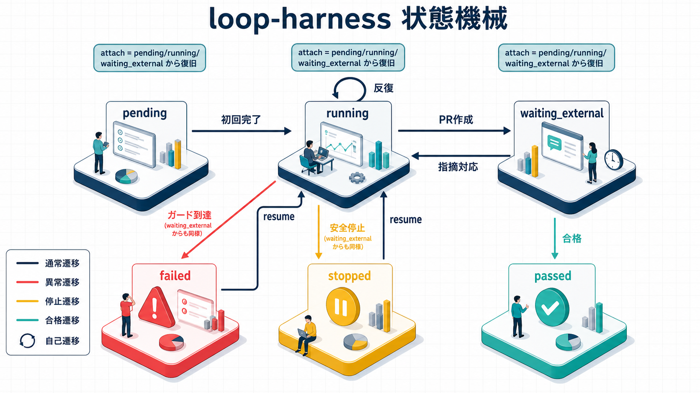

---
codd:
  node_id: "design:loop-harness-core"
  kind: design
  status: active
  depends_on:
    - id: "design:loop-harness"
      relation: refines
  owner: ai-orchestra
---

# Loop Harness（反復ループ基盤）詳細設計ドキュメント — core 編

**作成日**: 2026-07-06
**ステータス**: active（`loop_common.py` / `loop_definition.py` / `worktree_manager.py` の実装可能仕様）
**対象**: `feat/loop` ブランチ
**関連**: `design:loop-harness`（基本設計）・`req:loop-harness`（要件）

> 本書は `design:loop-harness`（基本設計）を **refines** する詳細設計である。基本設計が「何を・どう
> 構成するか」を定めたのに対し、本書は `loop_common.py` / `loop_definition.py` / `worktree_manager.py`
> の関数シグネチャ・スキーマ・アルゴリズムを実装者がそのまま着手できる粒度まで確定する。
> `loop_step.py` / `loop_driver.py` / `loop_scheduler.py` / `pr_review_wait.py` 等の CLI/実行系の
> 詳細設計は別紙（core 編の続編）に委ねる。本書は各章冒頭に「基本設計の該当節」を明記する。

---

## 0. 章構成と基本設計対応表

| 章  | 内容                           | 詳細化する基本設計の節          |
| --- | ------------------------------ | ------------------------------- |
| 1   | 状態機械の完全定義             | 5.2 節（スキーマ骨子）          |
| 2   | two-phase プロトコルの状態遷移 | 5.3 節・5.4 節・5.5 節          |
| 3   | ガード評価アルゴリズム         | 6.1 節・6.3 節・10.3 節         |
| 4   | 失敗シグネチャ正規化           | 6.2 節・10.1 節                 |
| 5   | CheckResult スキーマ確定       | 4 節・6 節                      |
| 6   | lock/fencing の API 仕様       | 5.1 節・5.2 節                  |
| 7   | journal 仕様                   | 5.1 節・5.2 節・5.4 節・10.2 節 |
| 8   | `loop_definition.py`           | 4 節                            |
| 9   | `worktree_manager.py`          | 3 節・7 節・10.1 節             |
| 10  | 詳細設計版 config 全キー       | 10.3 節                         |
| 11  | 基本設計との整合確認・申し送り | 12 節                           |

---

## 1. 状態機械の完全定義

> 基本設計 5.2 節（スキーマ骨子）を詳細化する。

### 1.1 `state.json` 全フィールド

```python
from dataclasses import dataclass, field
from typing import Literal, TypedDict

ActionType = Literal[
    "run_maker", "run_checker", "wait_external_review",
    "advance_phase", "stop", "exit_success", "exit_failure",
]
LoopStatus = Literal[
    "pending", "running", "waiting_external", "passed", "failed", "stopped",
]


@dataclass
class GuardCounters:
    """フェーズ単位のガードカウンタ（6 節）。"""

    iteration: int = 0
    no_progress_streak: int = 0
    last_signature: str | None = None
    infrastructure_failure_count: int = 0


@dataclass
class PendingAction:
    """propose が提案し complete 待ちの単一アクション（2 節）。"""

    action_id: str
    action: ActionType
    phase: str
    iteration: int
    issued_at: str  # ISO8601


@dataclass
class LastCompletedAction:
    """直近確定アクションの記録（complete の冪等応答用。2 節）。"""

    action_id: str
    state_version_before: int
    state_version_after: int
    result_digest: str  # sha256 of the completed CheckResult/effect payload
    completed_at: str


@dataclass
class LoopState:
    """`.claude/loop/<loop_id>/state.json` の正本スキーマ。"""

    schema_version: int
    loop_id: str
    definition_id: str
    repo_identity_hash: str
    phase: str
    iteration: int
    status: LoopStatus
    worktree_path: str
    branch: str
    pr_number: int | None
    guards: dict[str, GuardCounters]  # キー: フェーズ名
    last_check_result: dict | None  # PhaseCheckResult の JSON 表現（5 節）
    pending_action: PendingAction | None
    last_completed_action: LastCompletedAction | None
    stop_reason: str | None
    pr_review: dict | None  # pr_review_response フェーズの状態（Codex レビュー指摘反映。P2）。
    # スキーマは pr-review 編を正とする（本節では概要のみ）:
    #   - baseline: iteration_head_sha / baseline_review_id / baseline_recorded_at
    #     （pr-review 編 1.1 節。フェーズ各反復開始時、push/PR 作成の実行前に記録）
    #   - processed_comment_ids: "{source}:{id}" 形式で reviews/review_comments/issue_comments の
    #     3 種をネームスペースした dedup 済み ID 集合（pr-review 編 4.1 節）
    #   - findings: 指摘シグネチャ（pr-review 編 4.2 節）をキーとする dedup・無進捗判定用の
    #     指摘履歴マップ（pr-review 編 4.1 節）
    # `pr_review_response` フェーズに未到達の間は None。
    ignored_untrusted_comment_count: int  # 9.1 節
    created_at: str
    updated_at: str
    state_version: int
    maker_agent: str | None = None  # 初回選定後に固定。旧 state の欠落は None として読む。
```

`state.json` の JSON 例（`implementation` フェーズ 2 反復目・pending_action あり）:

```jsonc
{
  "schema_version": 1,
  "loop_id": "a1b2c3d4-issue-42",
  "definition_id": "issue-loop",
  "repo_identity_hash": "a1b2c3d4",
  "phase": "implementation",
  "iteration": 2,
  "status": "running",
  "worktree_path": "/repo/.worktrees/loop-issue-42",
  "branch": "loop/issue-42",
  "pr_number": null,
  "maker_agent": "backend-python-dev",
  "guards": {
    "implementation": {
      "iteration": 2,
      "no_progress_streak": 1,
      "last_signature": "3f9a2b1c4d5e6f70",
      "infrastructure_failure_count": 0,
    },
    "pr_review_response": {
      "iteration": 0,
      "no_progress_streak": 0,
      "last_signature": null,
      "infrastructure_failure_count": 0,
    },
  },
  "last_check_result": null,
  "pending_action": {
    "action_id": "act-7f3a2b",
    "action": "run_checker",
    "phase": "implementation",
    "iteration": 2,
    "issued_at": "2026-07-06T10:15:00+09:00",
  },
  "last_completed_action": {
    "action_id": "act-6a1b2c",
    "state_version_before": 10,
    "state_version_after": 11,
    "result_digest": "sha256:9f8e...",
    "completed_at": "2026-07-06T10:14:50+09:00",
  },
  "stop_reason": null,
  "pr_review": null, // pr_review_response フェーズ到達前は null（詳細スキーマは pr-review 編 1.1 節・4.1 節）
  "ignored_untrusted_comment_count": 0,
  "created_at": "2026-07-06T10:00:00+09:00",
  "updated_at": "2026-07-06T10:15:00+09:00",
  "state_version": 11,
}
```

- `iteration`（トップレベル）は `guards[phase].iteration` のミラーであり、現在フェーズの反復回数を
  表示用に即参照するための冗長フィールド。正本は `guards[phase].iteration` であり、両者は
  `_write_state()` 内で常に同期する。
- `guards` はフェーズごとに保持し続ける（フェーズを離れてもエントリは消さない）。将来同一フェーズへ
  戻る設計（現時点では発生しない）や、デバッグ時の反復履歴確認のため。

### 1.2 `status` 遷移表


_`status` の状態遷移を表す図（下表の内容に対応）_

| From                         | To                 | トリガー                                                                                    | 条件                                                                                        |
| ---------------------------- | ------------------ | ------------------------------------------------------------------------------------------- | ------------------------------------------------------------------------------------------- |
| (なし)                       | `pending`          | 初回 `propose`（`loop_id` 未存在）                                                          | worktree・branch 作成成功（`worktree_manager.create_worktree`）                             |
| `pending`                    | `running`          | 初回 `run_maker` の `complete`                                                              | `pending_action.action_id` 一致                                                             |
| `running`                    | `running`          | `complete` 確定 → `propose` が `continue`（`run_maker`）を返す                              | ガード評価: 不合格・無進捗未到達・反復上限未到達（3 節）                                    |
| `running`                    | `waiting_external` | `advance_phase` 確定、次フェーズが `checker.external_signal` を持つ                         | `propose` が `wait_external_review` を返す                                                  |
| `waiting_external`           | `waiting_external` | ポーリング未検知                                                                            | `timeout_seconds` 未到達（9 節）                                                            |
| `waiting_external`           | `running`          | 完了シグナル検知、新規指摘 > 0                                                              | `run_maker`（レビュー対応反復）へ継続                                                       |
| `running`/`waiting_external` | `passed`           | ガード評価①合格、かつ `on_success.disposition == exit_success`                              | 最終フェーズ到達                                                                            |
| `running`/`waiting_external` | `failed`           | ガード到達（無進捗 or 反復上限 or infrastructure_failure 上限到達）                         | `on_failure.disposition == exit_failure`（正規の失敗出口）                                  |
| `running`/`waiting_external` | `stopped`          | **安全停止 3 条件のみ**: push 前ガード違反 / repo-identity 不一致 / 他ホスト生存 lease 検知 | `propose` 冒頭または push 直前チェックが `stop` action を確定（3.2 節）。ガード評価とは独立 |
| `failed`/`stopped`           | `running`          | `loop_step resume --reset-counters`                                                         | `reset_counters=True` 必須（5.5 節）。フラグなしは拒否                                      |

`passed` / `failed` は基本設計 5.2 節スキーマ骨子どおり維持する。`stopped` は本書で新設し、`stale` は
本書では state の状態値として採用しない（詳細は 11 章の整合確認を参照）。

**`failed`（正規の失敗出口）と `stopped`（安全停止）の違い（4 文書共通の確定仕様）**

`infrastructure_failure` の上限到達（3 章）はここでいう安全停止ではなく、従来どおり `failed`
（正規の失敗出口）である点に注意する。安全停止は上記 3 条件のみに限定されるスコープの狭い機構であり、
「repo の同一性・安全性自体が疑わしい」状況専用である。

| 観点              | `failed`（正規の失敗出口）                                               | `stopped`（安全停止）                                                                                                                |
| ----------------- | ------------------------------------------------------------------------ | ------------------------------------------------------------------------------------------------------------------------------------ |
| 発生条件          | ガード到達（無進捗 / 反復上限 / infrastructure_failure 上限到達）        | push 前ガード違反・repo-identity 不一致・他ホスト生存 lease 検知の 3 条件のみ                                                        |
| `on_failure.exec` | **実行する**（Draft PR 作成等、ループ定義の `exec`）                     | **実行しない**（repo への書き込みを伴う出口 exec は一切実行しない。repo の同一性・安全性自体が疑わしい状況での書き込みは危険なため） |
| 通知              | ループ定義の `exec`（`notify` 等）に従う                                 | **必ず実行**（FT-19 充足）: macOS 通知は常時発火。Issue コメントは repo-identity が検証できている場合のみ投稿                        |
| journal / audit   | `completed`→ガード評価による `failed` 遷移の記録、`audit.loop_stop` emit | `stopped` journal イベントの記録必須、`audit.loop_stop` emit（`stop_reason` 付き）必須                                               |
| 人間の関与        | Draft PR 経由での引き継ぎ・再挑戦（resume 可）                           | **人間エスカレーション必須**（repo の同一性/安全性の確認そのものが人手判断のため）。resume 可                                        |

### 1.3 phase 遷移

phase 遷移はループ定義（8 章）の `phases[].on_success.next` に従う汎用規則で決まる。

```text
現在の phase の on_success.disposition が:
  advance_phase → 次 phase = on_success.next（loop_definition から解決）
                  → 次 phase の guards[phase] は既存値があればそのまま維持、無ければ 0 初期化
                  → state.phase = next、state.iteration = guards[next].iteration（通常 0 → 1 目の run_maker へ）
  exit_success  → state.status = "passed"（loop 終了。phase は現在値のまま）
  exit_failure  → state.status = "failed"（loop 終了。phase は現在値のまま）
```

2 本目以降のループ定義で phase が 3 つ以上ある場合も同じ規則で連鎖する（`loop_common.py` は
phase 数を決め打ちしない）。

### 1.4 `state_version` の増分規則

- 正本は `state.json` のみ（`lock.json` は持たない。基本設計 5.2 節）。
- `state.json` への書き込みが発生するたびに **1 ずつ増分**する。書き込みが発生する操作:
  - `propose`: `pending_action` を新設した書き込み
  - `complete`: 副作用適用 + `pending_action` クリア + `last_completed_action` 更新の書き込み
  - `reconcile`: 孤立 `pending_action` を解決した書き込み
  - `resume`: ガードカウンタをリセットした書き込み
- 増分**しない**操作: `heartbeat`（`lock.json` のみ更新。1.2 節・6 章）。
- `propose` が返す `state_version` は「その `propose` 呼び出し自身の書き込み後」の値であり、対応する
  `complete` はこの値をそのまま引数として要求される（2 章）。

---

## 2. two-phase プロトコルの状態遷移

> 基本設計 5.3 節（two-phase プロトコル）・5.4 節（reconcile）・5.5 節（クラッシュ回復・意図的再開）を
> 詳細化する。

### 2.1 関数シグネチャ

```python
@dataclass
class ProposeResult:
    action: ActionType
    action_id: str
    state_version: int          # この propose 呼び出し後の state_version
    expected_phase: str
    phase: str
    iteration: int
    context: dict  # advance_phase 時は verified_branch を含む（5.6 節）


@dataclass
class CompleteResult:
    ok: bool
    idempotent_replay: bool     # 同一 action_id への再送で前回結果を再応答したか
    state_version: int
    next_hint: str              # "call propose again" 等


def propose(loop_id: str, project_dir: str, lease_token: str) -> ProposeResult:
    """現在の state を読み、reconcile → ガード評価（3 節）を経て次アクションを決定する。

    内部で必ず reconcile()（2.4 節）を最初に実行してから、次アクションを journal に
    `pending` として記録し、state.pending_action を新設する。
    """


def complete(
    loop_id: str,
    project_dir: str,
    action_id: str,
    state_version: int,
    result: dict,
    lease_token: str,
) -> CompleteResult:
    """action_id / state_version を検証し、一致すれば副作用を適用して state を確定する。

    - last_completed_action.action_id == action_id の場合は再更新せず前回結果を再応答する（冪等性）。
    - pending_action が None、または action_id / state_version が不一致の場合は StaleActionError。
    """


def reconcile(loop_id: str, project_dir: str) -> "ReconcileOutcome":
    """孤立した pending action（complete を経ずに終わった action）を解決する（2.4 節）。

    propose() の内部から自動的に呼ばれるのが基本経路である。**加えて、手動診断・障害回復用に
    `loop_step reconcile` として CLI サブコマンドにも公開する**（cli 編 1.6 節が正。Codex レビュー
    指摘反映。P2）。旧記述は「CLI サブコマンドとしては公開しない」としていたが、これは cli 編 1.6 節
    （`reconcile` を明示的に呼び出せる独立サブコマンドとして提供する）と矛盾していた。両立させる
    設計とし、propose 内部からの自動呼び出しと、独立 CLI サブコマンドとしての手動呼び出しの
    いずれも同じ本関数を呼ぶ（cli 編 1.6 節参照）。
    """


def heartbeat(loop_id: str, project_dir: str, lease_token: str) -> bool:
    """lock.json の heartbeat_at のみを更新する（state.json には触れない。6 章）。"""


def resume(
    loop_id: str, project_dir: str, reset_counters: bool, owner_id: str, ttl_seconds: int
) -> LoopState:
    """failed/stopped からの意図的再開（5.5 節）。reset_counters=False は拒否する。

    **`lease_token` を引数に取らない（Codex レビュー指摘反映。P2）**: `resume` は前セッションが
    消滅した後の `failed`/`stopped` ループランへの入口であり、呼び出し元はそもそも有効な旧
    `lease_token` を持ち得ない（`lock.json` を読ませて自己申告させる経路は fencing 設計に反する）。
    `attach`（同節）と同様に **発行側**として、`resume` 自身が新しい `lease_token` を発行し、
    戻り値（`LoopState.pending_action` 等を含む状態、および cli 編 1.8 節の応答 JSON の
    `lease_token` フィールド）で呼び出し元へ返す。`attach` と異なり、対象状態を `failed`/`stopped`
    （ループが既に終了・安全停止済みで、正当な所有者が更新し続けている前提が無い状態）に限定して
    いるため、旧 lease の生存確認（`is_lease_alive()`）は行わず無条件に新しい lease を発行する。
    """


def attach(loop_id: str, project_dir: str, owner_id: str, ttl_seconds: int) -> ProposeResult:
    """`running`/`waiting_external` ループランに対し、新しい呼び出し元が `lease_token` を
    再取得してから続行する（cli 編 1.10 節。FT-22。Codex レビュー指摘反映。P2）。

    内部で `reacquire_lease()`（6.3 節。旧 lease が生存中なら `ForeignLeaseError`）を呼んで
    新しい `lease_token` を取得したのち、`propose()` と同じ reconcile → ガード評価ロジックを
    実行して次アクションを決定する。戻り値の `ProposeResult` は呼び出し側が保持すべき新しい
    `lease_token` を含む（`ProposeResult.context` 経由。1.10 節の応答 JSON 参照）。
    """
```

**`lease_token` の呼び出し契約（Codex レビュー指摘反映。P1。`design:loop-harness-cli` 1.9 節参照）**:
上記シグネチャの `lease_token: str` は、いずれも **呼び出し側（LP-1 オーケストレーター / LP-2
`loop_driver`）が保持し、引数として明示的に渡す値**である。`propose`/`complete`/`reconcile`/
`heartbeat` の実装は `validate_lease()`（6.3 節）でこの引数値と `lock.json.lease_token` を照合する
のみとし、**`lock.json` を独自に読み直して自己完結的に検証すること（呼び出し元の識別を伴わない
自己参照チェック）はしない**。この区別が無いと、TTL 失効後に別プロセスが新しい lease を取得した
場合でも「その時点の `lock.json` の値と一致するか」を自分自身に問うだけになり fencing が機能しない
（cli 編 1.9 節が詳細な CLI インターフェース契約を定義する）。

**`start`/`attach`/`resume` は lease_token を「発行する」側（Codex レビュー指摘反映。P2）**:
`propose`/`complete`/`reconcile`/`heartbeat` が既存の `lease_token` を**検証する**のに対し、
`start`（新規）・`attach`（クラッシュ・セッション断絶後の再取得。FT-22）・`resume`（正規終了・
安全停止からの意図的再開）の 3 関数は、いずれも新しい `lease_token` を**発行し呼び出し側へ返す**
側であるという非対称性を持つ。3 者の対象状態は排他的である（基本設計 5.5 節の表）。

### 2.2 各操作の事前条件・事後条件（state 不変条件）

| 操作        | 事前条件                                                                                                                                               | 事後条件                                                                                                                                          |
| ----------- | ------------------------------------------------------------------------------------------------------------------------------------------------------ | ------------------------------------------------------------------------------------------------------------------------------------------------- |
| `propose`   | `pending_action is None`（前回 `complete` 済み）、または reconcile で解消可能                                                                          | `pending_action != None`；`state_version += 1`；journal に `pending` イベント追記                                                                 |
| `complete`  | `pending_action.action_id == action_id` かつ `state.state_version == state_version`。または `last_completed_action.action_id == action_id`（冪等再送） | `pending_action = None`；`last_completed_action` 更新；`state_version += 1`；journal に `completed` 追記。合否確定時は guards/phase/status も更新 |
| `reconcile` | `pending_action != None` かつ対応する `completed` journal イベントが存在しない                                                                         | 副作用確認できれば `completed` 相当として記録・進行再開。確認不能なら `infrastructure_failure` として記録し新しい `propose` に委ねる              |
| `heartbeat` | `lock.json` が存在し `lease_token` が有効                                                                                                              | `lock.json.heartbeat_at` のみ更新。`state.json` は不変（`state_version` 不変）                                                                    |
| `resume`    | `state.status in {"failed", "stopped"}` かつ `reset_counters == True`（`lease_token` は事前条件に含まない。発行側のため。P2）                          | 対象フェーズの `guards` をリセット；`status → "running"`；`stop_reason = None`；`state_version += 1`；`lock.json` に新しい `lease_token` を発行   |

`state_version` が不一致な `complete` 呼び出し（stale）はすべて拒否され、例外 `StaleActionError` を
送出する。呼び出し側（オーケストレーター）はこれを検知したら `propose` から再実行する。

### 2.3 pending action の表現と冪等 complete

`pending_action` は 1.1 節のスキーマで表現する。`complete` の冪等性は次の 2 段判定で実現する。

```python
def complete(loop_id, project_dir, action_id, state_version, result, lease_token):
    validate_lease(loop_id, project_dir, lease_token)  # フェンシング（6 章）
    state = load_state(loop_id, project_dir)

    # 1. 冪等再送チェック（同一 action_id への complete 再送）
    if state.last_completed_action and state.last_completed_action.action_id == action_id:
        return CompleteResult(
            ok=True,
            idempotent_replay=True,
            state_version=state.last_completed_action.state_version_after,
            next_hint="call propose again",
        )

    # 2. stale チェック
    if (
        state.pending_action is None
        or state.pending_action.action_id != action_id
        or state.state_version != state_version
    ):
        raise StaleActionError(loop_id, action_id, state_version)

    # 3. 副作用適用（run_maker/run_checker/advance_phase 等。3 節のガード評価を含む）
    digest = sha256(json.dumps(result, sort_keys=True).encode()).hexdigest()
    apply_action_effect(state, state.pending_action.action, result)  # phase/status/guards を更新
    new_version = state.state_version + 1
    state.last_completed_action = LastCompletedAction(
        action_id=action_id,
        state_version_before=state_version,
        state_version_after=new_version,
        result_digest=digest,
        completed_at=now_iso(),
    )
    state.pending_action = None
    state.state_version = new_version
    state.updated_at = now_iso()

    # 4. journal を先に書く（durable な記録。Codex レビュー指摘反映。P2。6.4 節の順序に従う）
    append_journal_event(
        loop_id, project_dir, event="completed", action_id=action_id, state_version=new_version, ...
    )
    # 5. journal 追記が成功した後にのみ state.json を更新する（この間でクラッシュしても、
    #    journal にはイベントがあり state.json はまだ古い state_version のままという、
    #    reconcile（7 章）が想定する不整合パターンにのみ倒れる）
    _write_state(state, project_dir)  # 0600・atomic replace（6 章の fencing 検証込み）
    return CompleteResult(ok=True, idempotent_replay=False, state_version=new_version, next_hint="call propose again")
```

`last_completed_action` は直近 1 件のみ保持する（複数世代の巻き戻り再送は想定しない。二重報告は
「直前の 1 アクションの再送」のみを対象とする、基本設計 5.3 節の想定と一致させる）。

### 2.4 reconcile（詳細アルゴリズム）

```text
function reconcile(loop_id, project_dir):
    state = load_state(loop_id, project_dir)
    if state.pending_action is None:
        return ReconcileOutcome(action_taken="none")

    action_id = state.pending_action.action_id
    completed_event = find_journal_event(loop_id, project_dir, action_id, event="completed")
    if completed_event is not None:
        # journal には complete 相当の記録がある（応答がオーケストレーターに届かなかっただけ）
        apply_action_effect(state, state.pending_action.action, completed_event.payload)
        finalize_as_completed(state, action_id, completed_event.payload)
        return ReconcileOutcome(action_taken="resolved_from_journal")

    artifact = load_artifact(loop_id, project_dir, action_id, "check_result.json")
    if artifact is not None and state.pending_action.action == "run_checker":
        # artifact から CheckResult を復元（5.4 節 CheckResult 復元の優先順位 2）
        apply_action_effect(state, "run_checker", artifact)
        finalize_as_completed(state, action_id, artifact)
        return ReconcileOutcome(action_taken="resolved_from_artifact")

    if state.pending_action.action == "run_checker":
        # Checker は副作用を持たない読み取り検証のため、再実行は冪等（5.4 節優先順位 3）
        return ReconcileOutcome(action_taken="rerun_required")

    # run_maker 等、副作用を持つアクションは Maker の冪等性契約（既存ブランチ/PR/差分確認）に委ねる。
    # 副作用の有無をここでは確認できないため infrastructure_failure として記録し、
    # ガード評価（3 節）に乗せたうえで新しい propose を返す。
    mark_infrastructure_failure(state, reason="pending_action_unresolved_after_crash")
    return ReconcileOutcome(action_taken="marked_infrastructure_failure")
```

### 2.5 意図的再開（resume）とクラッシュ回復（reconcile）の違い

| 観点         | reconcile（2.4 節）                                  | resume（2.1 節・5.5 節）                    |
| ------------ | ---------------------------------------------------- | ------------------------------------------- |
| 起動契機     | `propose` 呼び出し時に自動実行                       | 人間が明示的に CLI を呼ぶ                   |
| 対象状態     | `pending_action` が残る `running`/`waiting_external` | `failed`/`stopped`（正規に終了したループ）  |
| カウンタ扱い | 変更しない（infrastructure_failure のみ加算）        | 明示的にリセット（`--reset-counters` 必須） |

---

## 3. ガード評価アルゴリズム

> 基本設計 6.1 節（評価順序）・6.3 節（infrastructure_failure）・10.3 節（既定値）を詳細化する。

### 3.1 確定値

| キー                                        | 確定値 |
| ------------------------------------------- | ------ |
| `guards.max_iterations`                     | `3`    |
| `guards.no_progress.repeat`                 | `2`    |
| `guards.infrastructure_failure.max_retries` | `3`    |

### 3.2 安全停止（stop）チェックの位置づけ（evaluate_guards とは独立）

**安全停止 3 条件（push 前ガード違反・repo-identity 不一致・他ホスト生存 lease 検知）は
`evaluate_guards()` の内部では検査しない。** これらは以下の 2 箇所で独立に検査され、`stop` action /
`stopped` 状態を確定させる（1.2 節）。

- **他ホスト生存 lease 検知**: `propose()` 冒頭（`reconcile()` 呼び出しより前）で
  `check_foreign_host()`（6 章）を呼ぶ。検知した場合は即座に `ProposeResult(action="stop", ...)`
  を返し、ガード評価・通常のアクション決定ロジックには一切進まない。
- **push 前ガード（ブランチ検証・repo-identity 照合、5.6 節）**: `on_success.exec` に `push` を含む
  アクション（`advance_phase`）の副作用適用時、`complete()` の効果適用フェーズで push 実行直前に
  検査する。違反時は `apply_action_effect()` が `status="stopped"` へ遷移させ、`on_success.exec`
  （`push`/`pr_create` 等の repo 書き込みを伴う出口処理）は一切実行しない。

**`evaluate_guards()` はこれら安全停止 3 条件を扱わない。** `evaluate_guards()` が扱うのは
合格判定・無進捗判定・反復上限判定・`infrastructure_failure` の 4 種のみであり、いずれの分岐も
遷移先は `passed` / `failed`（`on_failure.disposition` 経由）である。**`infrastructure_failure`
上限到達は安全停止ではなく、従来どおり `on_failure.disposition`（= `exit_failure` →
`status="failed"`）に遷移する。** Maker/Checker 実行環境側の一時的障害の累積と、repo の同一性・
安全性自体が疑わしい状況（安全停止 3 条件）は性質が異なるため、区別を維持する。

### 3.3 評価順序（擬似コード）

`infrastructure_failure` は 6.3 節の通り独立トラックであり、合格/無進捗/反復上限の 3 段評価より
**前**に分岐する（Checker 自体が成立しなかった＝Maker/Checker の実質的な成果を評価できていない
ため）。

```python
def evaluate_guards(
    state: LoopState,
    phase_check: "PhaseCheckResult",
    phase_def: "PhaseDefinition",
    config: dict,
) -> "GuardDecision":
    """安全停止（stop）の 3 条件はここでは検査しない（3.2 節）。ここで扱うのは合格/無進捗/
    反復上限/infrastructure_failure の 4 種のみであり、いずれも遷移先は passed/failed。
    """
    counters = state.guards.setdefault(state.phase, GuardCounters())
    infra_cfg = config["guards"]["infrastructure_failure"]["max_retries"]

    # 0. infrastructure_failure 分離トラック（6.3 節）
    # 注: 上限到達時の遷移先は stop ではなく、従来どおり on_failure（exit_failure → failed）。
    if phase_check.infrastructure_failure:
        counters.infrastructure_failure_count += 1
        if counters.infrastructure_failure_count >= infra_cfg:
            return GuardDecision(
                disposition=phase_def.on_failure.disposition,  # exit_failure（stop ではない）
                reason="infrastructure_failure_exhausted",
            )
        return GuardDecision(disposition="retry", reason="infrastructure_failure_retry")

    # ① 合格判定
    if phase_check.passed:
        counters.no_progress_streak = 0
        counters.last_signature = None
        counters.infrastructure_failure_count = 0
        return GuardDecision(
            disposition=phase_def.on_success.disposition,
            next_phase=phase_def.on_success.next,
        )

    # ② 無進捗判定
    if phase_check.signature == counters.last_signature:
        counters.no_progress_streak += 1
    else:
        counters.no_progress_streak = 1
        counters.last_signature = phase_check.signature
    if counters.no_progress_streak >= phase_def.guards.no_progress.repeat:
        return GuardDecision(disposition=phase_def.on_failure.disposition, reason="no_progress")

    # ③ 反復上限判定
    if counters.iteration >= phase_def.guards.max_iterations:
        return GuardDecision(disposition=phase_def.on_failure.disposition, reason="max_iterations")

    # 継続
    counters.iteration += 1
    return GuardDecision(disposition="continue", next_action="run_maker")
```

### 3.4 フェーズ別カウンタの持ち方

`state.guards` は `dict[phase_name, GuardCounters]`（1.1 節）。`implementation` と
`pr_review_response` は独立したカウンタを持ち、互いに影響しない（FT-15）。`infrastructure_failure_count`
も同様にフェーズ単位で管理する（PR ポーリングタイムアウトは `pr_review_response` のカウンタのみ加算し、
`implementation` の無進捗カウントには影響しない）。

### 3.5 `infrastructure_failure` の対象範囲

以下は `phase_check.infrastructure_failure = True` として扱う（Maker/Checker の成果物自体の評価には
使わない）:

- `checker.external_signal` のポーリングタイムアウト到達（9 節）
- LLM レビュアー（サブエージェント）起動そのものの失敗（Task 起動エラー等、レビュー内容以前の失敗）
- GitHub API（`gh api`）呼び出し失敗（認証エラー・レート制限等、指摘取得以前の失敗）

`checker.mechanical` の pytest/ruff 失敗（テスト不合格・lint 不合格）は `infrastructure_failure` では
なく通常の不合格（4 節のシグネチャで無進捗判定）として扱う。

---

## 4. 失敗シグネチャ正規化の確定仕様

> 基本設計 6.2 節・10.1 節（`failure_detector.analyze()` 再利用）を詳細化する。

### 4.1 `failure_detector.analyze()` からの変換

`packages/core/hooks/failure_detector.py` の `analyze(tool_name, tool_input, tool_response) -> dict | None`
は以下を返す（改修なしで利用）:

```python
{"failure_type": "test_failure", "error_type": "assertion", "detected_by": "output_pattern", "command_kind": "test"}
```

`checker.mechanical.commands`（例: `["pytest -q", "ruff check ."]`）は複数コマンドを持つため、
`loop_common.py` は各コマンドを個別に実行し `analyze()` にかけたうえで、以下のラッパーで
`MechanicalFailure` の列を組み立てる。

```python
import subprocess
from dataclasses import dataclass

import failure_detector as fd  # packages/core/hooks/failure_detector.py


@dataclass
class MechanicalFailure:
    command: str
    failure_type: str  # tool_error | test_failure | lint_failure | cli_failure
    error_type: str
    output: str


def run_mechanical_checks(
    commands: list[str], cwd: str, timeout_seconds: int
) -> list[MechanicalFailure]:
    """commands を順に実行し、失敗したものだけ MechanicalFailure として返す（空リスト=全合格）。"""
    failures: list[MechanicalFailure] = []
    for cmd in commands:
        proc = subprocess.run(
            ["bash", "-lc", cmd],
            cwd=cwd,
            capture_output=True,
            text=True,
            timeout=timeout_seconds,
        )
        tool_response = {"exit_code": proc.returncode, "stdout": proc.stdout + proc.stderr}
        result = fd.analyze("Bash", {"command": cmd}, tool_response)
        if result is not None:
            failures.append(
                MechanicalFailure(
                    command=cmd,
                    failure_type=result["failure_type"],
                    error_type=result["error_type"],
                    output=tool_response["stdout"],
                )
            )
    return failures
```

### 4.2 実装反復シグネチャ（テスト失敗）

```python
import hashlib
import re

_FAILED_NODEID_RE = re.compile(r"^FAILED\s+(\S+?)(?:\s+-\s+.*)?$", re.MULTILINE)
_RUFF_RULE_RE = re.compile(r"^\S+:\d+:\d+:\s+([A-Z]{1,4}\d{2,4})\b", re.MULTILINE)


def extract_failed_test_ids(output: str) -> list[str]:
    """pytest の `short test summary info` から失敗テスト nodeid 集合を抽出する。"""
    return sorted(set(_FAILED_NODEID_RE.findall(output or "")))


def extract_lint_rule_ids(output: str) -> list[str]:
    """ruff/lint 出力からルール ID 集合を抽出する（例: `foo.py:10:5: F401 ...` → `F401`）。"""
    return sorted(set(_RUFF_RULE_RE.findall(output or "")))


def _normalize_excerpt_for_hash(excerpt: str) -> str:
    """揮発情報（一時パス・アドレス・時刻・行番号）を除去し、抽出不能時のフォールバックに使う。"""
    text = re.sub(r"/(tmp|private/var/folders)/\S+", "<TMP>", excerpt or "")
    text = re.sub(r"0x[0-9a-fA-F]+", "<ADDR>", text)
    text = re.sub(r"\b\d{4}-\d{2}-\d{2}[T ]\d{2}:\d{2}:\d{2}(\.\d+)?\b", "<TS>", text)
    text = re.sub(r":\d+:", ":<LINE>:", text)
    return text.strip()


def _per_command_signature(f: "MechanicalFailure") -> str:
    """1 コマンド分の正規化シグネチャ（sha256[:16]）を返す。"""
    if f.failure_type == "test_failure":
        failed_ids = extract_failed_test_ids(f.output)
        if failed_ids:
            material = f"{f.failure_type}|{f.error_type}|" + ",".join(failed_ids)
        else:
            # 抽出不能（collection error 等）→ error_excerpt の正規化ハッシュにフォールバック
            material = f"{f.failure_type}|{f.error_type}|excerpt:{_normalize_excerpt_for_hash(f.output)[:2000]}"
    elif f.failure_type == "lint_failure":
        rule_ids = extract_lint_rule_ids(f.output)
        if rule_ids:
            material = f"{f.failure_type}|" + ",".join(rule_ids)
        else:
            material = f"{f.failure_type}|excerpt:{_normalize_excerpt_for_hash(f.output)[:2000]}"
    else:  # tool_error / cli_failure
        material = f"{f.failure_type}|{f.error_type}|excerpt:{_normalize_excerpt_for_hash(f.output)[:2000]}"
    return hashlib.sha256(material.encode("utf-8")).hexdigest()[:16]


def compute_implementation_signature(failures: list["MechanicalFailure"]) -> str:
    """`implementation` フェーズ全体（複数 mechanical コマンド）の無進捗判定キーを返す。

    基本設計 6.2 節の 2 つの正規化フォーミュラ（テスト: failure_type+error_type+失敗テスト
    nodeid 集合 / lint: ルール ID 集合）をコマンド単位のシグネチャとして採用し、
    `checker.mechanical.commands` が複数コマンドで同時に失敗した場合は、それらを結合した
    複合シグネチャを返す（申し送り事項の確定。12 節参照）。
    """
    per_command = sorted(_per_command_signature(f) for f in failures)
    combined = "|".join(per_command)
    return hashlib.sha256(combined.encode("utf-8")).hexdigest()[:16]
```

`failed_ids` が空になるケース（pytest の collection error でテスト単位まで分解できない場合等）は
`error_excerpt` の正規化ハッシュにフォールバックする（要求仕様どおり）。

### 4.3 PR レビュー対応シグネチャ

`pr_review_response` フェーズの無進捗判定（同一指摘の再提起、または新規指摘件数の非減少）は
9 節の実装（別紙で詳細化）に委ねるが、シグネチャ計算の型は本節と揃える。

**指摘シグネチャベースに修正（Codex レビュー指摘反映。P2）**: 当初はコメント ID
（`processed_comment_ids`）から直接フェーズシグネチャを計算していたが、この方式では同一の
未解消指摘であっても、Bot が次の反復で新しいコメント ID として再投稿するたびに別シグネチャに
なってしまい、「同一指摘の再提起」を検知できない欠陥があった。フェーズシグネチャは
pr-review 編 4.2 節の `normalize_signature()`（パス正規化 + 行範囲丸め + 指摘要旨の正規化ハッシュ）
が計算する**指摘シグネチャ**（dedup 後の `findings` マップ。pr-review 編 4.1 節）を入力とする。
コメント ID（`processed_comment_ids`）は dedup（同一コメントの二重処理防止）専用の役割に限定し、
フェーズシグネチャの計算には使わない。

```python
def compute_pr_review_signature(finding_signatures: list[str]) -> str:
    """処理対象の指摘シグネチャ集合（pr-review 編 4.2 節の `normalize_signature()` が返す値。
    dedup 後の `findings` マップ〔pr-review 編 4.1 節〕のキー集合）から、フェーズ全体の
    無進捗判定キーを計算する。
    """
    material = "|".join(sorted(set(finding_signatures)))
    return hashlib.sha256(material.encode("utf-8")).hexdigest()[:16]
```

無進捗の判定は「シグネチャ一致」に加えて「新規指摘件数が前回反復から減少しない」の OR 条件になる
（基本設計 6.2 節）。件数比較自体は `GuardCounters` に持たせず、`PhaseCheckResult`（5 節）の
`findings` 件数を `evaluate_guards` 呼び出し側（`loop_step.py`/`loop_driver.py`）が渡す想定とする。

### 4.4 `implementation` フェーズ `llm_review` 層のシグネチャ（Codex レビュー指摘反映）

**背景（ドリフト訂正）**: 従来の `combine_check_results`（5.2 節）は、`mechanical` が合格かつ
`llm_review` のみ不合格（Critical/High が残存）の場合、フェーズシグネチャを空文字列 `""` に
していた。この結果、指摘内容が反復ごとに変化（改善）していても、2 回連続で「レビューのみ不合格」
であれば指摘内容の異同にかかわらず無条件に同一シグネチャ扱いとなり、`guards.no_progress.repeat`
（既定 2）に誤ヒットする欠陥があった。

**修正**: `llm_ok` が `False` の場合、フェーズシグネチャに `llm_review` の指摘集合（critical/high の
み）から計算した正規化シグネチャを含める。正規化アルゴリズムは 4.2 節（PR レビュー指摘の
`normalize_signature`）と同方式（ファイルパス正規化 + 行範囲丸め + 指摘要旨の正規化ハッシュ）を
用いる。これにより指摘が変化していれば別シグネチャとなり、無進捗と誤判定されない。

```python
def _normalize_finding_key(f: "Finding") -> str:
    """1 件の Finding を 4.2 節の `normalize_signature` と同方式で正規化したキー文字列に変換する。"""
    path_norm = f.path.lstrip("./").replace("\\", "/") if f.path else "__general__"
    line_bucket = (f.line // 5) * 5 if f.line is not None else "__none__"
    body_norm = _normalize_excerpt_for_hash(f.summary)  # 4.1 節のヘルパーを流用
    return f"{path_norm}:{line_bucket}:{body_norm}"


def compute_llm_review_signature(findings: list["Finding"]) -> str:
    """`llm_review` 層の指摘集合から、critical/high のみを対象に正規化シグネチャを計算する。

    critical/high のみを対象とするのは、`pass_criteria` の合否判定自体が critical/high 件数のみを
    見ているため（5.2 節）。medium/low の増減で無進捗判定が乱れないようにする。
    """
    target = [f for f in findings if f.severity in ("critical", "high")]
    keys = sorted(_normalize_finding_key(f) for f in target)
    material = "|".join(keys)
    return hashlib.sha256(material.encode("utf-8")).hexdigest()[:16]
```

- `_normalize_excerpt_for_hash`（4.1 節）を summary の正規化にそのまま流用する（揮発情報除去の
  ロジックを共通化するため）。
- 本関数は 5.2 節の `combine_check_results` から、`mechanical` が合格かつ `llm_ok` が `False` の
  場合にのみ呼び出される。

---

## 5. CheckResult スキーマ確定

> 基本設計 4 節（`checker.mechanical` / `checker.llm_review`）・6 節を詳細化する。

### 5.1 単一 Checker 実行の結果（確定スキーマ）

```python
from typing import Literal


@dataclass
class Finding:
    severity: Literal["critical", "high", "medium", "low"]
    summary: str
    source: str  # 例: "pytest" | "ruff" | "code-reviewer" | "security-reviewer"
    path: str | None = None  # repo-relative POSIX パス。ファイルに紐づかない指摘は None（4.4 節）
    line: int | None = None  # 対象行番号。ファイルに紐づかない指摘は None（4.4 節）


@dataclass
class CheckResult:
    passed: bool
    layer: Literal["mechanical", "llm_review"]
    signature: str | None  # mechanical: 4 節の正規化シグネチャ。llm_review: 4.4 節の指摘正規化シグネチャ（フェーズ④で None から変更。7.5 節の開封検証が再計算一致を要求する）
    findings: list[Finding]
    raw_artifact_path: str  # artifacts/<action_id>/ 配下の相対パス
    infrastructure_failure: bool = False
```

`checker.external_signal`（`pr_review_response` フェーズ、9 節）は上記の `mechanical`/`llm_review`
のいずれにも該当しない別種の Checker であるため、`CheckResult` は流用せず別スキーマ
（`ExternalSignalResult`、別紙で詳細化）を用いる。これは基本設計 4 節が `checker.llm_review` の
必須/任意を `implementation` フェーズ限定として整理した区分と整合する。

### 5.2 フェーズ全体の集約結果

`implementation` フェーズは `mechanical` + `llm_review` の 2 層を必須で持つため（FT-06）、
ガード評価（3 節）へ渡す前に集約する。

```python
@dataclass
class PhaseCheckResult:
    passed: bool  # 全レイヤーが合格した場合のみ True
    results: list[CheckResult]  # 例: [mechanical の CheckResult, llm_review の CheckResult]
    signature: str  # 無進捗判定キー（4 節）。mechanical 起因の失敗、または llm_review のみ不合格
    # の場合の指摘正規化シグネチャ（4.4 節）のいずれか。両方合格時は ""
    infrastructure_failure: bool  # results いずれかが True なら True
    metadata: dict = field(default_factory=dict)  # フェーズ④追加: run-checker が reviewer manifest
    # （{"reviewers": [...]}) を格納する（7.5 節）。他の生成元では空 dict


def combine_check_results(
    results: list[CheckResult],
    pass_criteria: dict,
    required_layers: frozenset[str],
) -> PhaseCheckResult:
    """複数レイヤーの CheckResult を集約し、フェーズ全体の合否を判定する。

    required_layers は現在フェーズの loop 定義（`checker.mechanical`/`checker.llm_review` の
    宣言有無。基本設計 4 節・8.2 節）から呼び出し側が渡す、このフェーズで必須のレイヤー集合。
    `mechanical` は FT-05（全ループ共通の必須要件）により、`combine_check_results` を経由する
    フェーズでは常に `required_layers` へ含める。`llm_review` は `checker.llm_review` を宣言する
    フェーズ（`issue-loop` の `implementation` 等。FT-06）でのみ含める。

    pass_criteria は loop_definition の `checker.llm_review.pass_criteria`
    （例: {"critical": 0, "high": 0}）。llm_review レイヤーは critical/high 件数が
    pass_criteria を満たさなければ不合格として扱う。

    **必須層の存在チェックを合否判定より先に行う（Codex レビュー指摘反映。P1）**: `required_layers`
    に含まれる層の `CheckResult` が `results` に存在しない場合（Checker 実行自体が失敗した、
    フェーズ定義上必須の `llm_review` が未実行のまま渡された等）は、他の層が合格していても
    **暗黙合格にせず**、`infrastructure_failure` として不合格 + リトライ対象に倒す（3 節の
    infrastructure_failure 分離トラックへ委ねる）。従来は `mechanical` の欠落のみをこの扱いとし
    `llm_review` が欠落した場合は合否判定の初期値 `llm_ok = True` がそのまま通ってしまい、
    FT-05/FT-06/NF-03 の必須条件が silent に緩む欠陥があった。両層を同じ扱いに統一することで
    この抜け穴を塞ぐ。
    """
    mechanical = next((r for r in results if r.layer == "mechanical"), None)
    llm_review = next((r for r in results if r.layer == "llm_review"), None)
    layer_by_name = {"mechanical": mechanical, "llm_review": llm_review}

    # 1. 必須層の存在チェック（mechanical・llm_review のいずれの欠落も同じ扱い）
    missing_required = [name for name in required_layers if layer_by_name.get(name) is None]
    if missing_required:
        return PhaseCheckResult(
            passed=False,
            results=results,
            signature="",
            infrastructure_failure=True,
        )

    # 2. 各層の合否（この時点で required_layers に含まれる層は全て存在する）
    llm_ok = True
    if llm_review is not None:
        crit = sum(1 for f in llm_review.findings if f.severity == "critical")
        high = sum(1 for f in llm_review.findings if f.severity == "high")
        llm_ok = crit <= pass_criteria.get("critical", 0) and high <= pass_criteria.get("high", 0)

    infra = any(r.infrastructure_failure for r in results)
    if not mechanical.passed:
        signature = mechanical.signature
    elif not llm_ok:
        # mechanical 合格・llm_review のみ不合格（Codex レビュー指摘反映。4.4 節）:
        # 指摘内容が反復間で変化していれば別シグネチャとなるよう、llm_review 指摘の正規化
        # シグネチャを用いる（空文字列固定にしない）。
        signature = compute_llm_review_signature(llm_review.findings if llm_review else [])
    else:
        signature = ""
    return PhaseCheckResult(
        passed=mechanical.passed and llm_ok,
        results=results,
        signature=signature,
        infrastructure_failure=infra,
    )
```

`raw_artifact_path` は 7 章の artifact 保存契約に従い、各レイヤーの生出力（pytest ログ・ruff ログ・
LLM レビューの JSON）を指す相対パスとする。

---

## 6. lock/fencing の API 仕様

> 基本設計 5.1 節（配置と権限分離）・5.2 節（lock.json スキーマ・TTL 方針）を詳細化する。

### 6.1 `lock.json` 全フィールド

```python
@dataclass
class LockInfo:
    owner_id: str      # 例: "orchestrator-session-xxxx"（LP-1）/ "loop_driver-pid-12345"（LP-2）
    pid: int
    host: str
    started_at: str    # ISO8601
    heartbeat_at: str  # ISO8601
    ttl: int            # 秒
    lease_token: str    # secrets.token_hex(16)
```

### 6.2 TTL 確定値

| 実行形態 | TTL       | heartbeat 更新主体                                                                           |
| -------- | --------- | -------------------------------------------------------------------------------------------- |
| LP-1     | `3600` 秒 | `loop_step` の各サブコマンド呼び出し（`propose`/`complete`/`reconcile`/`heartbeat`）時に更新 |
| LP-2     | `300` 秒  | `loop_driver` 内のバックグラウンドスレッドが **60 秒間隔**で自律更新                         |

### 6.3 API 関数シグネチャ

```python
import os
import secrets
import socket


def acquire_lock(
    loop_id: str, project_dir: str, owner_id: str, ttl_seconds: int, host: str | None = None
) -> LockInfo | None:
    """新規 lease を取得する。

    - 既存 lock が同一ホストで生存中（TTL 内）→ None を返す（通常の取得失敗）。
    - 既存 lock が **他ホスト**で生存中（TTL 内）→ ForeignLeaseError を送出する（起動拒否）。
    - 既存 lock が stale（TTL 超過）→ TOCTOU 緩和のうえで奪取する
      （skill_evolution_common.acquire_lock の O_CREAT|O_EXCL パターンを踏襲）。
    """
    host = host or socket.gethostname()
    path = lock_path(loop_id, project_dir)
    _ensure_parent(path)
    try:
        fd = os.open(path, os.O_CREAT | os.O_EXCL | os.O_WRONLY, 0o600)
    except FileExistsError:
        existing = _read_lock(path)
        if existing is not None and is_lease_alive(existing):
            if existing.host != host:
                raise ForeignLeaseError(existing)
            return None
        if _read_lock(path) != existing:  # TOCTOU 緩和
            return None
        try:
            os.remove(path)
            fd = os.open(path, os.O_CREAT | os.O_EXCL | os.O_WRONLY, 0o600)
        except (OSError, FileExistsError):
            return None
    info = LockInfo(
        owner_id=owner_id,
        pid=os.getpid(),
        host=host,
        started_at=now_iso(),
        heartbeat_at=now_iso(),
        ttl=ttl_seconds,
        lease_token=secrets.token_hex(16),
    )
    with os.fdopen(fd, "w", encoding="utf-8") as f:
        json.dump(asdict(info), f)
    return info


def reacquire_lease(
    loop_id: str, project_dir: str, owner_id: str, ttl_seconds: int, host: str | None = None
) -> LockInfo:
    """`attach`（cli 編 1.10 節）の実体。既存の `running`/`waiting_external` ループランに対し、
    新しい呼び出し元（旧 `lease_token` を保持しない）が lease を再取得する（Codex レビュー指摘
    反映。P2。FT-22）。

    - 対象 `loop_id` に `lock.json` が存在しない場合は `LockNotFoundError` を送出する
      （`attach` は既存ループ専用であり、新規作成には使わない。新規は `acquire_lock`
      〔`start` の実体〕を使う）。
    - 既存 lease が **生存中**（`is_lease_alive()` が True）の場合は `ForeignLeaseError` を送出する
      （`attach` は exit `3` で拒否。1.10 節。二重 attach による同時書き込みを防ぐ）。
    - 既存 lease が stale（TTL 超過、または heartbeat 途絶）の場合のみ、`acquire_lock` と同じ
      TOCTOU 緩和パターンで `lock.json` を新しい `lease_token`（`secrets.token_hex(16)`）で
      上書きする。`owner_id`/`host`/`started_at` も呼び出し元の値で更新する（`pid`/`heartbeat_at`
      も再取得時刻で更新）。`ttl` は呼び出し元（LP-1/LP-2）の区分に応じた値を使う（6.2 節）。
    - `state_version` は `lock.json` が持たないため（基本設計 5.2 節: 正本は `state.json` のみ）、
      本関数は `state.json` に触れない。整合性は呼び出し元が続けて呼ぶ `propose`（内部で
      reconcile を実行。core 編 2.4 節）に委ねる。
    """


def release_lock(loop_id: str, project_dir: str, lease_token: str) -> bool:
    """lease_token が一致する場合のみ解放する。不一致は False（安全側。誤って他者の lock を消さない）。"""


def heartbeat_lock(loop_id: str, project_dir: str, lease_token: str) -> bool:
    """heartbeat_at を更新する。lease_token 不一致（他プロセスに奪取済み）なら False。"""


def validate_lease(loop_id: str, project_dir: str, lease_token: str) -> bool:
    """state/journal 書き込み直前に呼ぶフェンシングチェック。lease_token 一致 かつ TTL 内なら True。

    False の場合、呼び出し元（propose/complete/reconcile/resume）は WriteRejectedError を送出し、
    書き込みを行わない。
    """


def is_lease_alive(lock: LockInfo) -> bool:
    """heartbeat_at + ttl > now なら生存中とみなす。

    PID 生存確認はしない（skill_evolution_common._is_stale と同じ設計選択。ロングランの
    loop 実行では epoch/TTL 判定のみが安全であり、PID 確認は誤 stale 判定を招く）。
    """


def check_foreign_host(loop_id: str, project_dir: str, local_host: str | None = None) -> LockInfo | None:
    """既存 lock の host が local_host と異なり、かつ生存中（TTL 内）ならその LockInfo を返す。

    LP-2 の worker 起動時・LP-1 のセッション開始時に呼び出し、None 以外が返れば起動を拒否する
    （5.2 節: 複数マシンからの誤った同時運用を防ぐ）。
    """
```

### 6.4 書き込み手順の順序（基本設計 5.2 節の踏襲。Codex レビュー指摘反映。P2）

`state.json` / `journal.jsonl` への書き込みは常に次の順序で行う。

1. `validate_lease()` で `lease_token` を検証する（fencing）。
2. `journal.jsonl` に対応イベント（`completed`/`stopped` 等）を **先に** 追記する（durable な記録）。
3. `journal.jsonl` の内容に基づき `state.json` を更新する（`state_version` をインクリメント）。

当初は「`state.json` 更新 → `journal.jsonl` 追記」の順としていたが、この順序では両者の間で
クラッシュした場合に「新しい `state_version` の `state.json` に対応する `completed` イベントが
journal に存在しない」不整合を生み、journal を復元ソースとする reconcile（7 章）が当該反復の結果を
復元できなくなる。journal を先に書く順序にすることで、クラッシュ時は必ず「journal にはイベントが
あるが `state.json` がまだ古い `state_version` のまま」という、journal 優先で state を復元する
reconcile 方針（7 章・基本設計 5.4 節）と首尾一貫する不整合パターンにのみ倒れるようにする。

---

## 7. journal 仕様

> 基本設計 5.1 節（配置と権限分離）・5.2 節（journal スキーマ）・5.4 節（reconcile の CheckResult 復元）・
> 10.2 節（redaction 方針）を詳細化する。

### 7.1 全イベント型と payload スキーマ

| event                       | actor                                   | 発生タイミング                            | payload 要点                                                                   |
| --------------------------- | --------------------------------------- | ----------------------------------------- | ------------------------------------------------------------------------------ |
| `loop_created`              | `step`                                  | `state.json` 初回作成                     | `definition_id` / `worktree_path` / `branch` / `repo_identity_hash`            |
| `pending`                   | `step`                                  | `propose` が次アクションを決定            | `action` / `action_id` / `expected_phase`                                      |
| `completed`                 | `maker` / `checker` / `waiter` / `step` | `complete` が正常確定                     | `action` / `summary` / `guard_snapshot` / `check_result`（該当時）             |
| `reconciled`                | `step`                                  | `reconcile` が孤立 action を解決          | `resolved_by`（`journal`\|`artifact`\|`rerun_required`）/ `original_action_id` |
| `phase_advanced`            | `step`                                  | フェーズ遷移確定                          | `from_phase` / `to_phase` / `verified_branch`                                  |
| `stopped`                   | `step`                                  | `stop` action 確定（push 前ガード違反等） | `stop_reason`                                                                  |
| `resumed`                   | `step`                                  | `resume` 成功                             | `phase` / `reset_counters`                                                     |
| `ignored_untrusted_comment` | `waiter`                                | 9.1 節の非許可コメント検知                | `comment_id` / `login` / `author_association`                                  |

```jsonc
// completed イベントの例
{
  "ts": "2026-07-06T10:20:00+09:00",
  "loop_id": "a1b2c3d4-issue-42",
  "phase": "implementation",
  "iteration": 2,
  "action_id": "act-7f3a2b",
  "event": "completed",
  "actor": "checker",
  "payload": {
    "action": "run_checker",
    "check_result": {
      "passed": false,
      "signature": "3f9a2b1c4d5e6f70",
      "...": "...",
    },
    "guard_snapshot": {
      "iteration": 2,
      "no_progress_streak": 1,
      "infrastructure_failure_count": 0,
    },
  },
}
```

### 7.2 `artifacts/<action_id>/` 保存契約

```text
.claude/loop/<loop_id>/artifacts/<action_id>/
  mechanical_<n>.log            # 各 mechanical コマンドの生出力（redaction 適用済み）
  llm_review_<reviewer>.json    # レビュアーごとの CheckResult JSON（findings 含む）
  check_result.json             # PhaseCheckResult の集約結果（reconcile の復元元。5.4 節）
```

`save_artifact()` / `load_artifact()` は 0600 で読み書きし、`check_result.json` は必ず
`PhaseCheckResult` の JSON 表現（5 節）として保存する（reconcile の優先順位 2 の復元元）。

```python
def save_artifact(loop_id: str, project_dir: str, action_id: str, name: str, content: str) -> str:
    """artifacts/<action_id>/<name> に redaction 済み内容を書き込み、相対パスを返す。"""


def load_artifact(loop_id: str, project_dir: str, action_id: str, name: str) -> str | None:
    """artifacts/<action_id>/<name> を読む。存在しなければ None。"""
```

### 7.3 redaction 適用点

`redact()` は fail-logs（`packages/fail-logs/hooks/capture-failures.py` の `SECRET_PATTERNS`）と
同等のパターン集合を `loop_common.py` 側に移植・共有し、以下の書き込み直前に必ず適用する
（基本設計 10.2 節の対象チャネル表と一致）。

```python
def redact(text: str) -> str:
    """既知の機密情報パターンを [REDACTED] に置換する（fail-logs SECRET_PATTERNS 移植）。"""
```

| チャネル                       | 適用箇所                                                 |
| ------------------------------ | -------------------------------------------------------- |
| `artifacts/<action_id>/*`      | `save_artifact()` 内で書き込み直前に適用                 |
| `journal.jsonl` の `payload`   | `append_journal_event()` 内で共通適用                    |
| `audit.event_logger` への emit | payload 生成直後（呼び出し側の責務）                     |
| PR/Issue コメント・macOS 通知  | 投稿内容組み立て直後、API 呼び出し前（呼び出し側の責務） |

### 7.4 journal 突合検証（改ざん緩和策）

基本設計 12 節の申し送り「state 直接改ざんへの追加緩和策」に対する具体策として、`status` を
`passed` へ遷移させる直前に、直近の `completed` journal イベント（同一 `action_id`）に埋め込まれた
`CheckResult` のダイジェストと、これから `state.last_check_result` に書こうとしている内容の
ダイジェストが一致することを検証する。

```python
def _verify_journal_consistency(
    loop_id: str, project_dir: str, action_id: str, check_result_digest: str
) -> bool:
    """直近の journal `completed` イベント（同一 action_id）の CheckResult ダイジェストと一致するか検証する。

    不一致は state.json が journal と乖離している兆候（改ざん・破損）として扱い、
    passed への遷移を拒否する（IntegrityError を送出）。
    """
    event = find_journal_event(loop_id, project_dir, action_id, event="completed")
    if event is None:
        return False
    stored_digest = sha256(json.dumps(event.payload.get("check_result"), sort_keys=True).encode()).hexdigest()
    return stored_digest == check_result_digest
```

`apply_action_effect()` は `status = "passed"` に遷移させる分岐でのみこの検証を呼ぶ（`failed`/
`stopped` 等の遷移では検証しない。合格判定の改ざんによる不正な成功偽装を防ぐことが目的のため）。

### 7.5 Checker 結果の封緘検証（sealed checker。フェーズ④実装レビュー反映）

7.4 節の journal 突合が「state と journal の乖離」を検出するのに対し、本節は
「オーケストレーター（LLM）が Checker 判定そのものを捏造・改変して `complete` に渡す」経路への
追加緩和策である。FT-06（`issue-loop` の `implementation` フェーズにおける
`checker.llm_review` 省略不可）の**実行時強制**でもある（8.2 節のスキーマロード時検証は定義の
静的検証であり、実行時に渡される結果ペイロードの真正性は担保しないため、両者は補完関係にある）。

> **保証範囲の限定（Codex 設計レビュー反映）**: 本機構は暗号学的な来歴証明（attestation）では
> ない。shell 権限を持つ主体が自己整合的な封緘 artifact を直接書き込む攻撃は防げず、防御対象は
> あくまで「サンクションされた CLI フロー（`run-checker` → `complete`）内での、オーケストレーターの
> プロンプト逸脱・幻覚による判定の捏造・改変・取り違え」である。ファイルシステムレベルの改ざんへの
> 緩和は 0600 パーミッション（7.2 節）と 7.4 節の journal 突合に委ねる。

**適用範囲**: `definition_id == "issue-loop"` かつ `phase == "implementation"` の
`run_checker` アクション完了のみ。他ループ定義・他フェーズには強制しない
（`pr_review_response` フェーズの checker は `external_signal` 主体であり対象外）。

**仕組み（two-stage）**:

1. **封緘（seal）**: cli 編 1.11 節の `loop_step run-checker` が、機械検証の実行と LLM レビュー
   結果ファイルの取り込み・集約を**決定論的に**行い、redaction 適用済みの `PhaseCheckResult`
   JSON を `artifacts/<action_id>/check_result.json`（7.2 節の保存契約）に保存する。これが
   「封緘 artifact」であり、Checker 判定の正本となる。
2. **開封検証（verify-on-complete）**: `loop_step complete`（CLI レイヤ）は、対象が本節の
   適用範囲に該当する場合、
   (a) 封緘 artifact の存在を必須とし（欠落は `ProtocolViolationError`）、
   (b) artifact 内容をスキーマ・意味論の両面で検証し（下記。この検証関数は `loop_common.py` に
   置き、CLI から呼ぶ）、
   (c) 呼び出し側が `--result` で渡したペイロード（wrapper 形式の場合はその `check_result`
   フィールド。wrapper の兄弟フィールドは比較対象外）と封緘 artifact の **canonical JSON
   （`sort_keys=True`・区切り最小化）一致**を強制する。不一致はオーケストレーターによる
   改変とみなし拒否する。`reconcile` が artifact から `CheckResult` を復元する経路（5.2 節・
   7.2 節）でも同じスキーマ・意味論検証を適用し、不合格は `IntegrityError` とする。

**検証内容（`validate_implementation_checker_result()`）**:

- **スキーマ完全一致**: `PhaseCheckResult`／各層 `CheckResult`／`Finding` のキー集合が 5.1・5.2 節
  の確定スキーマと**過不足なく一致**すること（未知キーの混入も欠落も拒否）。キー集合定数は
  `loop_common.py` を単一ソースとし、他モジュールは同定数を import して用いる（二重定義しない）
- **層の構成**: `results` は `mechanical` と `llm_review` の 2 層をちょうど 1 つずつ含むこと
  （欠落・重複は拒否。3.5 節の「必須層欠落 = infrastructure_failure」より手前の、ペイロード
  形状そのものの検証）
- **reviewer manifest**: `metadata` は `{"reviewers": [...]}` のみを持ち、レビュアーは 1〜2 名・
  重複なし・`code-reviewer` を必ず含むこと（基本設計 FT-06 / pr-review 編 5.3.2 節の選定規則の
  実行時対応物）。`llm_review` 層の各 `Finding.source` は manifest 内のレビュアーであること
- **意味論の再計算**: `mechanical` 層の `findings` は空であること（4.1 節: 機械検証の詳細は
  `raw_artifact_path` 先の生ログが正本）、`infrastructure_failure` な層が `passed=True` で
  ないこと、`llm_review` の `passed`・`signature` を pass_criteria・4.4 節のシグネチャ計算で
  再計算して一致すること、フェーズ集約（`passed`/`signature`/`infrastructure_failure`）を
  `combine_check_results()` で再計算して一致すること。シリアライズ値と再計算値の矛盾は拒否する。
  **pass_criteria の単一ソース**: 封緘（`run-checker`）と開封検証の両方が、ループ定義の
  `checker.llm_review.pass_criteria` を同一の読み出し経路で参照する（片側のハードコード禁止。
  両者の食い違いは「封緘は成功するが complete で常に拒否される」壊れ方をするため）。なお
  `issue-loop` の `implementation` フェーズについては FT-06 の決定により `{critical: 0, high: 0}`
  が規範値であり、8.2 節の定義検証はこれと異なる値を持つ定義（`.local` の全体置換を含む）を
  `DefinitionValidationError` で拒否する。
  **redaction と署名の順序**: 封緘 artifact には redaction（7.3 節）適用済みの findings が入る
  ため、各層の `signature`・フェーズ集約 `signature` は **redaction 適用後の findings に対して**
  計算して封緘する（redaction 前に計算すると、開封検証の再計算と一致せず正当な結果まで拒否される）

**設計上の位置づけ**: 封緘 artifact は 7.2 節の `check_result.json` と同一ファイルであり、
新たな保存先は増やさない。検証はすべて決定論的（LLM 呼び出しなし）で、検証失敗は
「合格の暗黙成立」ではなく常に例外（拒否）に倒す（3.5 節の fail-safe 姿勢の踏襲）。

---

## 8. `loop_definition.py`

> 基本設計 4 節（ループ定義スキーマ）を詳細化する。

### 8.1 完全スキーマ（JSON Schema 風）

```jsonc
{
  "type": "object",
  "required": ["id", "trigger", "phases"],
  "properties": {
    "id": { "type": "string", "pattern": "^[a-z][a-z0-9-]*$" },
    "trigger": {
      "type": "object",
      "properties": {
        "lp1": {
          "type": "object",
          "properties": { "skill": { "type": "string" } },
        },
        "lp2": {
          "type": "object",
          "properties": {
            "kind": { "enum": ["label_queue", "cron"] },
            "label": { "type": "string" },
            "poll_interval_seconds": { "type": "integer", "minimum": 1 },
          },
        },
      },
    },
    "phases": {
      "type": "array",
      "minItems": 1,
      "items": {
        "type": "object",
        "required": [
          "name",
          "maker",
          "checker",
          "guards",
          "on_success",
          "on_failure",
        ],
        "properties": {
          "name": { "type": "string" },
          "maker": {
            "type": "object",
            "required": ["agent", "prompt_template"],
            "properties": {
              "agent": {
                "type": "string",
                "description": "cli-tools.yaml の agents.<name>.tool 解決キー。'auto' 可",
              },
              "prompt_template": { "type": "string" },
            },
          },
          "checker": {
            "type": "object",
            "properties": {
              "mechanical": {
                "type": "object",
                "properties": {
                  "commands": {
                    "type": "array",
                    "items": { "type": "string" },
                    "minItems": 1,
                  },
                  "analyzer": { "const": "failure_detector.analyze" },
                },
                "required": ["commands", "analyzer"],
              },
              "llm_review": {
                "type": "object",
                "properties": {
                  "baseline": { "type": "string" },
                  "selection": { "const": "skill-review-policy" },
                  "pass_criteria": {
                    "type": "object",
                    "properties": {
                      "critical": { "type": "integer" },
                      "high": { "type": "integer" },
                    },
                    "required": ["critical", "high"],
                  },
                },
                "required": ["baseline", "selection", "pass_criteria"],
              },
              "external_signal": {
                "type": "object",
                "properties": {
                  "source": { "const": "github" },
                  "events": { "type": "array", "items": { "type": "string" } },
                  "poll_interval_seconds": { "type": "integer", "minimum": 1 },
                  "timeout_seconds": { "type": "integer", "minimum": 1 },
                },
                "required": [
                  "source",
                  "events",
                  "poll_interval_seconds",
                  "timeout_seconds",
                ],
              },
            },
            "anyOf": [
              { "required": ["mechanical"] },
              { "required": ["external_signal"] },
            ],
          },
          "guards": {
            "type": "object",
            "required": ["max_iterations", "no_progress"],
            "properties": {
              "max_iterations": { "type": "integer", "minimum": 1 },
              "no_progress": {
                "type": "object",
                "required": ["signature", "repeat"],
                "properties": {
                  "signature": { "enum": ["implementation", "pr_review"] },
                  "repeat": { "type": "integer", "minimum": 1 },
                },
              },
            },
          },
          "on_success": {
            "type": "object",
            "required": ["disposition"],
            "properties": {
              "disposition": { "enum": ["advance_phase", "exit_success"] },
              "next": { "type": "string" },
              "exec": { "type": "array", "items": { "type": "string" } },
            },
          },
          "on_failure": {
            "type": "object",
            "required": ["disposition"],
            "properties": {
              "disposition": { "const": "exit_failure" },
              "exec": { "type": "array", "items": { "type": "string" } },
            },
          },
        },
      },
    },
    "notifications": {
      "type": "object",
      "properties": {
        "issue_comment": { "type": "boolean" },
        "macos_notification": { "type": "boolean" },
      },
    },
  },
}
```

### 8.2 検証ルール

```python
@dataclass
class LoopDefinition:
    id: str
    trigger: dict
    phases: list["PhaseDefinition"]
    notifications: dict


def load_and_validate(path: str) -> LoopDefinition:
    """YAML を読み込みスキーマ検証する。違反時は DefinitionValidationError を送出する。"""


def _validate(raw: dict, source_path: str) -> None:
    """必須キー・制約を検証する。

    - `id` は kebab-case（`^[a-z][a-z0-9-]*$`）。
    - `phases` は 1 件以上。各 phase は `name`/`maker`/`checker`/`guards`/`on_success`/`on_failure` 必須。
    - `checker` は `mechanical` または `external_signal` の少なくとも一方を持つ（FT-05）。
    - **`id == "issue-loop"` かつ `phase.name == "implementation"` の場合、`checker.llm_review` は
      省略不可**（FT-06。この制約は Issue 消化ループに限定し、他ループ定義の `implementation`
      という名前だけを理由に強制しない。将来 2 本目以降のループで同名フェーズを設けても、
      本ルールは `id` との組み合わせでのみ発火する）。
    - `on_success.disposition == "advance_phase"` の場合は `next` が必須（存在しない phase 名を
      指す場合は DefinitionValidationError）。
    - `on_success.disposition == "exit_success"` の場合は `next` を持たない（矛盾を検出する）。
    - `guards.no_progress.signature` は `implementation` / `pr_review` のいずれか（4 節で定義した
      シグネチャ計算のどちらを使うかの参照名）。
    """
```

### 8.3 ロード順序

1. `packages/loop-harness/config/loops/*.yaml`（配布ベース定義）
2. `.claude/config/loop-harness/loops/*.yaml`（プロジェクト側追加・上書き）

**マージ方式はキー単位の deep merge ではなく、`id` 単位の全体置換とする。** これは
`config-loading.md` が定める `*.local.yaml` のキー単位深いマージ規則（`loop-harness.yaml` 本体の
スカラー設定キーには引き続き適用する）とは異なる、ループ定義ファイル固有のポリシーである。

```python
def load_all_definitions(project_dir: str) -> dict[str, LoopDefinition]:
    """2 か所を走査し、id をキーに集約する。同一 id はプロジェクト側が完全に置き換える
    （ループ定義は宣言的な自己完結ユニットであり、フィールド単位の部分上書きは事故のもと
    となるため、意図的にファイル単位置換とする）。
    """
    definitions: dict[str, LoopDefinition] = {}
    for path in sorted(glob.glob(os.path.join(PACKAGE_LOOPS_DIR, "*.yaml"))):
        d = load_and_validate(path)
        definitions[d.id] = d
    for path in sorted(glob.glob(os.path.join(project_dir, ".claude/config/loop-harness/loops", "*.yaml"))):
        d = load_and_validate(path)
        definitions[d.id] = d  # 完全置換（同一 id ならプロジェクト側が勝つ）
    return definitions
```

2 本目以降のループはこのディレクトリへの YAML 追加のみで登録でき、`loop_common.py` の改修を
要しない（FT-01）。

---

## 9. `worktree_manager.py`

> 基本設計 3 節・7 節・10.1 節（`issue-fix` ヒューリスティックの移植）を詳細化する。

### 9.1 移植する判定ロジック

`facets/instructions/issue-fix.md`（Phase 2-1）の bash ヒューリスティックは「準備済みブランチの
判定」（`git rev-parse --git-dir` と `--git-common-dir` の比較 + base branch との差分）を目的とする。
loop-harness では常に専用 worktree を新規作成する（FT-03）ため、このロジックは「同一目的のブランチ
判定」ではなく、**既存 loop worktree の冪等性チェック**（同一 `loop_id` で再実行された場合に二重
作成しないための存在確認）に転用する。

```python
import subprocess


def _git(args: list[str], cwd: str) -> str:
    """git コマンドを実行し stdout を返す。失敗時は空文字列（呼び出し側で判定）。"""
    try:
        result = subprocess.run(
            ["git", *args], cwd=cwd, capture_output=True, text=True, timeout=5
        )
        return result.stdout.strip() if result.returncode == 0 else ""
    except (FileNotFoundError, subprocess.TimeoutExpired, OSError):
        return ""


def is_existing_loop_worktree(worktree_path: str, expected_branch: str) -> bool:
    """指定パスが既に当該ループ専用の worktree として機能しているかを判定する。

    issue-fix.md の判定ロジック（git-dir と git-common-dir の比較で「worktree 内か」を検知する
    手法）を移植し、ここでは「対象パスが独立 worktree であり、かつブランチが期待値と一致するか」
    の確認に用いる。
    """
    if not os.path.isdir(worktree_path):
        return False
    git_dir = _git(["rev-parse", "--git-dir"], cwd=worktree_path)
    git_common_dir = _git(["rev-parse", "--git-common-dir"], cwd=worktree_path)
    is_worktree = bool(git_dir) and bool(git_common_dir) and git_dir != git_common_dir
    current_branch = _git(["branch", "--show-current"], cwd=worktree_path)
    return is_worktree and current_branch == expected_branch
```

### 9.2 命名規則

| 対象          | 規則                                        | 例                               |
| ------------- | ------------------------------------------- | -------------------------------- |
| ブランチ      | `loop/issue-<N>`                            | `loop/issue-42`                  |
| worktree パス | `<root worktree>/.worktrees/loop-issue-<N>` | `/repo/.worktrees/loop-issue-42` |

ラベル別プレフィックス（`fix/`/`feat/`/`chore/`。`issue-fix` の慣習）は採用しない。`loop/` 固定
プレフィックスにより、`issue-fix` が作成する手動ブランチと loop-harness 起源のブランチを明確に
区別する（誤って手動ブランチを loop が上書きする事故を避ける）。

### 9.3 API

```python
@dataclass
class WorktreeInfo:
    path: str
    branch: str
    repo_identity_hash: str


def resolve_repo_identity_hash(project_dir: str) -> str:
    """remote URL 等リポジトリ固有値のハッシュを短縮して返す（5.1 節の repo-identity-hash）。"""


def compute_loop_id(project_dir: str, issue_number: int) -> str:
    """<repo_identity_hash 短縮>-issue-<Issue番号> を決定論的に採番する。"""


def branch_name_for(issue_number: int) -> str:
    """`loop/issue-<N>` を返す。"""


def worktree_path_for(project_dir: str, issue_number: int) -> str:
    """`<root worktree>/.worktrees/loop-issue-<N>` の絶対パスを返す。"""


def create_worktree(
    project_dir: str, issue_number: int, base_branch: str | None = None
) -> WorktreeInfo:
    """git worktree add + ブランチ作成。既に 9.1 節の判定で存在確認できればそれを再利用する（冪等）。

    base_branch 省略時は resolve_base_branch.py（git-workflow パッケージ）の解決結果を使う。
    """


def remove_worktree(project_dir: str, issue_number: int, force: bool = False) -> None:
    """`git worktree remove` を実行する。成功/失敗出口では自動的に呼ばれない
    （FT-23: 保持が既定。`loop_status.py` の明示的なクリーンアップ操作からのみ呼ばれる）。
    """


def verify_repo_identity(worktree_path: str, expected_hash: str) -> bool:
    """push 直前の repo-identity 照合（5.6 節 (b)）。worktree_path から再計算した
    repo-identity-hash が expected_hash と一致するかを返す。
    """
```

---

## 10. 詳細設計版 config 全キー（`loop-harness.yaml`）

> 基本設計 10.3 節の「オーダーレンジのみ」だった項目を、本書 3 章・6 章の確定値で埋める。

| キー                                        | 説明                                                           | 確定値 |
| ------------------------------------------- | -------------------------------------------------------------- | ------ |
| `guards.max_iterations`                     | フェーズ共通の反復上限                                         | `3`    |
| `guards.no_progress.repeat`                 | 無進捗停止のしきい値                                           | `2`    |
| `guards.infrastructure_failure.max_retries` | `infrastructure_failure` の連続許容回数                        | `3`    |
| `lock.ttl_seconds.lp1`                      | LP-1 の lease TTL（cli 編 5.1 節・5.2 節のキーパスに統一。P2） | `3600` |
| `lock.ttl_seconds.lp2`                      | LP-2 の lease TTL（同上）                                      | `300`  |
| `lock.heartbeat_interval_seconds`           | heartbeat 更新間隔（LP-1/LP-2 共通。同上）                     | `60`   |
| `pr_review.poll_interval_seconds`           | PR レビュー完了シグナルのポーリング間隔（基本設計既定を継続）  | `120`  |
| `pr_review.timeout_seconds`                 | 完了シグナル待機のタイムアウト（基本設計既定を継続）           | `3600` |
| `maker.allowed_agents`                      | Maker に選定できる実装可能ロールの positive allowlist          | config の 8 ロール |
| `maker.fallback_agent`                      | 検出不能時の Maker。`allowed_agents` 内でなければならない       | `general-purpose` |

初回 `run_maker` の `complete` または completed journal の `reconcile` で
`result.maker.agent` を `maker.allowed_agents` に照合し、合格した値だけを `state.maker_agent` に一度保存する。
`issue-loop` では `maker.agent` の欠落・空値・非文字列を journal 書き込み前に拒否する。保存後は完了結果の
agent が保存値と一致することを必須とし、不一致も拒否する。以後は上書きせず、すべての `run_maker`
proposal が保存済み値を返す。旧 state でフィールドが欠落する場合は `None` として読み、ループ定義の
`maker.agent: auto` を返して初回選定を行う。

`pr_review.reviewer_allowlist` / `lp2.concurrency_limit` / `lp2.wall_clock_timeout_seconds` /
`retention.purge_after_days` は `loop_step.py`/`loop_scheduler.py`/`loop_status.py` の詳細設計
（別紙）で確定する（本書は `loop_common.py`/`loop_definition.py`/`worktree_manager.py` の
スコープに限定するため）。

---

## 11. 基本設計との整合確認・矛盾報告（ドリフトプロトコル対象）

以下は基本設計を否定するものではなく、詳細化の過程で確定・具体化した内容だが、基本設計側の
記述と字面上ずれるため、明示的に報告する。

| #   | 内容                                                                                                                                                                                                                                                                                                                                                                                                                                                                                                               | 扱い                                                                                                                                                                                                          |
| --- | ------------------------------------------------------------------------------------------------------------------------------------------------------------------------------------------------------------------------------------------------------------------------------------------------------------------------------------------------------------------------------------------------------------------------------------------------------------------------------------------------------------------ | ------------------------------------------------------------------------------------------------------------------------------------------------------------------------------------------------------------- |
| 1   | 基本設計 5.2 節の `state.json` 骨子コメントは `status` を `running \| passed \| failed \| waiting_external \| stale` と列挙していたが、本書は two-phase プロトコル（5.3 節）の「ループ作成直後・初回 complete 前」を表す `pending`、および push 前ガード違反・repo-identity 不一致・他ホスト生存 lease 検知による安全停止を表す `stopped` を新設し、`stale` は state の状態値としては採用しなかった（`stale` はロック/lease の生存判定〔6 章 `is_lease_alive`〕の性質であり、loop 自体の状態ではないと整理した）。 | **解消済み（基本設計 5.2 節反映済み）**。基本設計 5.2 節の `status` 列挙は `pending \| running \| waiting_external \| passed \| failed \| stopped` に更新済み（別エージェント対応）。本書とのずれは解消した。 |
| 2   | 基本設計 5.2 節の `state.json` 例は `"branch": "issue-42-fix"` を例示しているが、これは説明用の仮の値であり、正式なブランチ命名規則としては規定されていなかった。本書 9.2 節で `loop/issue-<N>` を確定値とした。                                                                                                                                                                                                                                                                                                   | **軽微・非矛盾**。基本設計側の例をこの命名規則に合わせて更新することを推奨する（機能的な矛盾ではない）。                                                                                                      |
| 3   | 基本設計 5.3 節の `action` 語彙に `stop` が含まれていたが、どの条件で発生するかは明記されていなかった。本書 1.2 節・7.1 節で「push 前ガード違反・repo-identity 不一致・他ホスト生存 lease 検知」の 3 条件に確定した。                                                                                                                                                                                                                                                                                              | **非矛盾・確定のみ**。基本設計の申し送り事項（12 節）を解消する形での具体化。                                                                                                                                 |
| 4   | 基本設計 4 節の「`checker.llm_review` は `implementation` フェーズでは省略不可」という記述は、字面上フェーズ名にのみ依存するように読めるが、同節の直後の表は「Issue 消化ループ」限定である旨も併記している。本書 8.2 節では検証ルールを `id == "issue-loop" かつ phase.name == "implementation"` の組み合わせで確定し、将来の別ループが偶然 `implementation` という名前のフェーズを持っても強制されないようにした。                                                                                                | **非矛盾・具体化**。基本設計側の表現の曖昧さを解消したが、意図（Issue 消化ループ限定）とは整合している。                                                                                                      |

上記 1 は状態値の列挙という基本設計の記述と直接不一致になるため、基本設計ドキュメントの
更新を推奨していたが、基本設計側の 5.2 節反映により解消済みである（項目 1）。他は申し送り事項の
具体化であり矛盾ではない。

---

## セルフチェック

- **章立て網羅**: 依頼された 9 項目（状態機械 / two-phase / ガード評価 / 失敗シグネチャ / CheckResult /
  lock・fencing / journal / `loop_definition.py` / `worktree_manager.py`）をすべて章として収録した。
- **確定値の反映**: `max_iterations=3` / `no_progress.repeat=2` / `infrastructure_failure.max_retries=3` /
  lock TTL（LP-1: 3600s・LP-2: 300s+60s heartbeat）を明記済み。
- **既存資産の踏襲**: `skill_evolution_common.py` の TOCTOU 緩和付き lock 取得パターン、
  `failure_detector.analyze()` の実シグネチャ、`capture-failures.py` の `_append_secure_jsonl` /
  `SECRET_PATTERNS` 前例をそれぞれ 6 章・4 章・7 章で明示的に踏襲した。
- **基本設計との整合確認**: 11 章で 4 件を報告済み。うち 1 件（`status` 列挙の要更新）は基本設計
  5.2 節の反映により解消済み。安全停止（`stop`/`stopped`）の発生条件・意味論は 4 文書共通の確定
  仕様として 1.2 節・3.2 節に反映済み。
