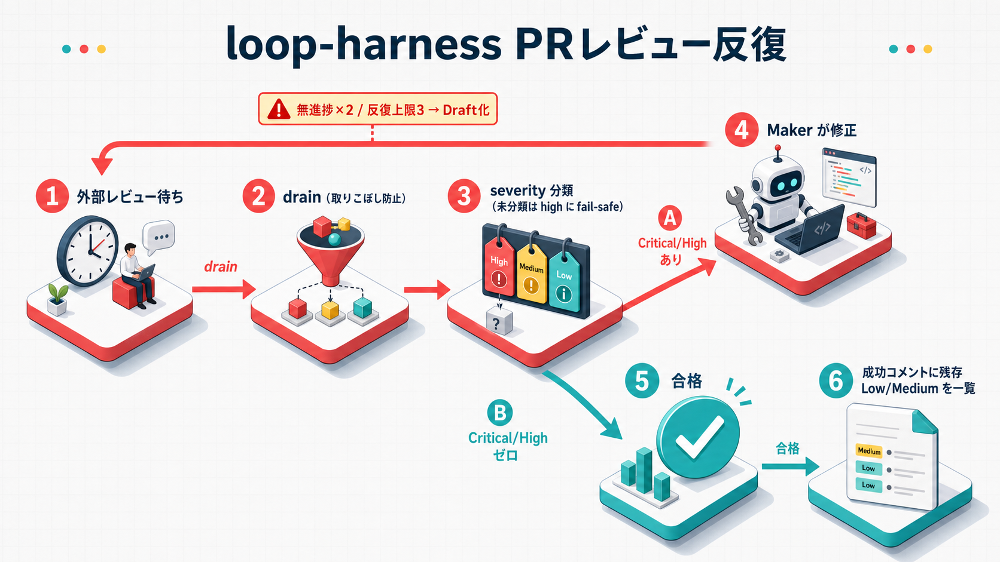

---
codd:
  node_id: "design:loop-harness-pr-review"
  kind: design
  status: active
  depends_on:
    - id: "design:loop-harness"
      relation: refines
  owner: ai-orchestra
---

# Loop Harness — PR レビュー対応 / `/loop-issue` スキル 詳細設計書

**作成日**: 2026-07-06
**ステータス**: active（詳細設計。実装可能粒度）
**対象**: `feat/loop` ブランチ
**関連**: `design:loop-harness`（本書はその 7 節・9 節・9.1 節を精緻化する refines 文書）

> 本書は基本設計（`docs/design/loop-harness.md`）12 節で詳細設計フェーズへ申し送られた事項のうち、
> 「外部指摘の severity 判定ロジック」「PR レビュー完了シグナルの詳細」「失敗シグネチャ正規化の詳細
> （PR 指摘側）」を確定し、あわせて `/loop-issue` スキル（LP-1）の実行手順を実装可能粒度まで落とし込む。
> 基本設計で確定済みの制御実行モデル・state/journal スキーマ・ガード評価順序・two-phase プロトコルは
> 改変しない（そのまま前提とする）。

---

## 0. 位置づけと本書のスコープ

> 基本設計参照: 7 節（LP-1 実行フロー）、9 節（PR レビュー対応フロー）、9.1 節（発信元検証）

基本設計は「何を・どう構成するか」を定めたが、以下は詳細設計に委ねられていた（基本設計 12 節）。

| 申し送り事項（基本設計 12 節）          | 本書での対応節 |
| --------------------------------------- | -------------- |
| 外部指摘の severity 判定ロジック        | 3 節           |
| PR レビュー完了シグナルの詳細           | 1 節           |
| 失敗シグネチャ正規化の詳細（PR 指摘側） | 4 節           |
| （追加）`/loop-issue` スキルの実行手順  | 5 節           |
| （追加）通知テンプレートの具体化        | 6 節           |

本書が新たに導入する config キー・振る舞いは、基本設計 10.3 節の config テーブルへの**追加**であり、
既存キーの意味を変更しない（1 点を除く。1.2 節で明記する）。


_PR レビュー対応ループと Codex 自動レビューの関係を示す図_

---

## 1. `pr_review_wait.py` の仕様

> 基本設計参照: 9 節（PR レビュー対応フロー冒頭）、10.3 節（`pr_review.*` config）

### 1.1 完了シグナル検知

`pr_review_wait.py` は「レビューが実行されたかどうか」を判定する。基本設計 9 節の要求どおり、
**コメントの有無では判定しない**（コメント 0 件の完了と、未実行を区別する）。

#### baseline 記録（push/PR 作成 直前）

**手順の順序（ドリフト訂正。Codex レビュー指摘反映）**: ① baseline 記録 → ② push（または初回の
`pr_create`）→ ③ ポーリング開始、の順序を必ず守る。`pr_review_response` フェーズの各反復開始時、
`on_success.exec` が `push`（レビューをトリガーするイベント）を**実行する前**に、以下を
`state.json` へ記録する。

```jsonc
{
  "pr_review": {
    "iteration_head_sha": "abcd1234...", // push 完了後に別途取得する、このイテレーションの head commit sha
    "baseline_review_id": 918273645, // push/PR作成の実行前時点で存在した reviews の最大 id（無ければ 0）
    "baseline_recorded_at": "2026-07-06T10:29:00+09:00", // push/PR作成より前の記録時刻
  },
}
```

- `baseline_review_id` は `gh api repos/{o}/{r}/pulls/{pr}/reviews` を **`push`（または初回の
  `pr_create`）を実行する前**に 1 回呼び、返却された review オブジェクトの `id` の最大値を採る
  （PR がまだ存在しない初回作成前は 0）。
- **レース条件への対処（ドリフト訂正）**: 当初は baseline を push 完了後に記録する順序としていたが、
  push 完了から baseline 記録までの間隙に Codex 等の自動レビューが提出されると、そのレビューが
  誤って baseline に取り込まれ、`id > baseline_review_id` フィルタで唯一のレビューを取りこぼし
  （`pr_review.timeout_seconds` まで検知できない）不具合があった。baseline を push/PR 作成という
  「レビューをトリガーするイベント」より**前**に記録することで、この間隙自体をなくす。
- `iteration_head_sha` は `gh api repos/{o}/{r}/pulls/{pr} --jq .head.sha` で取得した push **完了後**の
  head commit sha（baseline とは異なり、push 後にしか値が定まらないため取得順序は逆になる）。
  check-run はコミット sha にスコープされる GitHub API 仕様のため、この sha を使う限り「前回反復の
  check-run」を誤って今回の完了シグナルとして拾うことは起きない（sha が変われば check-run の集合も
  別物になる）。したがって check-run 側には reviews のような baseline id 管理は不要で、
  「`iteration_head_sha` に対する check-run」を見るだけで自然にスコープが今回反復に限定される。
- baseline 記録タイミングを **push/PR 作成の実行前** に固定することで、「レビュー未実行・実行中」
  （baseline 以降に新規 review が 0 件）と「完了かつ指摘ゼロ」（baseline 以降に新規 review が
  1 件以上あり、そのレビューに紐づく review comment が 0 件）を実装レベルで区別できる。

#### 検知ロジック（正 / フォールバック）

```text
loop:
    reviews = gh api repos/{o}/{r}/pulls/{pr}/reviews
    new_reviews = [r for r in reviews if r.id > baseline_review_id and allowlist_match(r)]  # 9.1 節
    if new_reviews:
        signal = REVIEW_SUBMITTED
        break

    check_runs = gh api repos/{o}/{r}/commits/{iteration_head_sha}/check-runs
    allowlisted_runs = [c for c in check_runs if c.name in pr_review.checkrun_allowlist]
    if allowlisted_runs and all(c.status == "completed" for c in allowlisted_runs):
        signal = CHECK_RUN_COMPLETED
        break

    if elapsed >= pr_review.timeout_seconds:
        signal = TIMEOUT
        break

    sleep(pr_review.poll_interval_seconds)
```

- **正シグナル**: `pulls/{pr}/reviews` の review 提出イベント（`state`: `COMMENTED` /
  `CHANGES_REQUESTED` / `APPROVED`）。`id > baseline_review_id` かつ 9.1 節の発信元検証を通過した
  ものだけを対象とする。
- **フォールバックシグナル**: `commits/{sha}/check-runs` の完了（`status: completed`。`conclusion`
  の値〔`success`/`neutral`/`failure` 等〕は問わない）。Codex の GitHub 連携が正式な review
  オブジェクトを作らず check-run 経由で結果を返す実装形態を取る場合に備える。対象 check-run 名は
  `pr_review.checkrun_allowlist`（config、任意項目。未設定ならフォールバック経路自体を無効化し、
  正シグナルのみで待機する）で絞り込む。
- 両シグナルとも検知されないまま `pr_review.timeout_seconds` に到達した場合は 1.2 節の扱いに従う。

### 1.2 ポーリングとタイムアウトの扱い

- ポーリング間隔: `pr_review.poll_interval_seconds = 120`（**120 秒**）
- 完了待機の全体タイムアウト: `pr_review.timeout_seconds = 3600`（60 分）

**この完了待機タイムアウトは `infrastructure_failure` ではなく、`pr_review_response` フェーズの
無進捗（No-Progress）としてカウントする。** 具体的には、`guards.no_progress` のカウンタを 1
インクリメントした上で 6 節（基本設計 6.1 節）のガード評価順序に乗せる（無進捗連続 2 回で失敗出口）。

> **基本設計との整合（要件 FT-13 準拠。基本設計側も本方針に整合済み）**
> 要件定義 FT-13 は「完了シグナルが得られない場合に備えタイムアウト付き待機とし、**タイムアウトは
> 無進捗扱いとしてガードに乗せる**」と明記している。基本設計 9 節・6.3 節も本方針（完了待機タイムアウト
> = 無進捗、個々の API 呼び出し失敗 = `infrastructure_failure`）に整合済みであり（別文書での修正反映）、
> 本書は要件定義 FT-13 を優先し、完了待機の全体タイムアウト（`pr_review.timeout_seconds` 到達）を
> 無進捗としてカウントする設計で確定する。
>
> 基本設計 6.3 節の `infrastructure_failure` 概念自体は無効化しない。以下のように**責務を分離**
> することで両者を矛盾なく両立させる。
>
> | 事象                                                                                                 | 扱い                                                                                                                                                             |
> | ---------------------------------------------------------------------------------------------------- | ---------------------------------------------------------------------------------------------------------------------------------------------------------------- |
> | 個々の `gh api` 呼び出し失敗（5xx、network error、rate limit 応答）                                  | `infrastructure_failure` カウンタ（基本設計 6.3 節）。指数バックオフで同一ポーリング周期内リトライし、`guards.infrastructure_failure.max_retries` 到達で失敗出口 |
> | `pr_review.timeout_seconds` 到達（API 呼び出し自体は成功し続けたが、シグナルが一度も得られなかった） | 無進捗カウンタ（本節。要件定義 FT-13 準拠）                                                                                                                      |

### 1.2.1 push_required 時の no_new_commit ショートカット

`pr_review_response` フェーズの Maker がコード変更を作らない場合がある。たとえば、Maker が既存状態で
レビュー指摘を満たしていると判断した場合、または実際には対応行動を取れなかった場合である。従来はこの場合も
`push_required: true` 経路が no-op push 相当で進み、完了シグナルが得られないまま
`pr_review.timeout_seconds`（既定 3600 秒 = 60 分）まで poll してから無進捗として検知していた。
しかし「push すべき新規 commit が無い」ことは、待機前に決定論的に検出できる。

検出シグナルは Maker の自己申告に依存しない。直前の正常な push 直後に `record_iteration_head()` が
GitHub API から取得して `state.pr_review["iteration_head_sha"]` に保存した PR head sha と、現在の
worktree で `git rev-parse HEAD` が返す local HEAD sha を比較する。両者が完全一致する場合、
local branch には前回 push 済み head から進んだ commit が存在せず、push すべき新規 commit は無い。

| 比較結果                                   | 扱い                                                                                                   |
| ------------------------------------------ | ------------------------------------------------------------------------------------------------------ |
| `iteration_head_sha == git rev-parse HEAD` | `no_new_commit`。baseline 記録・push・poll を省略し、timeout 相当の無進捗結果へ直行する                |
| 両 sha が取得でき、かつ不一致              | `new_commit`。従来どおり baseline 記録 → push → `record_iteration_head()` → wait / poll / collect する |
| どちらかの値が取得できない                 | `unknown`。安全側フォールバックとして従来フローを続行する                                             |

`unknown` はショートカットとして扱わない。git コマンド失敗、worktree が不正、または
`iteration_head_sha` が未記録（初回反復の境界条件など）の場合は、情報不足だけを理由に push / poll を
省略してはならない。必ず既存の full flow（baseline 記録 → push → `record_iteration_head()` →
wait / poll / collect）へフォールバックする。

> **guard 合格後にだけ判定する**
> no_new_commit ショートカットの判定は repo identity / branch guard の再検証に合格した後にのみ行う。
> guard 不合格の場合はショートカットを検討せず、従来どおり `push_guard` を含む結果で complete し、
> `_apply_safety_stop_if_needed()` による `push_guard_violation` / `repo_identity_mismatch` への安全停止を
> 優先する。worktree のブランチがすり替わっていた場合等に、guard を経由せず `pr_review_timeout` として
> 無進捗扱いにしてしまうことを防ぐための順序である。

`no_new_commit` を検出した場合の結果は、新しい失敗カテゴリではない。library は
`timed_out=True`、`infrastructure_failure=False` の timeout-shaped `CompletionOutcome` を返し、
metadata に `shortcut_reason: "no_new_commit_to_push"` と比較に使った
`local_head_sha` / `iteration_head_sha` を載せる。この outcome は実際の poll timeout と同じ
`phase_check_from_completion_outcome()` を通り、`pr_review_timeout` signature として
FT-13 の無進捗 guard 経路に集計される。

> **設定キーは追加しない**
> この判定は常に有効である。完全一致した sha に基づく latency optimization であり、情報が欠ける場合は
> 必ず既存フローへ戻るため、正しさのトレードオフや disable 用 config key は導入しない。

オーケストレーター（`/loop-issue` の skill instructions）は `CompletionOutcome` や
`PhaseCheckResult` を手書きで構築してはならない。必ず `pr_review_wait.py` の決定論 API である
`detect_pr_review_push_delta()` と `no_new_commit_completion_outcome()` を呼び、その結果を
`phase_check_from_completion_outcome()` へそのまま渡す。

### 1.3 コメント取得（3 API の使い分け）

完了シグナル検知後、以下 3 種類の API を組み合わせて指摘一覧を構築する。

| API                                       | 用途                                                                                                        | 主要フィールド                                                                               |
| ----------------------------------------- | ----------------------------------------------------------------------------------------------------------- | -------------------------------------------------------------------------------------------- |
| `GET /repos/{o}/{r}/pulls/{pr}/reviews`   | レビュー提出イベントそのもの（1.1 節の完了シグナル検知に使用）。`body` にレビュー全体の総評が入る場合がある | `id`, `user.login`, `user.type`, `state`, `body`, `submitted_at`, `performed_via_github_app` |
| `GET /repos/{o}/{r}/pulls/{pr}/comments`  | diff に紐づくインライン指摘（ファイル・行単位の個別指摘）。severity 判定・dedup の主対象                    | `id`, `path`, `line`/`original_line`, `body`, `user.login`, `pull_request_review_id`         |
| `GET /repos/{o}/{r}/issues/{pr}/comments` | diff に紐づかない会話コメント（レビュー総括のサマリコメント等をここに投稿する bot 実装に対応）              | `id`, `body`, `user.login`, `created_at`                                                     |

- `pulls/{pr}/comments` を主とし、`issues/{pr}/comments` は補助（file/line を持たないため severity
  判定・修正指示には使えるが、dedup のシグネチャ計算ではファイルパス・行範囲を欠く扱いとなる。4.2 節
  で別扱いを定義する）。
- **取り込み条件は AND（Codex レビュー指摘反映。P1）**: 3 API すべてについて、baseline **より後**
  （`created_at`/`submitted_at` が `baseline_recorded_at` より後）**かつ**未処理（ID が
  `processed_comment_ids` に含まれない）の**両方**を満たすエントリのみを対象にする。当初は
  この 2 条件を `or` で結合していたため、baseline 以前に投稿された歴史的コメントが「処理済み集合に
  無い」というだけで通過してしまい、既に無関係・解消済みの古い指摘を現行反復の指摘として
  誤って再処理する欠陥があった。
- **安全策（二重の防御）**: `pr_review_response` フェーズ開始時（baseline 記録と同時タイミング。
  1.1 節）に、その時点で存在する baseline 以前の全コメント ID（`pulls/{pr}/comments` /
  `issues/{pr}/comments` それぞれの既存エントリ全件）を `processed_comment_ids` へ初期記録する。
  これにより、上記 AND 条件の時刻比較に万一のずれがあっても、processed 側の判定が歴史的コメントの
  再処理を防ぐ二重の防御になる。

---

## 2. 発信元検証

> 基本設計参照: 9.1 節（発信元検証）

### 2.1 検証方式（強度順）

投稿者検証は以下の優先順位で行う。

1. **`performed_via_github_app.slug` 一致**（最も信頼できる）: `reviews` / `comments` API のレスポンスに
   含まれる `performed_via_github_app` オブジェクトの `slug` が
   `pr_review.reviewer_allowlist[].app_slug` のいずれかと一致するか。GitHub App 経由の投稿である
   ことを GitHub 自身が保証するフィールドであり、`login` 文字列の詐称余地がない。
2. **`login` 完全一致 + `user.type == "Bot"`**（フォールバック）: `performed_via_github_app` が
   得られない場合（レビュー連携の実装によっては App 経由でなく Bot アカウント直接投稿の形態を取り
   得る）、`login` を `pr_review.reviewer_allowlist[].login` と完全一致（大文字小文字区別。GitHub の
   bot login は末尾 `[bot]` を含む形式が一般的）で照合し、あわせて `user.type == "Bot"` であることを
   確認する。
3. **`author_association` の確認**（補助）: 上記 1 or 2 に加えて `author_association` が
   `NONE` / `COLLABORATOR`（プロジェクトが bot を招待した場合）等、config で許容した値の集合に
   含まれることを確認する。予期しない `author_association`（悪意ある第三者が偶然同名の login を
   得ることは GitHub のユーザー名一意性により実質不可能だが、念のための多層防御）の場合は不一致
   として扱う。

### 2.2 config 必須化（安全側）

`pr_review.reviewer_allowlist` は **必須キー**とする。

```yaml
# .claude/config/loop-harness/loop-harness.local.yaml（プロジェクト側で必ず設定する）
pr_review:
  reviewer_allowlist:
    - app_slug: "chatgpt-codex-connector" # GitHub App slug（判明していれば最優先で設定）
      login: "chatgpt-codex-connector[bot]" # フォールバック照合用
      type: "Bot"
      author_association: ["NONE"]
  checkrun_allowlist: [] # 任意。フォールバック経路（check-run）を使う場合のみ check-run 名を列挙
```

- `pr_review.reviewer_allowlist` が未設定（キー自体が無い、または空リスト）の場合、
  `pr_review_wait.py` は起動時（`propose` が `wait_external_review` action を返す前）に**エラーで
  停止**する。安全側のデフォルト（「未設定なら誰でも許可」）は取らない。エラーメッセージには
  「Codex の GitHub 連携で実際に使われる bot アカウント名・App slug をプロジェクトごとに確認し
  `pr_review.reviewer_allowlist` に設定すること」を明記する（導入プロジェクトごとに実際の bot
  アカウント名が異なり得るため、ai-orchestra 側でハードコードした既定値は持たない）。
- config の読み込みは `config-loading` ルールに従い、ベース `loop-harness.yaml`
  （空配列またはキー自体を持たない）→ プロジェクト側 `loop-harness.local.yaml`（必須設定）の順。

### 2.3 非許可コメント検知時の扱い

許可リストに一致しない投稿者からのレビュー/コメントが検知された場合:

1. **severity 判定・Maker への入力には使わない**（無視する）。
2. `journal.jsonl` に `event: "ignored_untrusted_comment"` として記録する（payload に
   `login` / `comment_id` / `author_association` / 検知した API 種別を含める。10.2 節の redaction
   方針に従い、コメント本文全体はそのまま記録せず要約または先頭 N 文字に丸める）。
3. **能動的通知（2 経路。基本設計 9.1 節の踏襲）**:
   - (a) ループ停止・完了時に投稿する Issue 結果コメント（6.1 節）に「無視した非許可指摘が n 件
     ある」旨を明記する。
   - (b) 検知したその場で macOS 通知（6.2 節）を発火し、ループ終了を待たずに気づけるようにする。
     本節固有の通知本文は「件名レベル」（Issue 番号、`ignored_untrusted_comment` 件数、投稿者
     login）に留め、コメント本文は含めない（10.2 節の redaction 方針と整合）。

---

## 3. severity 判定ロジックの確定

> 基本設計参照: 9 節（severity 判定）、12 節（申し送り事項）

判定対象は 2.1〜2.3 節を通過した（許可リスト一致の）コメントのみ。3 段階（Step 1〜3）で判定する。

### 3.1 Step 1: 明示的表記のパース

コメント本文を正規表現でスキャンし、以下のマッピング表に従って分類する。マッチした場合は Step 2/3
をスキップし、この結果を採用する。

| 表記パターン（例）               | 正規表現例（大文字小文字無視）                   | マッピング先 severity  | 備考                                                                            |
| -------------------------------- | ------------------------------------------------ | ---------------------- | ------------------------------------------------------------------------------- |
| `P1`, `[P1]`, `Priority: P1`     | `\bP1\b`                                         | critical               |                                                                                 |
| `P2`, `[P2]`                     | `\bP2\b`                                         | high                   |                                                                                 |
| `P3`, `[P3]`                     | `\bP3\b`                                         | medium                 |                                                                                 |
| `P4`, `[P4]`                     | `\bP4\b`                                         | low                    |                                                                                 |
| `[critical]`, `CRITICAL`, `🔴`   | `\[critical\]`&#124;`\bCRITICAL\b`&#124;`🔴`     | critical               |                                                                                 |
| `[high]`, `HIGH`                 | `\[high\]`&#124;`\bHIGH\b`                       | high                   |                                                                                 |
| `[medium]`, `MEDIUM`             | `\[medium\]`&#124;`\bMEDIUM\b`                   | medium                 |                                                                                 |
| `[low]`, `LOW`                   | `\[low\]`&#124;`\bLOW\b`                         | low                    |                                                                                 |
| `[nit]`, `NIT:`, `nitpick`       | `\[nit\]`&#124;`\bNIT\b`&#124;`nitpick`          | low                    | 「言わなくてもいい」指摘の慣用表記                                              |
| `[must]`, `MUST FIX`, `blocking` | `\[must\]`&#124;`MUST\s*FIX`&#124;`\bblocking\b` | **high**（3.3 節適用） | 「対応必須」は分かるが critical/high の区別が付かないため安全側で high に丸める |

- 複数パターンが同時にマッチした場合（例: 本文に `P1` と `[nit]` が両方含まれる）は、**最も高い
  severity を採用する**（安全側）。
- マッピング表にない独自表記（プロジェクト固有の絵文字ルール等）は `pr_review.severity_markers`
  （config、任意の追加マッピング）で拡張できる。
- 本文中の表記マッチによる誤検知（bot の自動生成サマリコメント本文中に `High` 等の語が偶然含まれる
  ケース）を防ぐため、Step 1 の直前（`_finding_from_item` の空 body チェック直後、
  `_is_positive_review_summary` の判定より前）で自動生成コメント除外フィルタを適用する。
  `pr_review.auto_generated_markers`（config、既定値: CodeRabbit の非 actionable ステータスマーカー
  3 種（summarize / rate limited / review in progress））に列挙したマーカーのいずれかが本文に**部分一致**（大文字小文字を無視する casefold 比較）
  すれば、severity 判定・Maker 入力の対象にはせず `None` を返す。config キーが未設定（キー自体が無い）
  場合は既定値を使うが、**空リストを明示すればフィルタ自体を無効化**できる（未設定と空リスト明示は
  区別する）。除外されたコメントも他の `_finding_from_item` が `None` を返すケース（肯定コメント等）
  と同様に `processed_comment_ids` へ追加され、以後のポーリングで再処理されない。
  CodeRabbit の actionable コメントマーカー `<!-- This is an auto-generated comment by CodeRabbit -->`
  （`comment` の後にコロンが無い形式）は実指摘を含むため、既定では除外しない。

### 3.2 Step 2: 表記が無い場合の分類サブエージェント

Step 1 でマッチしなかったコメントは、分類専用サブエージェントで 4 段階の severity または
finding 非該当の `none` に分類する。

**エージェント選定**: 新規の専用サブエージェント種別は追加せず、既存の `code-reviewer`
（読み取り専用の性質を持ち、Maker とは明確に別コンテキスト）を「分類専用モード」の専用プロンプトで
起動する。`code-reviewer` エージェント定義自体は変更しない（プロンプト側で役割を「分類のみ」に
限定する）。これにより NF-07（既存資産の再利用）を満たしつつ、Maker と Checker（この分類も
Checker 側の処理）の分離を保つ。

```
Task(subagent_type="code-reviewer", prompt="""
[PR Review Comment Severity Classification — 読み取り専用・分類のみ]

あなたはコードを修正しません。以下の既存レビューコメント 1 件を、
critical / high / medium / low / none のいずれか 1 つに分類することだけが役割です。

## 対象コメント（原文）
{comment_body}

## コンテキスト
ファイル: {file_path}
行範囲: {line_range}
該当 diff hunk:
{surrounding_diff_hunk}

## 分類基準
- critical: セキュリティ脆弱性・データ損失・本番障害に直結する指摘
- high: バグの可能性・設計上の欠陥・重大なパフォーマンス劣化
- medium: コード品質・可読性・軽微な改善提案
- low: スタイル・命名・コメント表現の改善提案
- none: 修正要求を含まない肯定的・情報提供のみのコメント（finding ではない）

## 出力形式（これ以外のテキストを含めないこと）
SEVERITY: <critical|high|medium|low|none>
CONFIDENCE: <high|low>
""")
```

- **コメント本文の受け渡し**: オーケストレーターがコメント原文をメインコンテキストに保持することは
  NF-05（コンテキスト分離）に反するため、`{comment_body}` 等の値は分類 Task 自身が
  `source_comment_id` から `gh api`（cwd は検証済み worktree に固定）で取得してよい。その場合、
  Task の返却は出力形式の 2 行のみとし、コメント本文を転載しない。
- **応答の確定**: オーケストレーターは Task 応答を `pr_review_wait.classify_severity()` に
  `classification_response` として渡して確定する（パース失敗・`CONFIDENCE: low` の 3.3 節への丸めは
  同 API が決定論的に行う。呼び出し側で severity を手書きしない）。
- **state への適用**: 全 Task 応答は `pr_review_wait.apply_severity_classifications()` へまとめて渡す。
  同 API が確定 severity を同じ signature の永続 state へ反映し、`none` のコメントは
  `state.pr_review["findings"]` と phase check 対象の両方から除外する。呼び出し側で一時的な
  `ReviewFindingsResult` だけを差し替えない。

- 応答パース失敗（形式不一致）、または `CONFIDENCE: low` の場合は 3.3 節を適用する。
- 分類結果は `artifacts/<action_id>/severity_classifications.json` に保存し、次回反復での
  reconcile（基本設計 5.4 節）から復元できるようにする。

### 3.3 Step 3: 不確実時は High に倒す（安全側）

以下のいずれかに該当する場合、分類結果を **High** で確定する（見送り不可の対応必須扱いに倒す）。

- Step 1 の `[must]` / `MUST FIX` / `blocking` 表記（critical/high の区別が付かない）
- Step 2 の応答が `CONFIDENCE: low`
- Step 2 の応答パースに失敗した（形式不一致、severity 値が 4 種または `none` のいずれにも該当しない）

理由: ループは無人反復であり、人間の「Medium だと思うので見送る」判断を挟めない
（基本設計 FT-06 の踏襲）。誤って見送るより誤って対応する方を安全側として優先する。

### 3.4 対応要否

| severity | 対応                                                            |
| -------- | --------------------------------------------------------------- |
| critical | 対応必須（理由記録による見送り不可）                            |
| high     | 対応必須（理由記録による見送り不可）                            |
| medium   | 対応 or 理由付き見送り可（`journal` に `dismissed` として記録） |
| low      | 対応 or 理由付き見送り可（`journal` に `dismissed` として記録） |
| none     | finding 非該当として state / phase check 対象から除外           |

`dismissed` の journal エントリには `signature`（4 節）・`reason`・`decided_by: "maker"` を含める。
見送り理由は Maker が生成し、`run_checker` 側で「medium/low かつ理由が空でない」ことのみを機械的に
検証する（理由の妥当性そのものは検証しない。無人反復の限界として受容する）。

---

## 4. dedup 機構

> 基本設計参照: 6.2 節（失敗シグネチャの二本立て）、12 節（失敗シグネチャ正規化の詳細・申し送り）

### 4.1 対応済み ID の記録

`state.json` に以下を追加する（`pr_review` オブジェクト配下）。

```jsonc
{
  "pr_review": {
    "processed_comment_ids": [
      "review_comment:918273645",
      "issue_comment:22334455",
    ],
    "findings": {
      "a1b2c3d4e5f6": {
        // signature（4.2 節）をキーとする
        "first_seen_iteration": 1,
        "last_seen_iteration": 2,
        "status": "open", // open | resolved | dismissed
        "severity": "high", // 分類待ちがあれば fail-safe high、なければ confirmed_severity
        "confirmed_severity": "medium", // 確定前のみ null
        "pending_classification_source_comment_ids": ["issue_comment:22334455"],
        "dismiss_reason": null,
        "source_comment_ids": ["review_comment:918273645", "issue_comment:22334455"],
      },
    },
  },
}
```

- `processed_comment_ids` は `{source}:{id}` の形式でネームスペースする（`review` / `review_comment`
  / `issue_comment` の 3 種。GitHub の ID は各リソース種別ごとに独立採番されるため、素の数値のみでは
  衝突し得る）。
- 再取得のたびに `processed_comment_ids` に含まれるコメント ID を除外してから 4.2 節のシグネチャ計算
  に回す（同一コメントの二重処理を防ぐ）。
- Step 2 の分類待ちコメントは、`collect_review_findings()` では `processed_comment_ids` に追加しない。
  `apply_severity_classifications()` が分類結果と finding state を永続化する同じ action fence 内で追加する。
  これにより collect 後・分類前に中断しても、同じコメントを次回 collect で再取得できる。
- `confirmed_severity` と `pending_classification_source_comment_ids` を分離し、分類待ちの暫定 `high` が
  既存の確定 severity を上書きしないようにする。分類確定時は pending ID を除き、確定 severity を
  `severity` へ反映する。`none` なら該当 source ID を除き、確定 finding も pending ID も残らない
  signature は削除する。

### 4.2 指摘シグネチャの正規化アルゴリズム

「同一指摘」の判定キーを以下の手順で計算する（`loop_common.py` に実装。基本設計 6.2 節が定義した
`pr_review_response` 用シグネチャの具体アルゴリズム）。

````text
normalize_signature(comment) -> str:
    1. path_norm = comment.path を repo-relative POSIX パスに正規化（先頭 "./" を除去、
       区切り文字を "/" に統一）。issue_comment（file/line を持たない）の場合は
       path_norm = "__general__" とする。
    2. line_bucket（Codex レビュー指摘反映。P2）:
       - review_comment: line = comment.line が null でなければそれを使う。null の場合
         （outdated/削除された diff 側のコメント。GitHub API は行削除時に `line` を null にし
         `original_line` に投稿時点の行番号を残す）は comment.original_line にフォールバックする。
         line が得られた場合: floor(line / 5) * 5（行番号の軽微なズレ〔前後の反復での差分行移動〕を
         許容するため 5 行単位に丸める）
       - line も original_line も得られない場合: line_bucket = "__none__" とし、path_norm +
         body_norm のみ（行に依存しないシグネチャ）で退避する
       - issue_comment（そもそも file/line を持たない）: line_bucket = "__none__"
    3. body_norm:
       a. コードブロック（```...```）を除去
       b. URL（https?://...）を除去
       c. bot 署名フッター（設定可能な正規表現。例: "^---\s*$" 以降の定型文）を除去
       d. Markdown 記法（`**`, `#`, `- ` 等）を除去
       e. 小文字化し、\w+ でトークン化
       f. ストップワード（助詞・冠詞等の言語非依存の高頻度語。config で言語別リストを持つ）を除去
       g. 残ったトークンの重複を除いて辞書順にソートし、空白区切りで結合
    4. signature = sha256(f"{path_norm}:{line_bucket}:{body_norm}").hexdigest()[:16]
````

- 3.f のストップワード除去とトークンソートにより、語順の入れ替えや軽微な言い回しの違い（例:
  「null チェックを追加してください」と「null のチェックを足してください」）を同一シグネチャに
  丸め込む。意味的類似度判定（embedding 等）までは行わない（無人反復で扱うにはオーバーエンジニア。
  将来拡張の余地として 9 節に申し送る）。
- `path_norm` を `line_bucket` の前に置くことで、同一ファイル内の別行の指摘を確実に区別する。

### 4.3 無進捗判定（同一指摘の再提起検知）とシグネチャの再利用

基本設計 6.2 節の `pr_review_response` 無進捗判定（「同一指摘シグネチャの再提起」「新規指摘件数が
前回反復から減少しない」）は、本節 4.2 のシグネチャをそのまま入力として使う。

**「新規指摘件数」の定義（要件用語表準拠）**: 今回反復で新規に検出された指摘の件数、すなわち
**前回までに記録済みの指摘シグネチャ（`findings[sig].first_seen_iteration` が過去の反復番号のもの）
に含まれない**シグネチャの件数を指す。open 状態の指摘の総数（累計）ではない。したがって
`this.new_count` は「今回初めて `first_seen_iteration == 今回の反復番号` として記録されたシグネチャ
の件数」として計算する（4.1 節の `findings` 辞書から算出できる）。

擬似コードでは、反復ごとの集計結果を単一のデータ構造 `IterationFindings` に統一し、
辞書アクセスと属性アクセスの型混在を解消する。

```text
IterationFindings = {
    signatures: set[str],  # 当該反復で確認された指摘シグネチャの集合（open のみ。dismissed を除く）
    new_count: int,        # 新規指摘件数（上記定義。this.signatures のうち
                            # findings[sig].first_seen_iteration == 当該反復番号 であるものの件数）
}

evaluate_no_progress(prev: IterationFindings, this: IterationFindings) -> Result:
    reraised = this.signatures & prev.signatures  # 同一指摘シグネチャの再提起
    if reraised:
        return NO_PROGRESS  # 同一指摘の再提起
    if this.new_count >= prev.new_count:
        return NO_PROGRESS  # 新規指摘件数が前回反復から減少しない
    return PROGRESS
```

- `prev` / `this` はいずれも `IterationFindings` 型で統一し、`findings_prev_iteration[sig]` のような
  辞書アクセスと `.new_open_count` のような属性アクセスが混在しないようにする。
- `reraised` の判定は `this.signatures` と `prev.signatures`（いずれも `set[str]`）の積集合で行う。

dedup（4.1〜4.2 節）と無進捗判定（本節）は同じシグネチャ計算関数を共有するため、実装は
`loop_common.py` に一箇所（`normalize_pr_finding_signature()`）だけ持つ。`IterationFindings` の
構築（`this.signatures` / `this.new_count` の算出）も同モジュール内の単一関数に集約する。

---

## 5. `/loop-issue` スキル仕様

> 基本設計参照: 7 節（LP-1 実行フロー）、3 節（facets 資産の配置）

本節は `facets/instructions/loop-issue.md` と `facets/compositions/skills/loop-issue.yaml`
の設計内容を規定する（本書はこれらのファイル自体を作成しない。実装フェーズの成果物とする）。

### 5.1 LP-1 オーケストレータープロトコル（指示文骨子）

`facets/instructions/loop-issue.md` の冒頭に、以下の趣旨の指示を明記する（基本設計 5.3 節の
two-phase プロトコルをオーケストレーター側の行動規範として言語化したもの）。

```markdown
## 実行プロトコル（MUST）

### 起動時の入口選択（新規 / セッション再開 / 人間による再挑戦。Codex レビュー指摘反映。P1・P2）

対象 `loop_id` の状況に応じて、次の 3 つの入口から**1 つだけ**を呼ぶ（基本設計 5.5 節・cli 編 1.10 節）:

| 状況                                                                                  | 呼ぶコマンド                                       |
| ------------------------------------------------------------------------------------- | -------------------------------------------------- |
| 新規 Issue（state 未存在）                                                            | `loop_step start --issue <N> ...`                  |
| 既存ループの再開（前回セッションがクラッシュ・断絶し `lease_token` を保持していない） | `loop_step attach --loop-id <id>`                  |
| 正規に `failed`/`stopped` で終了したループを、人間判断で再挑戦                        | `loop_step resume --loop-id <id> --reset-counters` |

いずれの応答 JSON にも `lease_token` が含まれる。これを保持し、以後のすべての `loop_step` 呼び出し
（`propose`/`complete`/`reconcile`/`heartbeat`）に `--lease-token` で渡す。

**`start`/`attach` の応答は、そのまま最初の `propose` の結果として扱う（cli 編 1.3 節・1.10 節）。**
応答を受け取った直後に、実行を挟まずあらためて `propose` を呼んではならない。`start`/`attach` は
内部で最初（または reconcile 後）のアクションを既に `pending` として journal に記録済みであるため、
ここでもう一度 `propose` を呼ぶと、実行されていない・`complete` されていないアクションが孤立し、
reconcile が「孤立した pending action」として扱ってしまう（実行されたはずの初回 Maker 起動が欠落
する、または `infrastructure_failure` に誤分類される）。

このスキルの実行中、次の手順で進める:

1. 上表から適切なコマンド（`start`/`attach`/`resume` のいずれか 1 つ）を呼ぶ
2. 応答の `action` を実行する（`run_maker` なら Task で Maker を起動する。それ以上でもそれ以下でも
   ない）
3. `loop_step complete --action-id <action_id> --result <json> --lease-token <保持している lease_token>`
   を呼ぶ
4. 以後、次の 1 サイクルを繰り返す:
   a. `loop_step propose --lease-token <保持している lease_token>` を呼ぶ
   b. 応答の `action` に**厳密に一致する**アクションだけを実行する
   c. `loop_step complete --action-id <action_id> --result <json> --lease-token <保持している lease_token>` を呼ぶ
   d. a に戻る

**MUST NOT（禁止事項）**:

- `start`/`attach` の応答を受け取った直後、実行と `complete` を挟まずにもう一度 `propose` を呼ばない
  （孤立 pending action を生む。上記参照）
- `propose` が返した action 以外を自己判断で実行しない
  （例: `run_maker` が返ってきたのに「もう直ったはずだ」と判断して `run_checker` や
  `exit_success` を先取りしない）
- ガード（反復上限・無進捗）に達していないのに、実装が完了したように見えるという理由だけで
  反復を打ち切らない。停止は必ず `propose` が `exit_success` / `exit_failure` を返した時にのみ行う
- `complete` を呼ばずに次の `propose` を呼ばない（two-phase プロトコルの整合性が壊れる）
- `start`/`attach`/`resume` で取得した `lease_token` を保持せず `--lease-token` を省略する、または
  古い値を使い回す（cli 編 1.9 節。省略・不一致は exit code 2 で拒否される）
- 既存ループの再開に `start` を使う、または新規作成に `attach` を使う（対象状態が異なり、それぞれ
  `already_exists`／対象外状態エラーで拒否される。上表参照）
- Maker/Checker の生出力をそのままユーザーへの応答に含めない（要約のみ。NF-05）

action の実行方針に疑問がある場合は、その懸念を報告してよい。ただし懸念があっても
`complete` は実際に試みた結果でそのまま呼び、継続/停止の判断は次の `propose` の
ガード評価に委ねる（自己判断で先取りしない）。
```

### 5.2 Maker 実行

#### 5.2.1 subagent_type の選定（issue-fix Phase 2 相当の踏襲）

`issue-fix.md` Phase 2 は「変更が 3 箇所以上なら implementation agent に委譲」という判断のみを
持ち、具体的な agent 選定ロジックは持たない（ユーザー対話セッションでは `agent-routing` の
`UserPromptSubmit` hook が別途キーワード検出を行うため）。`/loop-issue` はヘッドレスに近い反復の
中で同じ選定を行う必要があるため、`agent-routing` パッケージの検出ロジックをそのまま呼び出す。

```python
import sys, os
sys.path.insert(0, os.path.join(os.environ["AI_ORCHESTRA_DIR"], "packages", "agent-routing", "hooks"))
from route_config import detect_agent, load_config, get_agent_tool  # 既存資産をそのまま再利用（NF-07）

# detect_agent()/get_agent_tool() には agent-routing 自身の config（cli-tools.yaml）を渡す
routing_config = load_config()  # cli-tools.yaml（+ .local.yaml 上書き。config-loading ルール準拠）

issue_text = f"{issue_title}\n{' '.join(issue_labels)}"  # 本文は含めない（誤検出対策。EV-74）
agent_name, trigger = detect_agent(issue_text)  # cli-tools.yaml 由来のキーワードマッピングで検出
if agent_name is None:
    # fallback_agent は cli-tools.yaml ではなく loop-harness 自身の config（config/loop-harness.yaml）
    # に定義される（Codex レビュー指摘反映。P2）。config-loading ルールに従い
    # config/loop-harness.yaml → config/loop-harness.local.yaml の順で読み込む専用ローダーを使う。
    loop_harness_config = load_package_config("loop-harness")
    agent_name = loop_harness_config.get("maker", {}).get("fallback_agent", "general-purpose")
tool = get_agent_tool(agent_name, routing_config)  # cli-tools.yaml の agents.<name>.tool 解決（FT-04）
```

- `detect_agent()` / `get_agent_tool()` は `packages/agent-routing/hooks/route_config.py` の既存
  純粋関数をそのまま import して使い、いずれも `agent-routing` パッケージの config（`cli-tools.yaml`）
  を引数に取る（agent 検出・tool 解決のロジックは agent-routing 側の設定に属するため）。
- **`maker.fallback_agent` の読み出し元（Codex レビュー指摘反映。P2）**: 検出できなかった場合の
  フォールバック先は `cli-tools.yaml` ではなく、本パッケージ自身の `config/loop-harness.yaml` の
  `maker.fallback_agent`（既定値 `general-purpose`）から読む（7 節・10 節参照）。両者は別パッケージの
  config であり、`load_config()`（`cli-tools.yaml` 用）と混同しない。

#### 5.2.2 Maker への指示テンプレート

```
Task(subagent_type="{agent_name}", prompt="""
## タスク
Issue #{issue_number}: {issue_title} の実装/修正を行ってください。

## 実行コンテキスト（MUST）
- 作業ディレクトリ（cwd）: {worktree_path} （このパス以外では作業しないこと）
- 現在のブランチ: {branch}
- これは反復 {iteration} 回目です

## 冪等性契約（MUST）
- 既存のコミット・差分を必ず確認してから変更すること
  （`git log --oneline -5`, `git diff` で現状を把握してから着手する）
- 前回の反復で行った変更を二重にコミットしない
- 既にブランチ/PR が存在する場合、新規作成せず既存のものに追加コミットする

## 直前反復の情報（2 回目以降のみ提供）
### 前回の Checker 結果（機械検証）
{last_check_result.mechanical}

### 前回の LLM レビュー指摘（Critical/High のみ抜粋）
{last_check_result.llm_review.critical_and_high}

### 前回の PR レビュー指摘（pr_review_response フェーズのみ提供。3 節の severity 済み）
{pr_review_findings.must_fix}  # critical/high の未解決指摘一覧

上記の指摘を解消するように修正してください。
""")
```

- `worktree_path` / `branch` は `state.json` から取得し、オーケストレーターが組み立てる（Maker
  自身に worktree 探索・ブランチ判定を行わせない。基本設計 3 節の `worktree_manager.py` の責務）。
- Checker/PR レビュー指摘の引き渡しは、生の JSON をそのまま貼らず、Critical/High のみに絞った
  要約を渡す（NF-05・トークン節約）。Medium/Low は Maker が対応するかどうかの判断材料として渡す
  必要が薄いため、必要なら `state.json` の参照パスのみ伝える。

### 5.3 Checker 実行

#### 5.3.1 機械検証（`loop_step` が直接実行）

基本設計 4 節 `issue-loop.yaml` の `checker.mechanical.commands`（`pytest -q` / `ruff check .`）を
`worktree_path` を cwd として実行し、`failure_detector.analyze()` に結果を渡す。この経路は
LLM を介さないため `loop_step`（Python）が直接 subprocess 実行する（オーケストレーターの Task
起動を介さない）。

#### 5.3.2 LLM レビュー（`skill-review-policy` 準拠の追加選定）

機械検証とは別に、`code-reviewer` をベースラインとし `skill-review-policy.md` のパスパターン
マッピングに基づき追加選定する（**ベースライン込みで合計最大 2 名**。skill-review-policy の
「最大 2 レビュアー」ルールと同じ上限。フェーズ④実装レビュー反映で曖昧さを解消）。
`review.md` Phase 1 Step 2 相当だが、diff コンテンツスキャンは行わず、パスパターンのみで
選定する軽量版（理由: 無人反復で毎周回すため、選定コストを最小に保つ）。

```
git diff --stat {base}..HEAD  # 変更ファイル一覧
# → skill-review-policy.md のパスパターンマッピングでレビュアーを選定（最大 2 名）

Task(subagent_type="{reviewer}", run_in_background=true, prompt="""
以下の変更をレビューしてください（Issue #{issue_number} の実装反復 {iteration} 回目）:

変更ファイル:
{diff_stat}

変更内容:
{diff}

Tiered Output 形式（Critical/High/Medium/Low）で報告してください。
""")
```

複数レビュアーの結果は Tiered Output で集約し、`CheckResult.llm_review` として
`pass_criteria: {critical: 0, high: 0}`（基本設計 FT-06）で判定する。判定結果（合否・指摘一覧）を
`CheckResult` の JSON として `artifacts/<action_id>/` に保存する（基本設計 5.4 節の reconcile 対象）。

### 5.4 出口処理

#### 5.4.1 成功出口（`implementation` フェーズ）: `pr-create` 再利用

```
Task(subagent_type="general-purpose", prompt="""
`pr-create` スキルの Step 1〜4（facets/instructions/pr-create.md）に従い PR を作成してください。

- 対象ブランチ: {verified_branch}  # 5.6 節の push 前ガードを通過済みのブランチ名（loop_step から渡された値をそのまま使う。オーケストレーター側で別途組み立てない）
- --issue {issue_number}
- Push は既に完了済み（loop_step の advance_phase action 内で実行済み）のため、
  pr-create の Step 4-1（Push）は既存ブランチへの追加コミットが無ければスキップしてよい
""")
```

- `verified_branch` は基本設計 5.6 節（LP-1 での強制結線）で `loop_step propose` の
  `advance_phase` 応答 `context` に含まれる検証済みブランチ名を**そのまま**渡す。オーケストレーター
  が別途組み立てたブランチ名を使う経路は作らない。
- `pr-create` は auto-merge を付けない（基本設計 FT-12 / ユーザーの手動マージポリシー）。

#### 5.4.2 失敗出口

`on_failure.exec: [pr_create_draft, notify]`（`implementation`）または
`[pr_to_draft, post_summary_comment, notify]`（`pr_review_response`）を、`pr-create` の
`--draft` 相当のオプション（`gh pr create --draft` または既存 PR を
`gh pr ready --undo` で Draft に戻す）で実行する。`post_summary_comment` は 6.1 節のテンプレートで
Issue へ結果コメントを投稿する。

### 5.5 `facets/compositions/skills/loop-issue.yaml` の骨子

`facets/compositions/skills/issue-fix.yaml` と同型の構造で設計する（実装フェーズで新規作成）。

```yaml
name: loop-issue
description: Issue 起点の自律反復ループ（実装→検証→修正反復と PR レビュー対応反復を loop-harness で駆動）

frontmatter:
  name: loop-issue
  description: |
    GitHub Issue 番号を受け取り、loop-harness（LP-1）で実装→検証→修正の反復ループを駆動する。
    合格後は pr-create 資産で PR を作成し、外部レビュー対応反復まで自動で継続する。
    トリガー: /loop-issue
  metadata:
    short-description: Issue 消化ループ（伴走型自律反復）

# 参照するポリシー
policies:
  - cli-language
  - pr-standards

# 参照する Output Contract（Checker の LLM レビューで Tiered Output を使用）
output_contracts:
  - tiered-review

# スキル固有の instruction
instruction: loop-issue
```

---

## 6. 通知仕様

> 基本設計参照: 8 節（macOS 通知の粒度）、9 節（Issue コメント + macOS 通知の 2 経路）、10.2 節（redaction 方針）

本節は 3 種類の終端パターンを扱う: 6.1〜6.3 は通常の **PASSED / FAILED**（成功出口・失敗出口）を、
6.4 は **安全停止（stopped）** を扱う。両者は発生条件・通知経路の実行条件が異なる（6.4 節参照）。

### 6.1 Issue 結果コメントテンプレート

```markdown
## Loop 実行結果: {PASSED | FAILED (max_iterations reached) | FAILED (no_progress)}

**Loop ID**: `{loop_id}`
**フェーズ**: {implementation | pr_review_response}
**総反復回数**: {iteration_count}
**PR**: {pr_url}（{Open | Draft}）

### 反復サマリ

| #   | フェーズ           | Checker 結果                        | 停止/継続理由 |
| --- | ------------------ | ----------------------------------- | ------------- |
| 1   | implementation     | FAIL（test_failure:AssertionError） | 継続          |
| 2   | implementation     | PASS                                | advance_phase |
| 1   | pr_review_response | 2 件指摘（High 1 / Medium 1）       | 継続          |
| 2   | pr_review_response | 0 件指摘                            | exit_success  |

### 無視した非許可指摘

- {n} 件（許可リスト不一致のため対応対象外。詳細は journal 参照）

### 次のアクション

{FAILED の場合: "Draft PR の内容を確認し、手動で対応するか `loop_step resume --reset-counters` で再開してください"}
{PASSED の場合: "マージ判断は人間が行ってください（auto-merge は付与されません）"}
```

- テーブルの Checker 結果は要約（severity 件数、失敗シグネチャの種別）のみを載せ、指摘本文の
  全文は載せない（10.2 節の redaction 方針。詳細は PR 側の Draft 化コメント／journal を参照させる）。

### 6.2 macOS 通知（osascript）

```bash
osascript -e 'display notification "{結果: 成功/失敗} — 反復 {n} 回, 停止理由: {stop_reason_code}" \
  with title "Loop Issue #{issue_number}" sound name "Glass"'
```

- 通知本文は**件名レベル**に限定する（Issue 番号・結果・停止理由コード）。基本設計 8 節の方針を
  踏襲し、未解消指摘の一覧・反復履歴・コメント本文は通知に含めない。
- 2.3 節の非許可コメント検知時の即時通知も同一 API を使うが、件名は
  `"Loop Issue #{issue_number} — 非許可指摘を検知（{login}）"` のように用途を区別する。

### 6.3 redaction 適用

6.1 節（Issue コメント）・6.2 節（macOS 通知）とも、本文組み立て直後・投稿/表示 API 呼び出し直前に
基本設計 10.2 節の redaction（secret scan 資産と同等のマスクパターン適用）を通す。具体的な検出
パターン・実装共有の可否は基本設計 12 節の申し送りに従い、本書でも確定しない。

### 6.4 安全停止（stopped）時の通知（確定仕様）

**定義**: `stop` / `stopped` は、通常の合否判定（PASSED/FAILED）とは別の**安全停止**カテゴリであり、
以下の発生条件でのみ成立する。

- push 前ガード違反（`push_guard_violation`。基本設計 5.6 節 (a): push しようとしているブランチが
  デフォルトブランチと一致）
- repo-identity 不一致（`repo_identity_mismatch`。基本設計 5.6 節 (b): 起動時/push 直前の
  repo-identity-hash 照合失敗）
- 他ホスト生存 lease の検知（`foreign_live_lease`。基本設計 5.2 節: 起動時に他ホストの生存 lease
  〔TTL 内〕を検知）

**実行方針**: 安全停止時は、**リポジトリへの書き込みを伴う exec（push / pr_create / pr_to_draft 等）
は一切実行しない**（安全停止という概念そのものがこれらの実行を止めることを目的とするため）。
一方で、**通知は必ず実行する**（人間が気づけない状態を作らない）。ただし通知経路ごとに実行条件が
異なる。

| 通知経路           | 実行条件                                                                                                                                                                     |
| ------------------ | ---------------------------------------------------------------------------------------------------------------------------------------------------------------------------- |
| macOS 通知         | **常時実行**（`stop_reason` コード付き）。安全停止の原因を問わず必ず発火する                                                                                                 |
| Issue 結果コメント | **repo-identity が検証できている場合のみ投稿**。repo-identity 不一致そのものが停止理由の場合は投稿しない（誤ったリポジトリ／worktree の Issue へ書き込むリスクを避けるため） |

- macOS 通知を常時実行するのは、Issue コメントが投稿できない状況（repo-identity 不一致等）でも
  人間が停止に気づける経路を必ず残すため。
- Issue コメントを条件付きにするのは、repo-identity が不一致な状況で「どのリポジトリの Issue に
  書くべきか」自体が信頼できないためであり、誤投稿より沈黙を選ぶ（安全側）。

**stop_reason コード**: snake_case を全文書・全チャネル共通の正とする（state.json / journal.jsonl /
audit の実値・6.4 節の通知テンプレートの埋め込み値のすべてで**同一の文字列をそのまま使う**。
チャネル間の変換規則は設けない）。

| コード                   | 対応する発生条件            |
| ------------------------ | --------------------------- |
| `push_guard_violation`   | push 前ガード (a) 違反      |
| `repo_identity_mismatch` | repo-identity 不一致（(b)） |
| `foreign_live_lease`     | 他ホスト生存 lease の検知   |

**macOS 通知テンプレート（安全停止時）**:

```bash
osascript -e 'display notification "安全停止: {stop_reason}" \
  with title "Loop Issue #{issue_number} — SAFETY STOP" sound name "Basso"'
```

**Issue 結果コメントテンプレート（安全停止時。repo-identity 検証済みの場合のみ投稿）**:

```markdown
## Loop 安全停止: {stop_reason}

**Loop ID**: `{loop_id}`
**フェーズ**: {implementation | pr_review_response}
**発生時刻**: {timestamp}

このループは安全機構（push 前ガード / repo-identity 照合 / lease 排他制御）により停止しました。
リポジトリへの書き込み（push / PR 作成・更新）は行われていません。

### 次のアクション

状況を確認し、問題を解消した上で `loop_step resume --reset-counters` で再開するか、
手動で対応してください。
```

- 本節の macOS 通知・Issue コメントとも、6.3 節の redaction 適用の対象とする。

---

## 7. config 拡張（`loop-harness.yaml` への追加分）

> 基本設計参照: 10.3 節（config 設計）

`pr_review.poll_interval_seconds` / `pr_review.timeout_seconds` は基本設計 10.3 節で既に確定済みの
既存キーであり、本節では値の再掲（1.2 節との整合確認）に留める。以下は本書で新たに確定した config キー。

| キー                                        | 説明                                                                                              | 既定値                                 |
| ------------------------------------------- | ------------------------------------------------------------------------------------------------- | -------------------------------------- |
| `pr_review.poll_interval_seconds`（既存）   | 完了シグナルのポーリング間隔（1.2 節。基本設計 10.3 節と同値）                                    | `120`                                  |
| `pr_review.timeout_seconds`（既存）         | 完了待機の全体タイムアウト（1.2 節。基本設計 10.3 節と同値。到達時は無進捗カウント）              | `3600`                                 |
| `pr_review.reviewer_allowlist`              | 発信元許可リスト（`app_slug`/`login`/`type`/`author_association`。2.2 節）                        | **必須。既定値なし（未設定はエラー）** |
| `pr_review.checkrun_allowlist`              | check-run フォールバック対象の check 名（1.1 節。任意）                                           | `[]`（フォールバック無効）             |
| `pr_review.severity_markers`                | 3.1 節のマッピング表への追加パターン（プロジェクト固有拡張）                                      | `{}`                                   |
| `pr_review.auto_generated_markers`          | 3.1 節の自動生成コメント除外フィルタのマーカー一覧（部分一致・casefold。空リストで無効化）        | CodeRabbit 非 actionable ステータスマーカー 3 種: `("<!-- This is an auto-generated comment: summarize by coderabbit.ai", "<!-- This is an auto-generated comment: rate limited by coderabbit.ai", "<!-- This is an auto-generated comment: review in progress by coderabbit.ai")` |
| `pr_review.dedup.line_bucket_size`          | 4.2 節の行番号丸め幅                                                                              | `5`                                    |
| `pr_review.dedup.stopwords_ja` / `_en`      | 4.2 節のストップワードリスト                                                                      | 既定リスト（詳細設計内で別途定義）     |
| `maker.fallback_agent`                      | `detect_agent()` が検出できなかった場合の Maker subagent_type（5.2.1 節）                         | `general-purpose`                      |
| `guards.infrastructure_failure.max_retries` | 個々の `gh api` 呼び出し失敗のリトライ上限（1.2 節。基本設計 6.3 節の既存キーを本書で具体値確定） | `3`                                    |

---

## 8. トレーサビリティ

| 要件 ID | 本書での対応節                                                             |
| ------- | -------------------------------------------------------------------------- |
| FT-13   | 1 節（完了シグナル検知・ポーリング・タイムアウトの無進捗扱い）             |
| FT-14   | 3 節（severity 判定ロジック）、5.2.2 節（Maker への指摘引き渡し）          |
| FT-15   | 4.3 節（無進捗判定）、5.4.2 節（失敗出口）                                 |
| FT-19   | 6 節（通知仕様）                                                           |
| NF-04   | 6.3 節（redaction 適用）                                                   |
| NF-07   | 5.2.1 節（`route_config.py` の再利用）、3.2 節（`code-reviewer` の再利用） |

---

## 9. リスクと申し送り

| 項目                            | 内容                                                                                                                                                                          |
| ------------------------------- | ----------------------------------------------------------------------------------------------------------------------------------------------------------------------------- |
| 指摘シグネチャの類似度判定      | 4.2 節はストップワード除去 + トークンソートによる素朴な正規化に留まる。言い換えの幅が大きい指摘の再提起を見逃す可能性があり、embedding ベースの類似度判定は将来拡張候補とする |
| `checkrun_allowlist` の実運用値 | Codex の GitHub 連携が check-run 経由で結果を返す場合の実際の check 名は未実測。導入時に実機確認が必要                                                                        |
| ストップワードリストの既定値    | `pr_review.dedup.stopwords_ja` / `_en` の具体的な既定リストは本書で確定しない（実装時に確定）                                                                                 |

---

## セルフチェック

- **申し送り事項の解消**: 基本設計 12 節の 3 項目（severity 判定ロジック、PR レビュー完了シグナルの
  詳細、失敗シグネチャ正規化の詳細〔PR 指摘側〕）はすべて本書 1・3・4 節で確定済み。
- **既存資産の再利用**: `route_config.py`（agent-routing）、`code-reviewer`（review）、
  `skill-review-policy.md`、`pr-create`（Step 1〜4）をいずれも改修せず再利用する設計とした
  （NF-07）。
- **基本設計との整合チェック**: 1.2 節の「完了待機タイムアウトの扱い」（無進捗 vs
  infrastructure_failure の責務分離）は要件定義 FT-13 に準拠する形で基本設計側も整合済みであることを
  確認した。`pr_review.poll_interval_seconds`（120 秒）・`pr_review.timeout_seconds`（3600 秒）は
  基本設計 10.3 節の既存確定値とも一致させた。他の節（発信元検証・severity 判定・dedup・push 前
  ガードの `verified_branch` 受け渡し）も基本設計の既存記述と整合していることを確認済み。
