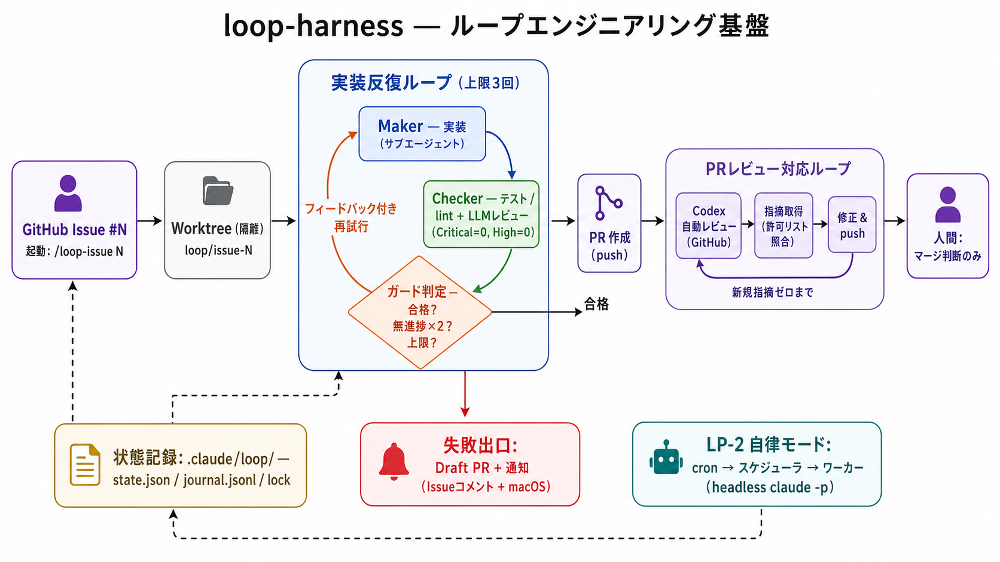
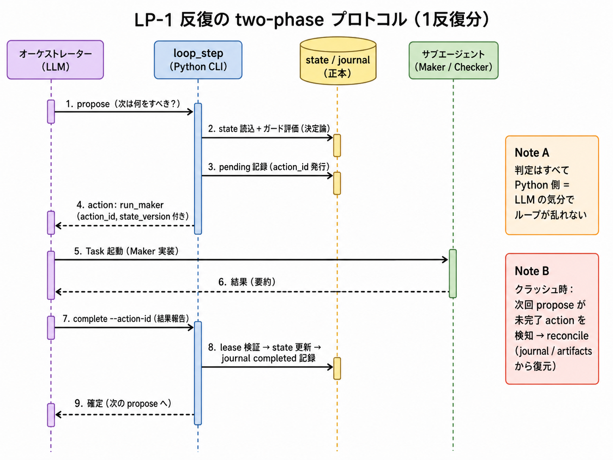

---
codd:
  node_id: "design:loop-harness"
  kind: design
  status: draft
  depends_on:
    - id: "req:loop-harness"
      relation: derives_from
  owner: ai-orchestra
---

# Loop Harness（反復ループ基盤）設計ドキュメント

**作成日**: 2026-07-06
**ステータス**: draft（基本設計。関数シグネチャの完全定義・config キーの全網羅は詳細設計〔Phase 3〕で確定する）
**対象**: `feat/loop` ブランチ
**関連**: `req:loop-harness`

> 本書は「何を・どう構成するか」の一覧と方針を定める基本設計である。`loop_common.py` 等の
> 関数シグネチャ、config の全キー、テストケースの網羅は詳細設計フェーズに委ねる。

---

## 1. 背景と設計方針

背景・課題（P-1〜P-5）・スコープの詳細は `req:loop-harness` を参照。本書では設計判断のみを記す。

### 1.1 制御実行モデルの比較（案A/B/C）

ループを「誰が・どこで駆動するか」で 3 案を比較した。

| 案                          | 概要                                                                                                                                                                                                                                  | 長所                                                                                                                                             | 短所                                                                                                                                          |
| --------------------------- | ------------------------------------------------------------------------------------------------------------------------------------------------------------------------------------------------------------------------------------- | ------------------------------------------------------------------------------------------------------------------------------------------------ | --------------------------------------------------------------------------------------------------------------------------------------------- |
| **案A: プロンプト駆動拡張** | `/review` の Phase 5-7 のように、LLM 自身が指示書に従って `while` ループを回す                                                                                                                                                        | 実装コスト最小。既存パターンの延長                                                                                                               | 停止判定・反復回数が決定論的に保証されない（P-2）。Maker/Checker の分離が指示書頼みで Nodding Loop 対策が弱い（P-4）                          |
| **案B: 完全独立実行**       | LP-1 もセッション内対話を持たず、常に `claude -p` を子プロセスとして起動する LP-2 型 worker に一本化する                                                                                                                              | 実行モデルが単純（1 種類のみ）                                                                                                                   | セッション内伴走（対話しながらの反復観察・介入）ができない。agent-routing / audit / tmux 等セッション内 hook 基盤を経由できず、二重実装になる |
| **案C: コア共有型（採用）** | 状態機械・ガード評価・シグネチャ正規化を `loop_common.py` に集約。LP-1 はオーケストレーターが `loop_step` を都度呼び出し次アクションを決定論的に受け取るハイブリッド制御、LP-2 は同じコアを使う完全独立ドライバ（scheduler + worker） | コアの二重実装を避けつつ、LP-1 はセッション内資産（agent-routing / audit / tmux hooks）を活かせる。LP-2 は認証・常駐の制約に合わせ独立して動ける | 実行モデルが 2 種類になり、コア（`loop_common.py`）のインターフェースを両モデルに耐える形で設計する必要がある                                 |

**採用: 案C**。理由は以下の通り。

- P-2（決定論的停止の欠如）・P-4（Nodding Loop 対策の欠如）は、状態機械とガード評価を Python 側に
  正本として持つことで解消する（LLM の自己申告のみに依存しない。NF-03）。
- LP-1 はセッション内でこそ価値がある（人間が同席し、Task 起動によって既存の agent-routing /
  audit / codex-suggestion-compliance 等の hook 基盤を素通りさせずに通せる）。案Bのように
  LP-1 まで headless 化すると、この hook 基盤を LP-2 側にも再実装する必要が生じる（NF-07 の
  「既存資産の最大限再利用」に反する）。
- LP-2 はローカル常駐・認証共有・cron/launchd 起動という制約上、そもそもセッション対話を持てない
  ため、独立ドライバとする以外の選択肢がない。
- コアを共有することで、ガード評価・失敗シグネチャ正規化・state/journal スキーマは 1 箇所に閉じ、
  LP-1/LP-2 で挙動が乖離しない（FT-06 の Critical=0 かつ High=0 基準を両モデルで一律にできる）。

### 1.2 two-phase プロトコルの採用（Codex セカンドオピニオン反映）

LP-1 のハイブリッド制御は「次に何をすべきか」を Python が答え、「実際にやる」のはオーケストレーター
（Task 起動）という分業になる。この分業では、Task 実行中にセッションが中断する、あるいは同一アクションを
二重報告してしまう、といった不整合が起こり得る。これに対し Codex のセカンドオピニオンで得た
`propose` / `complete` の two-phase プロトコル（5.3 節）を採用し、`action_id` / `state_version` に
よる整合性検証と reconcile（5.4 節）で対処する。

---

## 2. 全体アーキテクチャ


_loop-harness 全体の構成要素と処理フローの概要図_

### 2.1 コア共有の全体像

```text
                        ┌───────────────────────────────────────────┐
                        │            loop_common.py（共有コア）        │
                        │  状態機械 / ガード評価 / 失敗シグネチャ正規化  │
                        │  state・journal I/O / fencing lock          │
                        └───────────────┬───────────────┬─────────────┘
                                        │               │
                     ┌──────────────────┘               └──────────────────┐
                     ▼                                                     ▼
      ┌─────────────────────────────────┐          ┌─────────────────────────────────────┐
      │  LP-1（伴走型・ハイブリッド制御） │          │  LP-2（自律型・完全独立ドライバ）      │
      │                                   │          │                                       │
      │  セッションのオーケストレーター    │          │  loop_scheduler.py（常駐 1 プロセス）  │
      │        │  loop_step propose        │          │      │ discovery（ラベル付きIssueキュー）│
      │        ▼                           │          │      │ 同時実行数 cap / wall-clock 上限  │
      │  次アクション(JSON)を受け取る       │          │      ▼                              │
      │        │                           │          │  loop_driver.py（ループごとの worker）│
      │        ▼ Task(subagent_type=...)   │          │      │ claude -p 起動（Maker/Checker）  │
      │  Maker/Checker サブエージェント実行 │          │      ▼                              │
      │        │                           │          │  loop_common 経由で state/guard 評価  │
      │        ▼                           │          │                                       │
      │  loop_step complete --result ...   │          │  cron / launchd がトリガー検知して起動 │
      └─────────────────────────────────┘          └─────────────────────────────────────┘
```

- LP-1 は「Python が決定し、オーケストレーターが実行する」分業。アクションの実行そのもの
  （Task 起動）はオーケストレーターが担い、agent-routing / audit / codex-suggestion-compliance
  等の既存 hook 基盤をそのまま通す。
- LP-2 は Python プロセス（scheduler + worker）が Maker/Checker まで含めて自律的に駆動する。
  headless のため hook 基盤には乗らず、`loop_common` 自身の決定論的検証で合否を成立させる（NF-06）。

### 2.2 リポジトリ内配置

```text
.claude/loop/<loop_id>/          # 実行時 state（正本）
  state.json
  journal.jsonl
  lock.json

packages/loop-harness/           # 配布パッケージ
  lib/ scripts/ config/ tests/

.claude/config/loop-harness/     # プロジェクト側の config 上書き・ループ定義追加
  loop-harness.local.yaml
  loops/*.yaml

facets/instructions/loop-issue.md
facets/compositions/skills/loop-issue.yaml
```

- **セキュリティ設計上の補足**: `.claude/loop/<loop_id>/` は各ループの `worktree_path` とは独立した
  場所（root worktree 側）に解決する。詳細は 5.1 節（配置と権限分離）を参照。

---

## 3. コンポーネント構成

```text
packages/loop-harness/
  manifest.json
  lib/
    loop_common.py       # 状態機械・ガード評価・シグネチャ正規化・state/journal I/O・fencing lock
    loop_definition.py   # ループ定義 YAML のロード・スキーマ検証（phases[]）
    pr_review_wait.py    # 完了シグナル検知・コメント取得・dedup
    worktree_manager.py  # worktree 作成・ブランチ判定（issue-fix のヒューリスティックを Python へ移植した新規実装）・後始末
  scripts/
    loop_step.py         # LP-1: start/propose/complete/reconcile/heartbeat/resume サブコマンド（JSON 出力）
    loop_driver.py        # LP-2: worker（1 ループ = 1 プロセス、claude -p 起動）
    loop_scheduler.py    # LP-2: scheduler（discovery・同時実行 cap・timeout・kill/restart）
    loop_status.py       # 一覧・状況確認・purge（FT-20）
  config/
    loop-harness.yaml    # ガード既定値・LP-2 並列上限・ポーリング間隔・保持期間・通知設定
    loops/issue-loop.yaml # Issue 消化ループ定義
  tests/
facets/instructions/loop-issue.md + facets/compositions/skills/loop-issue.yaml  # /loop-issue スキル
```

| コンポーネント                                                              | 責務                                                                                                                                                                                                                                                                                                                                              |
| --------------------------------------------------------------------------- | ------------------------------------------------------------------------------------------------------------------------------------------------------------------------------------------------------------------------------------------------------------------------------------------------------------------------------------------------- |
| `loop_common.py`                                                            | ループの状態機械（phase 遷移・iteration 管理）、ガード評価（6 節の評価順序）、失敗シグネチャの正規化、state/journal/lock の読み書きと fencing（lease_token 検証）を提供する、LP-1/LP-2 共通の唯一のコア                                                                                                                                           |
| `loop_definition.py`                                                        | `config/loops/*.yaml` と `.claude/config/loop-harness/loops/*.yaml` をロードし、`phases[]` を含むスキーマの妥当性検証を行う（未知のループ定義追加はコア改修不要＝FT-01）                                                                                                                                                                          |
| `pr_review_wait.py`                                                         | PR Review API・check-run のポーリングによる完了シグナル検知、レビューコメント取得、処理済みコメント ID による dedup（9 節）                                                                                                                                                                                                                       |
| `worktree_manager.py`                                                       | ループ用 worktree の作成・存在確認、`facets/instructions/issue-fix.md` 内の bash ヒューリスティック（`git rev-parse --git-dir` 比較等）を Python へ移植したブランチ判定（既存コードの呼び出し流用ではなく、ロジックを踏襲した新規実装）、成功/失敗出口後の保持と明示的な後始末（FT-23）                                                           |
| `loop_step.py`                                                              | LP-1 向け CLI。`start --issue <N>`（ループラン初期化・Issue ロック取得・worktree 作成指示。詳細は `design:loop-harness-cli` 参照）/ `propose` / `complete --action-id ... --result ...` / 内部的な `reconcile` / heartbeat 更新用の `heartbeat`（5.2 節）/ 意図的再開用の `resume --reset-counters`（5.5 節）を提供し、常に JSON を返す（5.3 節） |
| `loop_driver.py`                                                            | LP-2 向け worker。1 プロセス = 1 ループランを担当し、`loop_common` を直接呼び出しながら `claude -p` で Maker/Checker を駆動する（8 節）                                                                                                                                                                                                           |
| `loop_scheduler.py`                                                         | LP-2 向け常駐プロセス。トリガー discovery（ラベル付き Issue キュー・cron）、同時実行数 cap、wall-clock timeout 監視、worker の起動/強制終了・再起動を管理する                                                                                                                                                                                     |
| `loop_status.py`                                                            | 実行中/完了済みループランの一覧表示、状況確認、保持期間超過分の state/journal を purge する（FT-20）                                                                                                                                                                                                                                              |
| `facets/instructions/loop-issue.md` + `compositions/skills/loop-issue.yaml` | `/loop-issue <Issue番号>` スキルの指示書と合成定義。LP-1 の起動口（FT-02）                                                                                                                                                                                                                                                                        |

---

## 4. ループ定義スキーマ

ループ定義は `id / trigger / phases[] / notifications` を第一級要素とする宣言的 YAML。
`phases[]` の各要素は `{name, maker, checker, guards, on_success, on_failure}` を持つ。外部待機
（PR レビュー完了待ち等）は独立した `waiter` フィールドを持たず、`checker.external_signal`（9 節）に
一本化する（アーキテクチャレビュー反映。スキーマ定義とフル例を一致させる）。
2 本目以降のループはこの YAML ファイルの追加のみで登録でき、コア（`loop_common.py` 等）の改修を
要しない（FT-01）。配置は配布用 `packages/loop-harness/config/loops/*.yaml` と、プロジェクト側の
`.claude/config/loop-harness/loops/*.yaml`（`config-loading` ルール準拠で追加・上書き）の 2 か所。

Issue 消化ループのフル例（`issue-loop.yaml`）:

```yaml
id: issue-loop
trigger:
  lp1:
    skill: /loop-issue
  lp2:
    kind: label_queue
    label: "loop:queue"
    poll_interval_seconds: 300

phases:
  - name: implementation
    maker:
      agent: auto # cli-tools.yaml の agents.<name>.tool 解決に従う（FT-04）
      prompt_template: "facets/instructions/loop-issue.md#maker"
    checker:
      mechanical:
        commands: ["pytest -q", "ruff check ."]
        analyzer: failure_detector.analyze # 合否判定は analyze() 出力を直接利用（FT-05）
      llm_review:
        baseline: code-reviewer
        selection: skill-review-policy # パスパターン + 優先順位で追加選定（最大2名）
        pass_criteria: { critical: 0, high: 0 } # FT-06
    guards:
      max_iterations: 3
      no_progress:
        signature: implementation # failure_type+error_type+失敗テスト識別子（6節）
        repeat: 2
    on_success:
      disposition: advance_phase # loop_step propose が返す action とは別概念。下記注記参照
      next: pr_review_response
      exec: [commit, push, pr_create] # 既存 pr-create 資産を再利用（FT-12）。push 前ガードは5.6節
    on_failure:
      disposition: exit_failure
      exec: [pr_create_draft, notify] # FT-16

  - name: pr_review_response
    maker:
      agent: auto
      prompt_template: "facets/instructions/loop-issue.md#pr-response"
    checker:
      external_signal: # 外部レビューの完了検知そのものが Checker（9節）
        source: github
        events: ["pull_request_review", "check_run.completed"]
        poll_interval_seconds: 120
        timeout_seconds: 3600
      severity_policy:
        must_fix: [critical, high]
        may_skip_with_reason: [medium, low]
      dedup:
        by: comment_id
    guards:
      max_iterations: 3
      no_progress:
        signature: pr_review # 指摘シグネチャ + 新規指摘件数の非減少（6節）
        repeat: 2
    on_success:
      disposition: exit_success
      exec: [notify]
    on_failure:
      disposition: exit_failure
      exec: [pr_to_draft, post_summary_comment, notify] # FT-15

notifications:
  issue_comment: true
  macos_notification: true
```

- `maker.agent: auto` は `cli-tools.yaml` の `agents.<name>.tool` 解決に委ねる値であり、ループ定義
  自体はツールを固定しない（FT-04）。
- `checker.llm_review` は `implementation` フェーズでは省略不可（FT-06）。他ループでは省略してよい
  （FT-05 の機械検証のみが全ループ共通の必須要件）。
- `guards.no_progress.signature` は 6 節で定義する 2 種類の正規化シグネチャのどちらを使うかを指す
  参照名であり、シグネチャの計算自体は `loop_common.py` が行う。
- **`disposition` と `loop_step propose` の `action` の関係**（アーキテクチャレビュー反映）:
  `on_success` / `on_failure` のフィールド名は `disposition`（ループ定義側の宣言）であり、
  5.3 節・7 節で `loop_step propose` が返す実行時の `action` とは別の概念として命名を分離する。
  値の語彙（`advance_phase` / `exit_success` / `exit_failure`）はあえて一致させている。これは
  ガード評価が合格判定に達した際、`disposition` の宣言をそのまま `propose` の `action` として
  返せるようにするためであり、フィールド名を分けることで「宣言（定義側）」と「決定（実行時）」の
  混同を避ける。

`checker.llm_review` の必須/任意は以下の通り（一覧化。FT-06）:

| フェーズ                             | `checker.llm_review`                                                              | 根拠  |
| ------------------------------------ | --------------------------------------------------------------------------------- | ----- |
| `implementation`（Issue 消化ループ） | 必須（省略不可）。baseline `code-reviewer` + `skill-review-policy` 準拠の追加選定 | FT-06 |
| `pr_review_response`                 | 対象外（外部レビューの指摘そのものを扱うため `checker.external_signal` を使う）   | 9 節  |
| 他ループ定義（2 本目以降）           | 任意。省略可（`checker.mechanical` のみが全ループ共通の必須要件）                 | FT-05 |

---

## 5. 状態管理

### 5.1 配置と権限分離（セキュリティレビュー反映）

```text
<root worktree>/.claude/loop/<loop_id>/
  state.json        # 正本 state（0600）
  journal.jsonl      # 追記専用の反復履歴（flock 排他 + 0600、fail-logs の _append_secure_jsonl パターン）
  lock.json         # ロック（fencing 用 lease_token を含む。0600）
  artifacts/<action_id>/  # Checker 実行結果（テスト出力・lint出力・CheckResult JSON）。reconcile の復元元（5.4節）
```

`loop_id` は決定論的に採番する: `<repo-identity-hash 短縮>-issue-<Issue番号>`。
`repo-identity-hash` は remote URL 等リポジトリを一意に識別する値のハッシュを短縮したもの。
これにより worktree・リポジトリ間での `loop_id` 衝突を避け、同一機構で二重起動防止（FT-07）と
state 分離（FT-03）の両方を実現する。

**state root は worktree の外に置く**: ループが実際に Maker/Checker のコマンドを実行するディレクトリ
（`state.json` の `worktree_path`）と、`.claude/loop/` の実体パスは常に分離する。`.claude/loop/` は
`audit`（`packages/audit/hooks/event_logger.py` の `_resolve_root_worktree`）と同じ解決パターンを
踏襲し、`git rev-parse --path-format=absolute --git-common-dir` の結果から `dirname` を取ることで、
linked worktree 内から実行された場合でも常に **root worktree（main worktree）側**のパスを得る。
これにより、Maker/Checker が動くコンテキスト（ループ用 worktree 内）から `.claude/loop/` への相対
パスが自明に見えず、意図しないアクセスを構造的に難しくする。

**権限分離の方針**:

- `state.json` / `lock.json` も `journal.jsonl` と同様に `0600` で作成する。
- `.claude/loop/` への書き込みは `loop_common.py` が提供する read/write/append API 経由のみとし、
  Maker/Checker のコマンド実行（`pytest` / `ruff` 等）は常に worktree（`worktree_path`）を cwd として
  実行する。Maker/Checker のプロセス自身が `.claude/loop/` を cwd に持つことはない。
- **残存リスク（詳細設計への申し送り）**: 上記は「誤って触れにくくする」設計であり、Maker/Checker
  は同一 OS ユーザー・同一マシン上で任意コマンドを実行し得るため、絶対パスを知っていれば
  `state.json` 等を直接改ざんすることを完全には防げない。この残存リスクは 12 節に記載し、
  詳細設計での追加緩和策（journal との突合検証等）を申し送る。

### 5.2 スキーマ骨子

`state.json`（骨子。全フィールドの網羅は詳細設計）:

```jsonc
{
  "loop_id": "a1b2c3d4-issue-42",
  "definition_id": "issue-loop",
  "phase": "implementation",
  "iteration": 2,
  "status": "running", // pending | running | waiting_external | passed | failed | stopped
  "worktree_path": "/path/to/worktree",
  "branch": "loop/issue-42",
  "pr_number": null,
  "last_check_result": {
    "passed": false,
    "signature": "test_failure:AssertionError:...",
  },
  "stop_reason": null,
  "created_at": "2026-07-06T10:00:00+09:00",
  "updated_at": "2026-07-06T10:20:00+09:00",
  "state_version": 12,
}
```

**`status` 列挙の定義（ドリフト訂正。`design:loop-harness-core` 1 章の詳細設計に合わせて更新）**:

| 値                 | 意味                                                                                                                                 |
| ------------------ | ------------------------------------------------------------------------------------------------------------------------------------ |
| `pending`          | ループラン作成直後、最初の `run_maker` がまだ実行されていない状態                                                                    |
| `running`          | 反復実行中                                                                                                                           |
| `waiting_external` | 外部レビュー完了シグナル待ち（`pr_review_response` フェーズ）                                                                        |
| `passed`           | 合格し成功出口へ到達                                                                                                                 |
| `failed`           | ガード（無進捗・反復上限）到達により失敗出口へ到達                                                                                   |
| `stopped`          | 安全停止（exec なし・通知あり）。push 前ガード違反・repo-identity 不一致・他ホスト生存 lease 検知の 3 条件で遷移する（新設。5.6 節） |

旧版で列挙に含めていた `stale` は state の値ではなく、lock の TTL に基づく **lease の生存判定概念**
（5.2 節の lock パターン参照）として整理し、`status` からは除外する。

`branch` はブランチ命名規則 `loop/issue-<Issue番号>` に統一する（ドリフト訂正）。

`journal.jsonl`（1 行 1 イベント）:

```jsonc
{
  "ts": "2026-07-06T10:20:00+09:00",
  "loop_id": "a1b2c3d4-issue-42",
  "phase": "implementation",
  "iteration": 2,
  "action_id": "act-7f3a2b",
  "event": "completed", // pending | running | completed
  "actor": "maker", // maker | checker | waiter | step
  "payload": { "summary": "..." },
  "guard_snapshot": { "iteration": 2, "no_progress_count": 1 },
}
```

`lock.json`（**`state_version` は持たない**。正本は `state.json` のみに一元化する。アーキテクチャ
レビュー反映）:

```jsonc
{
  "owner_id": "orchestrator-session-xxxx",
  "pid": 12345,
  "host": "MacBook-Pro.local",
  "started_at": "2026-07-06T10:00:00+09:00",
  "heartbeat_at": "2026-07-06T10:20:00+09:00",
  "ttl": 300,
  "lease_token": "6f1e...",
}
```

- **`state_version` の二重管理を解消**: `state_version` の正本は `state.json` のみとする。`complete`
  時の `state_version` 検証（5.3 節）は `state.json` を直接読んで行い、`lock.json` は所有権（lease）の
  管理に専念する。
- **`host` フィールドの用途**: 記録用（どのマシンがループを保持しているかの可視化）に加え、起動時
  （LP-2 の worker 起動時・LP-1 のセッション開始時）に **他ホストの生存 lease（TTL 内）を検知したら
  起動を拒否する**判定にも使う。同一リポジトリを複数マシンから誤って同時運用することを防ぐ。
- **書き込み手順の順序**: ① `lock.json` の `lease_token` を検証（fencing）→ ② `state.json` を更新
  （`state_version` をインクリメント）→ ③ `journal.jsonl` に対応イベントを追記、の順で行う。
  この順序では「`state.json` は更新されたが `journal.jsonl` への追記前にクラッシュした」不整合が
  「`journal.jsonl` はあるが `state.json` が未更新」より起こりやすくなる。したがって 5.4 節の
  reconcile は **journal を優先して state を復元する**（journal のイベント列を正として、古い
  `state.json` があれば書き戻す）方針とする。

ロックは `skill-evolution` の TTL 判定パターン（`_is_stale`：PID 生存確認は行わず epoch/TTL のみで
判定。短命プロセスの誤 stale 判定を避けるための既存の設計選択）を汎用化する。ただし本ハーネスの
ロックは長時間の loop 実行の所有権を表すため、heartbeat の更新主体・頻度は実行形態で分ける
（アーキテクチャレビュー反映）。

| 実行形態 | heartbeat 更新主体                                                                                                           | TTL の目安                                                                                         |
| -------- | ---------------------------------------------------------------------------------------------------------------------------- | -------------------------------------------------------------------------------------------------- |
| LP-1     | `loop_step` の各サブコマンド呼び出し時（`propose` / `complete` / `reconcile` / 専用の `heartbeat` サブコマンド）に更新される | 「1 アクションの最大想定時間」ベース。オーダーは分〜時間（既定 60 分程度を仮置きし詳細設計で確定） |
| LP-2     | worker（`loop_driver`）プロセス内のバックグラウンドスレッドが短い間隔で自律更新する                                          | 短 TTL（オーダーは分単位）。worker のクラッシュ検知を速くするため短めに保つ                        |

state/journal への書き込み時は必ず `lease_token` を検証し（fencing）、TTL 切れ後に別プロセスが
新しい lease を取得した場合、旧プロセスからの書き込みは拒否される。

### 5.3 two-phase プロトコル（LP-1）


_propose / complete の two-phase やり取りのシーケンス図_

`loop_step` は「提案（propose）」と「確定（complete）」を分離する。このほか `reconcile`（5.4 節。
`propose` 内部から呼ばれる照合処理）、`heartbeat`（5.2 節。ロックの生存更新）、
`resume --reset-counters`（5.5 節。人間判断による意図的な再開）、`start --issue <N>`（ループラン
初期化・Issue ロック取得・worktree 作成指示。詳細は `design:loop-harness-cli` 参照）を
サブコマンドとして提供する（最終整形反映。3 節のコンポーネント表と一覧を一致させる）。

```text
Orchestrator                          loop_step (Python)
     │                                      │
     │  loop_step propose                   │
     ├─────────────────────────────────────▶│  state.json を読み、ガード評価（6節）
     │                                      │  次アクションを決定し journal に pending 記録
     │◀─────────────────────────────────────┤
     │  { action, action_id,                │
     │    state_version, expected_phase }   │
     │                                      │
     │  Task(subagent_type=..., ...)        │
     │  （agent-routing / audit hook 経由） │
     │                                      │
     │  loop_step complete                  │
     │    --action-id <id> --result <json>  │
     ├─────────────────────────────────────▶│  action_id / state_version を検証
     │                                      │  一致 → state 更新・journal に completed 記録
     │                                      │  不一致（stale） → 拒否しエラー応答
     │◀─────────────────────────────────────┤
     │  { ok, next: "call propose again" }  │
```

- `propose` は `action_id`（今回提案したアクションの一意 ID）、`state_version`（提案時点の state
  バージョン）、`expected_phase`（このアクションが属する phase）を返す。
- `complete` はこれらを引数として要求し、`loop_step` 側で現在の pending action と一致するかを
  検証する。一致しない（stale な `action_id` / `state_version` での `complete`）は拒否する。
- action の種類（7 節のフロー記述と語彙を統一する。アーキテクチャレビュー反映）: `run_maker` /
  `run_checker` / `wait_external_review` / `advance_phase` / `stop` / `exit_success` /
  `exit_failure`。実行そのもの（Task 起動）は行わず、次に何をすべきかの決定のみを返す。
- **`complete` の冪等性**: 同一 `action_id` に対する `complete` が再送された場合（オーケストレーター
  側のリトライ、二重報告等）、`loop_step` は state を再更新せず、前回確定した結果をそのまま
  再応答する（二重カウント・二重副作用を防ぐ）。

### 5.4 reconcile（照合・回復）

オーケストレーターがセッション中断等で `complete` を呼べないまま終了した場合、journal には
`pending`（または `running`）のまま `completed` を欠く action が残る。次回 `propose` 呼び出し時、
`loop_step` は以下の reconcile を行う。

1. journal 末尾を走査し、直近の action が `completed` に到達していないかを検出する。
2. 検出した場合、その action の副作用が実際に生じているか確認する（例: `run_maker` なら対象
   ブランチのコミットが増えているか、`run_checker` なら 3 の artifact が存在するか）。
3. 副作用が確認できれば、その結果を用いて `completed` として記録し正常に進行を再開する。
4. 確認できなければ、当該反復を失敗（`infrastructure_failure` 扱い。6 節）として記録し、
   ガード評価に乗せた上で新しい `propose` を返す。

Maker には冪等性契約を課す（既存ブランチ・PR・差分を確認し、二重にコミットや PR を作成しない）。
これにより reconcile 後の再実行が安全に行える。

**CheckResult の復元方法（実体を明記。最終整形反映）**: `run_checker` の reconcile では、以下の
優先順位で復元する。

1. **journal 優先**: 当該 action の `completed` イベントが journal に実際には存在する（例えば
   `complete` 自体は成功したが応答がオーケストレーター側に届かなかった等）場合は、その `payload`
   に含まれる `CheckResult` をそのまま復元に使い、再実行はしない。
2. **artifact からの復元**: journal に `completed` イベントが無い場合、`loop_common.py` は
   `.claude/loop/<loop_id>/artifacts/<action_id>/` を確認する。Checker の実行結果はこのディレクトリに
   構造化ファイル（テスト出力、lint 出力、LLM レビュー結果を含む `CheckResult` の JSON 表現）として
   保存する契約とし、artifact が揃っていればそこから `CheckResult` を復元して `completed` として
   記録する。
3. **再実行**: journal にも artifact にも復元可能な情報が無い場合にのみ、当該アクションを
   再実行する。Checker は読み取り検証（テスト実行・lint・レビュー）であり副作用を持たないため、
   再実行は冪等であり安全に行える（`run_maker` のようなコミット生成的な冪等性契約を別途課す必要は
   ない）。

### 5.5 クラッシュ回復

- LP-1: セッション再開時、オーケストレーターは対象 `loop_id` の `state.json` を確認し、
  `propose` を呼ぶだけで reconcile を含めた続行判断が得られる（FT-22）。
- LP-2: `loop_scheduler` が worker プロセスの異常終了を検知した場合、同一 `loop_id` で
  `loop_driver` を再起動する。再起動後の `loop_driver` も同じ reconcile 経路（`loop_common`
  経由）で state を検証してから続行する。
- いずれの経路も lock の TTL・lease_token による fencing（5.2 節）で、旧プロセスが復帰して
  誤って state を上書きすることを防ぐ。
- **意図的な再開（FT-22。アーキテクチャレビュー反映）**: ガード到達により正規に `failed` 終了した
  ループランを、人間判断であらためて再開したい場合のために `loop_step resume --reset-counters`
  相当のサブコマンドを用意する。ガードカウンタ（反復回数・無進捗カウント）のリセットは明示フラグ
  （`--reset-counters`）を要求し、フラグなしでは `failed` 状態のまま resume できない（誤操作による
  無制限リトライを防ぐ）。5.4 節の reconcile（クラッシュ由来の自動復旧）とは目的が異なり、こちらは
  人間が明示的に再挑戦を指示する経路である。

### 5.6 push 前ガード（セキュリティレビュー反映）

`on_success.exec` に含まれる `push` の実行直前に、以下 2 点を機械的に検証する。8 節（LP-2 実行フロー）
でも同じガードを通す。

- **(a) ブランチ検証**: push しようとしているブランチが、リポジトリの **デフォルトブランチと一致
  しない**ことを検証する（誤って `main` 等へ直接 push する事故を防ぐ）。
- **(b) repo-identity 検証**: `loop_scheduler` / `loop_driver`（LP-2）は起動時、および push 直前に、
  5.1 節の `repo-identity-hash` を実行対象ディレクトリから再計算し、`loop_id` 採番時に記録した
  repo-identity と一致するかを照合する。LP-1（オーケストレーター経由）でも同様の照合を `loop_step`
  側で行う。

**帰結先の修正（ドリフト訂正。spec-reviewer の Critical 指摘反映）**: (a) 検証違反・(b) repo-identity
不一致・5.2 節の他ホスト生存 lease 検知、の **3 条件**では、いずれも失敗出口（`exit_failure`）では
なく **`stop` action → `stopped` 状態（安全停止）** に遷移する。失敗出口の `exec`（Draft PR 化等）は
リポジトリ書き込みを伴うため、repo の同一性・安全性が疑わしい状況で実行するのは危険であり、
書き込みを伴う出口処理そのものを避ける必要があるためである。

- 安全停止では、リポジトリ書き込みを伴う出口 `exec`（`push` / `pr_create` / `pr_create_draft` 等）は
  一切実行しない。
- 通知は必ず実行する: **macOS 通知は常時発火**する。**Issue コメントは repo-identity 検証済みの
  場合のみ投稿**する（repo-identity が不一致の状況で誤ったリポジトリの Issue にコメントしてしまう
  事故を避けるため）。
- **journal 記録**（安全停止専用の `event: "stopped"`, `actor: step`, `stop_reason` を含む payload。
  `design:loop-harness-core` 7.1 節・`design:loop-harness-cli` 2.6 節の定義に整合）と **audit の
  `loop_stop` emit** は安全停止でも必須とする。
- 詳細な状態遷移は `design:loop-harness-core` 1.2 節（状態遷移）を参照。

**LP-1 での強制結線（最終整形反映）**: 上記 (a)(b) を「オーケストレーターが任意に参照する検証」に
留めないため、`loop_step propose` が `advance_phase` action を返す際、`context` に検証済みの
ブランチ名（(a)(b) を通過したブランチ名）を含めて応答する。オーケストレーターは `push` /
`pr_create` の実行時、この応答に含まれる検証済みブランチ名を引数としてそのまま使うことを必須とし、
オーケストレーター自身が別途組み立てたブランチ名を使う経路を設計上作らない。これにより、検証を
経ないブランチ名で push が実行される余地を構造的に排除する。具体的な受け渡し方式（CLI 引数か
一時ファイル経由か等）は詳細設計で確定する。

---

## 6. ガード評価と失敗シグネチャ

### 6.1 評価順序（FT-08）

各反復の Checker 結果に対し、以下の順で評価する。無進捗判定を反復上限判定より先に評価することで、
早期の無進捗停止を優先させる。

```text
Checker 結果
   │
   ▼
① 合格判定 ──── 合格 ───▶ 成功出口（advance_phase / exit_success）
   │ 不合格
   ▼
② 無進捗判定 ── 無進捗 ─▶ 失敗出口（exit_failure）
   │ 進捗あり
   ▼
③ 反復上限判定 ─ 到達 ──▶ 失敗出口（exit_failure）
   │ 未到達
   ▼
継続（次の run_maker へ）
```

### 6.2 失敗シグネチャの二本立て

フェーズによって「同一性」の定義が異なるため、シグネチャ正規化は 2 種類を持つ。

| フェーズ             | シグネチャの構成要素                                                                                                                                                                                                                                                                                               | 無進捗の判定                                                           |
| -------------------- | ------------------------------------------------------------------------------------------------------------------------------------------------------------------------------------------------------------------------------------------------------------------------------------------------------------------ | ---------------------------------------------------------------------- |
| `implementation`     | `failure_detector.analyze()` の `failure_type`（4 種: `tool_error` / `test_failure` / `lint_failure` / `cli_failure`）+ `error_type`（7 種: `timeout` / `auth` / `not_found` / `rate_limit` / `syntax` / `assertion` / `unknown`）の組み合わせに加え、失敗テスト識別子（失敗テスト名集合の正規化ハッシュ）を含める | 同一シグネチャが `guards.no_progress.repeat`（既定 2）回連続           |
| `pr_review_response` | 正規化した外部指摘シグネチャ（同一指摘の再提起を検知するためのキー）＋ 新規指摘件数                                                                                                                                                                                                                                | 同一指摘シグネチャの再提起、または新規指摘件数が前回反復から減少しない |

- 比較キーの詳細な正規化アルゴリズム（失敗テスト名集合のハッシュ化方式、指摘シグネチャの
  類似度判定等）は詳細設計フェーズで確定する（申し送り。12 節）。

### 6.3 `infrastructure_failure`（別カテゴリ）

GitHub API 障害・レビュアー起動失敗等、Maker/Checker の成果そのものに起因しない失敗は
`infrastructure_failure` として別カテゴリに分類し、上記の無進捗カウントとは独立したリトライ用
カウンタで扱う。連続 N 回（config で既定値を持つ）到達した場合のみ失敗出口へ遷移する。無進捗
カウントに混入させないのは、Maker/Checker の実質的な進捗停滞と、外部要因による一時的な障害を
区別し、後者はリトライで解消し得るとみなすためである。既定値のオーダーは数回程度（目安 3〜5 回。
具体値は 10.3 節の config で確定）を想定する。

**PR レビュー完了待ちタイムアウトの分類（ドリフト訂正。要件 FT-13 準拠）**: 当初「ポーリング
タイムアウト」を本カテゴリの例として挙げていたが、これは上流要件 FT-13（「タイムアウトは無進捗
扱いとしてガードに乗せる」）と矛盾していたため訂正する。責務は以下のように分離する。

- 完了待機の**全体タイムアウト**（`pr_review.timeout_seconds` 到達）→ **無進捗としてカウント**
  （`infrastructure_failure` には分類しない）。
- **個々の** `gh api` 呼び出し失敗（5xx / ネットワーク / rate limit）→ 従来どおり
  `infrastructure_failure` として扱う。

詳細は `design:loop-harness-pr-review` の 1.2 節を参照。

---

## 7. LP-1 実行フロー

`/loop-issue <Issue番号>` 起動から出口までの一連の流れを示す。

```text
User: /loop-issue 42
   │
   ▼
Orchestrator: loop_step propose (state なし)
   │  → loop_id 決定論的採番、worktree 作成（worktree_manager.py、issue-fix.md の bash ヒューリスティックを Python へ移植した新規実装。ロジックの踏襲）
   │  → action: run_maker（phase=implementation, iteration=1）
   ▼
Orchestrator: Task(subagent_type=<agent-routing 解決結果>, prompt=...)
   │  → 実装コミット
   ▼
Orchestrator: loop_step complete --action-id ... --result {...}
   │
   ▼
Orchestrator: loop_step propose
   │  → action: run_checker
   ▼
Orchestrator: Task(mechanical: pytest/ruff, analyzer=failure_detector.analyze)
   │          Task(llm_review: code-reviewer + skill-review-policy 追加選定, 別サブエージェント)
   ▼
Orchestrator: loop_step complete --result {mechanical:..., llm_review:...}
   │
   ▼
Orchestrator: loop_step propose
   │  → ガード評価（6節）
   │     合格 → action: advance_phase（commit/push/pr_create 実行指示を含む）
   │     不合格・無進捗/上限未達 → action: run_maker（次反復へ）
   │     不合格・無進捗or上限到達 → action: exit_failure（Draft PR 作成指示）
   ▼
（合格の場合）Orchestrator: pr-create 資産を用いて PR 作成
   │
   ▼
Orchestrator: loop_step propose（phase が pr_review_response に進行）
   │  → action: wait_external_review
   ▼
Orchestrator: pr_review_wait.py 相当のポーリング（9節）
   │
   ▼
（新規指摘 0 まで、または上限まで implementation と同様の反復を継続）
   │
   ▼
exit_success（マージ判断は人間へ）/ exit_failure（Draft 化 + 通知）
```

- Maker/Checker の実行（Task 起動）は常にオーケストレーターが行い、`loop_step` 自体は
  提案のみを行う（NF-03: Maker と Checker（LLM レビュー）は別サブエージェント・別コンテキスト）。
  この分離は audit の `loop_iteration` イベントに記録されるサブエージェント識別情報から
  事後確認できる。
- Maker/Checker の生出力はオーケストレーターのメインコンテキストへ返さず、要約と
  state/journal 参照で受け渡す（NF-05）。
- `pr_create` 実行前の `push` には 5.6 節の push 前ガード（ブランチ検証・repo-identity 照合）を
  必ず適用する（LP-1/LP-2 共通）。違反時は失敗出口ではなく `stopped`（安全停止。5.6 節）に遷移する。

---

## 8. LP-2 実行フロー

```text
cron / launchd
   │ (定期起動)
   ▼
loop_scheduler.py（常駐）
   │  discovery: ラベル付き Issue キューを検知（label_queue trigger）
   │  同時実行数 cap を確認（config: lp2.concurrency_limit）
   ▼
loop_driver.py（1 ループ = 1 worker プロセス）
   │  loop_id 決定論的採番、worktree 作成
   │  claude -p でループ定義の prompt_template を渡し Maker を起動
   │    → 既存 Claude Code ログイン認証をそのまま利用（追加のキー管理なし）
   │  機械検証（pytest/ruff, failure_detector.analyze）を worker プロセス自身が実行
   │  LLM レビューは別 claude -p 呼び出しで（code-reviewer 相当のプロンプト）実行
   │  loop_common 経由でガード評価・state/journal 更新
   │  合格 → commit/push/pr_create → phase を pr_review_response へ
   │  不合格・継続 → 反復を繰り返す
   │  不合格・停止 → Draft PR 作成
   ▼
loop_scheduler.py
   │  wall-clock timeout 監視（NF-02。上限到達で worker を強制終了）
   │  worker のクラッシュ検知時は同一 loop_id で再起動（5.5節の reconcile 経路）
   ▼
停止・完了時: 対象 Issue へ結果コメント投稿 + macOS 通知（osascript 等）（FT-19）
```

- **訂正（アーキテクチャレビュー反映）**: 当初「LP-2 は headless（`claude -p`）実行であり hooks 基盤を
  経由しない」と記述していたが誤りである。`claude -p` は Claude Code 自身の実行モードであり、
  `SessionStart` / `PreToolUse` 等の既存 hooks はそのまま発火する。発火しないのは Codex の
  `codex exec` の方であり（`docs/design/codex-cli-harness.md` の実測）、両者を混同していた。
  `claude -p` での hooks 発火は **`adr:ADR-20260421-017` により実測確認済み**である（2026-04-21、
  Claude Code `v2.1.116` の `--print`〔`-p` と同じ非対話実行モード〕実測で、MCP 設定読み込み →
  `SessionStart` → `InstructionsLoaded` の順に発火することを確認済み）。ただし当該 ADR は cocoindex
  proxy の起動設計を主題とする文書であり、**loop-harness 固有シナリオ**（headless 実行中の起動遅延の
  実測値、提案系 hook 出力が反復に与える具体的な影響等）での検証はこの ADR ではカバーされておらず
  未検証である。これは 12 節に申し送る。
- 修正後の設計方針: **「hooks は発火し得るが、ループの正しさ（合否判定）は hooks に依存しない」**。
  合否は `loop_common` の決定論的検証（機械検証 + LLM レビュー結果の両方を必須条件とする、NF-03）
  のみで完結させる。NF-06 の「hooks 非発火」根拠は **`codex exec` を Maker として使う場合に限定**
  される。`claude -p` を Maker/Checker 呼び出しに使う場合は hooks が発火する前提で設計する。
- **発火する hook の副作用の扱い**: `SessionStart` の同期処理等により起動が数百 ms〜数秒程度
  遅延し得るが、反復自体を止めるものではない。`[Codex Suggestion]` 等の提案系 hook 出力が headless
  実行中に生じても、応答する人間がいないため `loop_driver` はこれを無視してよい（提案系 hook は
  対話セッション向けの補助であり、headless 実行の合否判定には使わない）。
- 同時実行数上限（FT-18）・壁時計時間上限（NF-02）はいずれも `loop-harness.yaml` の config 値。
- `push` 実行前には 5.6 節の push 前ガード（ブランチ検証・repo-identity 照合）を必ず適用する。
  違反時は失敗出口ではなく `stopped`（安全停止。5.6 節）に遷移する。
- **macOS 通知の粒度**（アーキテクチャレビュー反映）: 通知本文は件名レベル（Issue 番号・結果
  〔成功/失敗〕・停止理由コード）に留める。未解消指摘の一覧・反復履歴等の詳細は Issue コメント側
  にのみ記載し、通知には含めない（通知バナーへの情報過多・秘匿情報混入を避ける。NF-04 の
  redaction 方針とも整合。10.2 節参照）。

---

## 9. PR レビュー対応フロー

```text
PR 作成（implementation フェーズの成功出口）
   │
   ▼
pr_review_wait.py: ポーリング開始
   │  gh api repos/{o}/{r}/pulls/{pr}/reviews         （レビュー提出イベント: COMMENTED/CHANGES_REQUESTED/APPROVED）
   │  OR
   │  gh api repos/{o}/{r}/commits/{sha}/check-runs   （check-run 完了）
   │
   │  いずれかの完了シグナルを検知するまで待機（コメントの有無だけでは判定しない）
   │  全体タイムアウト（pr_review.timeout_seconds）到達 → 無進捗としてカウント（FT-13。ドリフト訂正）
   │  個々の gh api 呼び出し失敗（5xx/ネットワーク/rate limit）→ infrastructure_failure（従来どおり）
   │  詳細は design:loop-harness-pr-review の 1.2 節参照
   ▼
完了シグナル検知 → レビューコメント取得
   │  dedup: 処理済みコメント ID を state に記録し、再取得時に除外
   ▼
発信元検証（9.1節。セキュリティレビュー反映）
   │  許可リスト（config: pr_review.reviewer_allowlist）と login/author_association を照合
   │  非許可 → severity 判定・Maker 入力には使わず「無視」。journal に記録 + 人間へエスカレーション
   ▼
severity 判定（Critical/High/Medium/Low 相当。許可リスト一致分のみ対象）
   │  ※ 判定ロジックの詳細（分類基準・信頼性の担保）は詳細設計で確定する（申し送り。12節）
   ▼
Critical/High 相当 → 対応必須（理由記録による見送り不可）
Medium/Low 相当    → 対応 or 理由記録による見送りが可能
   │
   ▼
run_maker（修正）→ run_checker（新規指摘件数・指摘シグネチャの再評価）
   │
   ▼
新規指摘 0 → exit_success（以降のマージ判断は人間）
無進捗（同一指摘再提起 or 新規指摘件数が非減少）2 回連続、または反復上限到達
   → exit_failure: PR を Draft 化 + 未解消指摘一覧・反復履歴を PR コメントに記録 + 通知（FT-19）
```

- `pr_review_response` フェーズのガード（反復上限・無進捗判定）は `implementation` フェーズとは
  別カウンタ・別上限を持つ（FT-15）。
- 通知は Issue コメント（結果サマリ）＋ macOS 通知の 2 経路（既存 FT-19 の実装方針）。

### 9.1 発信元検証（セキュリティレビュー反映）

PR に投稿されるレビュー・コメントは、Codex の GitHub 連携以外の第三者（悪意ある外部コントリビュータ
等）によっても投稿され得る。取得したレビュー/コメントは severity 判定・Maker への入力として使う前に、
必ず発信元検証を行う。

- 投稿者の `login` / `author_association` を `loop-harness.yaml` の `pr_review.reviewer_allowlist`
  （許可リスト。Codex の GitHub 連携 bot アカウント等を列挙）と照合する。
- **許可リストに一致** → severity 判定・Maker への入力として採用する。
- **許可リストに不一致** → severity 判定・Maker 入力には使わず「無視」する。ただし黙って捨てず、
  journal に `ignored_untrusted_comment` として記録し、人間へのエスカレーション対象とする
  （無視された指摘があること自体は認識できるようにする）。
- **能動的な通知（最終整形反映）**: journal 記録のみに留めず、以下 2 経路で人間に能動的に知らせる。
  (a) ループ停止・完了時に投稿する Issue 結果コメント（FT-19）に「無視した非許可指摘が n 件ある」旨を
  明記する。(b) 非許可コメントを検知した時点で、その場でローカル通知（macOS 通知）を発火し、
  ループ終了を待たずに気づけるようにする。
- この設計は FT-13 の「当面 Codex の GitHub 連携自動レビューのみを対象とする」というスコープと
  整合させる措置であり、将来 CodeRabbit 等の他レビュー連携を追加する際は allowlist の拡張のみで
  対応できる。

---

## 10. 既存資産との接続・config 設計

### 10.1 既存資産の再利用（NF-07）

| 流用元                                        | 用途                                                                                                                                                                       |
| --------------------------------------------- | -------------------------------------------------------------------------------------------------------------------------------------------------------------------------- |
| `failure_detector.analyze()`                  | 機械検証の合否判定・失敗シグネチャの基礎分類（`failure_type` 4 種 × `error_type` 7 種）をそのまま利用（改修なし）                                                          |
| `skill-evolution` の lock パターン            | `acquire_lock` / `release_lock` の TTL・stale 判定の考え方を fencing 付きに汎用化                                                                                          |
| `issue-fix` の worktree・ブランチ判定ロジック | `facets/instructions/issue-fix.md` 内の bash ヒューリスティックを Python へ移植した新規実装（`worktree_manager.py`。ロジックの踏襲であり既存コードの呼び出し流用ではない） |
| `pr-create` スキル                            | 成功出口の PR 作成をそのまま再利用（auto-merge は付けない）                                                                                                                |
| `skill-review-policy`                         | Issue 消化ループの LLM レビュアー選定（ベースライン + パスパターン追加、最大2名）                                                                                          |
| `audit.event_logger`                          | `loop_start` / `loop_iteration` / `loop_stop` の emit 先（`EVENT_TYPES` に additive 追加。FT-11）                                                                          |
| `evaluate_stop()`（skill-evolution）の構造    | ガード評価の「複数ガードを順に評価する」構造のみ踏襲。連続値メトリクス（holdout 等）は前提にせず、離散値（合否・無進捗）用に新規実装                                       |

`log_common`（events.jsonl）への配線は行わない（既存 2 系統併存の悪化を避けるため。要件 3.2）。

**quality-gates hook との重複整理**（アーキテクチャレビュー反映）: ループの Checker が
`pytest`/`ruff` を実行すると、`quality-gates` パッケージの `post-test-analysis` 等の既存 hook も
反応し得る（8 節で修正した通り、`claude -p` では hooks が発火するため）。これは以下の方針で
整理し、新規の抑制機構は当面作らない。

- (a) audit への `quality_gate` イベントがループ経由の実行分と重複記録されても、記録が増えるだけで
  実害はないため許容する。
- (b) hook が返す提案系の出力（`[Codex Suggestion]` 等）は、headless/LP-2 実行では応答する人間が
  いないためオーケストレーター（LP-1）または `loop_driver`（LP-2）側が無視してよい。
- (c) 実運用で重複記録・レイテンシが問題化した場合にのみ、環境変数によるループ実行中の hook 抑制
  （例: `LOOP_HARNESS_ACTIVE=1` を hook 側で判定してスキップ）を将来検討する。本書では設計要素として
  追加しない。

### 10.2 redaction 方針（NF-04 拡張。セキュリティレビュー反映）

NF-04（秘匿情報をコミット・PR 本文・ログに含めない）は、ループが生成する**全ての外部出力チャネル**
に適用する。既存の secret scan 資産、および fail-logs の `error_excerpt` マスクパターン（検出した
秘匿情報らしき文字列を伏字化してから記録する方式）を前例として、以下の書き込み前に同等の redaction
を挟むことを設計方針として明記する。

| チャネル                                | redaction を挟むタイミング                                               |
| --------------------------------------- | ------------------------------------------------------------------------ |
| PR コメント・Issue コメント投稿前       | 投稿内容（未解消指摘一覧・反復サマリ等）を組み立てた直後、API 呼び出し前 |
| `journal.jsonl` への payload 書き込み前 | `loop_common` の journal 追記 API 内で共通適用                           |
| `audit.event_logger` への emit 前       | `loop_start` / `loop_iteration` / `loop_stop` の payload 生成直後        |
| macOS 通知の生成前                      | 8 節の通知粒度（件名レベル）と合わせ、通知本文の組み立て時点で適用       |

具体的な検出パターン・マスク方式（正規表現の網羅、既存 secret scan 資産との実装共有の可否）は
詳細設計フェーズで確定する（12 節）。

### 10.3 config 設計（`loop-harness.yaml`）

以下は既定値の例。全キーの網羅は詳細設計フェーズで確定する。`.claude/config/loop-harness/
loop-harness.local.yaml` で上書き可能（`config-loading` ルール準拠）。

| キー                                        | 説明                                                                    | 既定値（例）                                    |
| ------------------------------------------- | ----------------------------------------------------------------------- | ----------------------------------------------- |
| `guards.max_iterations`                     | フェーズ共通の反復上限                                                  | `3`                                             |
| `guards.no_progress.repeat`                 | 同一失敗シグネチャ連続回数による無進捗停止のしきい値                    | `2`                                             |
| `guards.infrastructure_failure.max_retries` | `infrastructure_failure` の連続許容回数（超過で失敗出口）               | 詳細設計で確定（オーダー目安: 数回、3〜5 程度） |
| `pr_review.poll_interval_seconds`           | PR レビュー完了シグナルのポーリング間隔                                 | `120`                                           |
| `pr_review.timeout_seconds`                 | 完了シグナル待機のタイムアウト                                          | `3600`                                          |
| `pr_review.reviewer_allowlist`              | 外部レビュー発信元の許可リスト（login/author_association。9.1 節）      | 詳細設計で確定（Codex bot アカウントを列挙）    |
| `lock.ttl_seconds`                          | ロックの TTL（LP-1/LP-2 で目安が異なる。5.2 節）                        | 詳細設計で確定（オーダー目安: 分単位）          |
| `lock.heartbeat_interval_seconds`           | ロック heartbeat の更新間隔                                             | 詳細設計で確定                                  |
| `lp2.concurrency_limit`                     | LP-2 の同時実行ループ数上限                                             | 詳細設計で確定（オーダー目安: 数個、2〜5 程度） |
| `lp2.wall_clock_timeout_seconds`            | LP-2 worker の壁時計時間上限（NF-02）                                   | 詳細設計で確定（オーダー目安: 時間単位）        |
| `retention.purge_after_days`                | 完了済みループランの state/journal を purge するまでの保持日数（FT-20） | 詳細設計で確定                                  |
| `notifications.macos_enabled`               | macOS 通知の有効/無効                                                   | `true`                                          |
| `notifications.issue_comment_enabled`       | Issue コメント通知の有効/無効                                           | `true`                                          |

主要な安全弁（`infrastructure_failure` リトライ上限・lock TTL・LP-2 並列上限・wall-clock 上限）は
上表の通りオーダーレンジのみを付記し、具体的な数値確定は詳細設計フェーズに委ねる
（アーキテクチャレビュー反映）。

`loop-harness` の合否・進行制御は hooks の発火有無に依存しない `loop_common.py` の決定論的処理のみで
成立させる（8 節で訂正した通り、`claude -p` では hooks が発火し得るが、それに依存しない設計とする。
NF-06 の「hooks 非発火」前提は `codex exec` を Maker とする場合に限る）。

---

## 11. FT/NF トレーサビリティ表

must 級 FT-01〜FT-19（19 件）すべて、および should 級 FT-20/22/23、NF-01〜NF-07 を対応付ける。

| ID    | 優先   | 対応する設計要素                                                                                                                                 |
| ----- | ------ | ------------------------------------------------------------------------------------------------------------------------------------------------ |
| FT-01 | must   | 3 節（コンポーネント構成）・4 節（`loop_definition.py` によるループ定義 YAML の宣言的追加、コア非改修）                                          |
| FT-02 | must   | 7 節（`/loop-issue` スキル起動から `loop_step propose` までのフロー）・3 節（facets 資産）                                                       |
| FT-03 | must   | 5.1 節（`loop_id` 決定論的採番による state 分離）・3 節（`worktree_manager.py`）                                                                 |
| FT-04 | must   | 4 節（`maker.agent: auto` が `cli-tools.yaml` の `agents.<name>.tool` 解決に委ねる設計）                                                         |
| FT-05 | must   | 4 節（`checker.mechanical.analyzer: failure_detector.analyze`）・6 節（合否判定の位置づけ）                                                      |
| FT-06 | must   | 4 節（`checker.llm_review` の baseline/selection/pass_criteria）・6 節（合格判定の一部）                                                         |
| FT-07 | must   | 5.1〜5.2 節（`loop_id` 決定論的採番 + `lock.json` の TTL・fencing）                                                                              |
| FT-08 | must   | 6.1 節（評価順序: 合格 → 無進捗 → 反復上限）                                                                                                     |
| FT-09 | must   | 6.2 節（失敗シグネチャの構成要素）・10.3 節（`guards.max_iterations` / `no_progress.repeat` 既定値）                                             |
| FT-10 | must   | 5.2 節（`state.json` / `journal.jsonl` スキーマ）                                                                                                |
| FT-11 | must   | 10.1 節（`audit.event_logger` への additive な emit）                                                                                            |
| FT-12 | must   | 4 節（`on_success.exec: [commit, push, pr_create]`）・10.1 節（`pr-create` 資産再利用）                                                          |
| FT-13 | must   | 9 節（完了シグナルの二系統 OR によるポーリング検知）・9.1 節（発信元検証で「当面 Codex のみ対象」と整合）                                        |
| FT-14 | must   | 9 節（severity 判定、Critical/High 対応必須・Medium/Low 見送り可、新規指摘 0 で完了）                                                            |
| FT-15 | must   | 6.2 節（`pr_review_response` 用の別シグネチャ）・9 節（別カウンタ・別上限のガード、打ち切り時の扱い）                                            |
| FT-16 | must   | 4 節（`on_failure.exec: [pr_create_draft, notify]`）                                                                                             |
| FT-17 | must   | 8 節（cron/launchd → `loop_scheduler` → `loop_driver` → `claude -p`、既存ログイン認証利用）                                                      |
| FT-18 | must   | 8 節・10.3 節（`lp2.concurrency_limit`）                                                                                                         |
| FT-19 | must   | 8 節・9 節（Issue コメント + macOS 通知）                                                                                                        |
| FT-20 | should | 3 節（`loop_status.py`）・10.3 節（`retention.purge_after_days`）                                                                                |
| FT-22 | should | 5.4〜5.5 節（reconcile・クラッシュ回復による再開、および 5.5 節の `loop_step resume --reset-counters` による意図的再開）                         |
| FT-23 | should | 4 節（成功/失敗出口とも worktree を保持する `exec` 設計）・3 節（`worktree_manager.py` の明示的後始末）                                          |
| NF-01 | -      | 10.1 節（`EVENT_TYPES` への additive 追加のみ、既存 config キー無変更方針）                                                                      |
| NF-02 | -      | 6.3 節（infrastructure_failure の別カウンタ）・8 節（LP-2 壁時計時間上限）・10.3 節（`wall_clock_timeout_seconds`）                              |
| NF-03 | -      | 7 節（Maker/Checker を別サブエージェントで起動し audit `loop_iteration` から確認可能）                                                           |
| NF-04 | -      | 10.2 節（redaction 方針を PR/Issue コメント・journal・audit emit・macOS 通知の全チャネルへ拡張）・12 節（secret scan 整合の検証手段は申し送り）  |
| NF-05 | -      | 7 節（生出力をメインコンテキストへ返さず state/journal 参照で受け渡す）                                                                          |
| NF-06 | -      | 8 節（`codex exec` を Maker とする場合に限り hooks 非発火前提。`claude -p` は hooks が発火し得るが、いずれもループ側決定論的検証のみで合否完結） |
| NF-07 | -      | 10.1 節（既存資産の再利用一覧）                                                                                                                  |

FT-21（LP-2 並列 worktree 管理の高度化）は要件でも「対象外」注記があり、本書でも将来拡張として
本文中には設計を割り当てない。

---

## 12. リスクと申し送り

本書は基本設計であり、以下は詳細設計フェーズ（Phase 3 相当）で確定する事項として申し送る。

| 項目                                                                             | 内容                                                                                                                                                                                                                                                                                                                                                                                                                           |
| -------------------------------------------------------------------------------- | ------------------------------------------------------------------------------------------------------------------------------------------------------------------------------------------------------------------------------------------------------------------------------------------------------------------------------------------------------------------------------------------------------------------------------ |
| 外部指摘の severity 判定ロジック                                                 | Critical/High/Medium/Low 相当への分類基準・判定の信頼性担保（誤って Medium に丸め込み対応漏れが起きないか）を詳細設計で確定する（要件 FT-14 の申し送り事項）。9.1 節の発信元検証は許可リストに一致した指摘のみを対象とする前提を確定する                                                                                                                                                                                       |
| PR レビュー完了シグナルの詳細                                                    | `gh api` のレート制限・認証エラー時のリトライ方針、ポーリング間隔の妥当値は `design:loop-harness-pr-review` で確定済み。完了待ちタイムアウトの無進捗分類（ドリフト訂正。9 節・6.3 節）も同文書 1.2 節に整合させた                                                                                                                                                                                                              |
| 失敗シグネチャ正規化の詳細                                                       | 失敗テスト識別子（テスト名集合）のハッシュ化方式、PR 指摘シグネチャの類似度判定アルゴリズムを詳細設計で確定する（要件 FT-09/用語表の申し送り）                                                                                                                                                                                                                                                                                 |
| LLM 遵守チェック hook の将来追加                                                 | 現状 hooks には依存しない設計方針（8 節）を採っているが、将来的に Maker の遵守状況を hook で補助検証する拡張の余地を残す                                                                                                                                                                                                                                                                                                       |
| `codex exec --full-auto` 非推奨化のフォロー                                      | `codex-cli-harness` 側の非推奨化動向を継続的に確認し、Maker が Codex を利用する際のフラグ運用に反映する                                                                                                                                                                                                                                                                                                                        |
| secret scan との整合（NF-04）                                                    | ループが生成するコミット・PR 本文が既存 secret scan 資産を通過することを、詳細設計または実装時の検証観点として明記する。10.2 節の redaction 方針（全出力チャネル対象）の具体的な検出パターン・マスク実装は詳細設計で確定する                                                                                                                                                                                                   |
| lock の TTL・heartbeat 具体値                                                    | ループ実行が長時間に及ぶ特性上、TTL が短すぎると誤って lease を奪取され、長すぎるとクラッシュ後の回復が遅れる。適正値は実測を踏まえ詳細設計で確定する（5.2 節の LP-1/LP-2 差分を前提に確定する）                                                                                                                                                                                                                               |
| cron/launchd の環境依存                                                          | LP-2 はローカルマシン常駐前提（要件 3.2 の Out of Scope）であり、macOS 以外の環境・CI 上での動作は本書の対象外                                                                                                                                                                                                                                                                                                                 |
| state 直接改ざんへの追加緩和策（セキュリティレビュー反映）                       | 5.1 節の権限分離（state root を worktree 外に置く・0600・API 経由書き込みの一本化）は「誤って触れにくくする」設計に留まり、同一 OS ユーザーによる直接改ざんは技術的に防げない残存リスクである。詳細設計で journal との突合検証（state の内容が journal のイベント列から導出可能かを定期チェックする等）の追加緩和策を検討する                                                                                                  |
| LP-2 で発火する hooks の loop-harness 固有シナリオでの副作用検証（最終整形反映） | `claude -p` での hooks 発火自体は `adr:ADR-20260421-017`（2026-04-21、`v2.1.116` の `--print` 実測）により確認済みである。ただし同 ADR は cocoindex proxy の起動設計が主題であり、loop-harness 固有シナリオ（headless 実行中の起動遅延の実測値、`[Codex Suggestion]` 等の提案系 hook 出力が反復の進行に与える具体的な影響、quality-gates hook との重複記録の実測頻度）は未検証のため、詳細設計または実装時の実機検証で確定する |

---

## セルフチェック

- **must FT 網羅**: 11 節のトレーサビリティ表で FT-01〜FT-19（must 級 19 件）すべてに対応する設計要素を
  記載済み。欠落なし。
- **should FT 網羅**: FT-20 / FT-22 / FT-23 も対応済み。FT-21 は要件どおり対象外として明記。
- **NF 網羅**: NF-01〜NF-07 の全 7 件を対応付け済み。
- **要件との矛盾チェック**: FT-06/NF-03 の「Critical=0 かつ High=0」を LP-1/LP-2 で一律とする方針、
  FT-08 の評価順序（合格→無進捗→反復上限）、FT-13/FT-14 の完了シグナル二系統 OR・severity 別対応方針、
  FT-17 の認証方式（追加キー管理なし）について、`docs/requirements/loop-harness.md` の該当箇所と
  文言レベルで突合し、矛盾がないことを確認した。
- **確定済み設計判断の非改変**: ユーザー承認済みの 8 項目（制御実行モデル・two-phase プロトコル・
  ループ定義スキーマ・state/lock/journal 設計・失敗シグネチャ・PR レビュー対応・コンポーネント分割・
  既存資産接続）はいずれも改変せず、本書の該当節にそのまま反映した。
- **レビュー反映（2026-07-06 architecture-reviewer / security-reviewer）**: セキュリティ Critical 2 /
  High 2 / Medium 3 / Low 1、アーキテクチャ High 6 / Medium 5 / Low 2 の全指摘を確定済み解決方針に
  従って反映した（発信元検証・state 権限分離・redaction 全チャネル拡張・push 前ガード・heartbeat
  方針・hooks 発火の訂正・action/disposition 命名分離・state_version 一元化・worktree_manager 記述の
  正確化・quality-gates 重複整理・failure_detector 分類数修正・reconcile 復元方法・resume 経路・
  complete 冪等性・安全弁オーダーレンジ・lock host 用途・macOS 通知粒度）。8 節の hooks 発火訂正に
  ついて当初指定された ADR 番号（`ADR-20260421-017`）は、初回反映時に「別トピック（cocoindex
  proxy）の ADR で誤引用」と判断したが、コーディネーターの指摘を受け全文を再確認した結果、同 ADR
  本文に「2026-04-21、Claude Code `v2.1.116` の `--print` 実測で MCP 設定読み込み → `SessionStart`
  → `InstructionsLoaded` の順に発火することを確認済み」との記述があり、`claude -p` での hooks 発火
  自体は実測確認済みという判断が正しいことを確認した。ただし同 ADR は cocoindex proxy を主題とする
  文書であり、loop-harness 固有シナリオでの副作用は同 ADR の対象外であるため、その旨を 8 節・12 節
  に明記した。
- **最終整形（2026-07-06 Medium 4 / Low 2 反映。再レビュー不要）**: worktree_manager 表記の
  7 節・10.1 節への統一、5.4 節 reconcile の artifact 復元経路（`.claude/loop/<loop_id>/artifacts/`）
  の明記、8 節・12 節の ADR-20260421-017 記述訂正（上記）、3 節・5.3 節の `loop_step` サブコマンド
  一覧への `heartbeat`/`resume` 追加、9.1 節の非許可コメント検知時の能動通知（Issue コメント＋
  ローカル通知）追記、5.6 節の LP-1 push ガード強制結線（`advance_phase` 応答に検証済みブランチ名を
  含め、push/pr_create はそれを引数として使うことを必須化）を反映した。
- **詳細設計からの上流ドリフト反映（2026-07-06。`design:loop-harness-core` / `design:loop-harness-pr-review`
  との整合）**: (1) 9 節・6.3 節の PR レビュー完了待ちタイムアウト分類を、要件 FT-13（「タイムアウト
  は無進捗扱い」）と矛盾していた旧記述（`infrastructure_failure` 一律扱い）から、全体タイムアウト
  =無進捗カウント／個々の `gh api` 呼び出し失敗=`infrastructure_failure` の責務分離に訂正し、
  `design:loop-harness-pr-review` 1.2 節を参照させた。(2) 5.2 節の `state.json` の `status` 列挙を
  `pending|running|waiting_external|passed|failed|stopped` に更新（`design:loop-harness-core` 1 章の
  two-phase プロトコル整合に合わせる）し、`stale` は state の値ではなく lease の生存判定概念として
  整理した。あわせて state.json 例のブランチ名を確定命名規則 `loop/issue-<N>` に統一した。
  12 節（PR レビュー完了シグナルの詳細の行）へ追従修正済み。
- **spec-reviewer Critical 指摘反映（2026-07-06）**: 5.6 節の push 前ガード違反・repo-identity 不一致・
  他ホスト生存 lease 検知の 3 条件を、リポジトリ書き込みを伴う失敗出口（`exit_failure`）ではなく
  exec なし・通知ありの安全停止（`stop` action → `stopped`）に帰結先変更し、5.2 節の `stopped` 定義・
  7 節・8 節のフロー記述を追従修正した（詳細は `design:loop-harness-core` 1.2 節参照）。
- **再レビュー軽微指摘反映（2026-07-06）**: 5.6 節の安全停止時 journal 記録を、汎用の
  `event: completed` ではなく安全停止専用の `event: "stopped"`（`actor: step`, `stop_reason` 付き
  payload）に修正し、`design:loop-harness-core` 7.1 節・`design:loop-harness-cli` 2.6 節の定義と
  整合させた。
