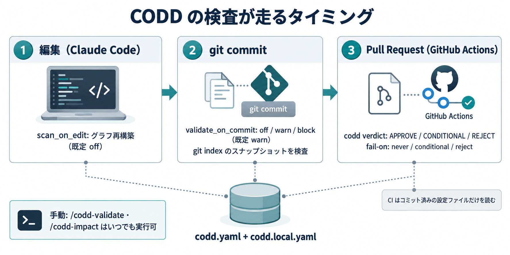
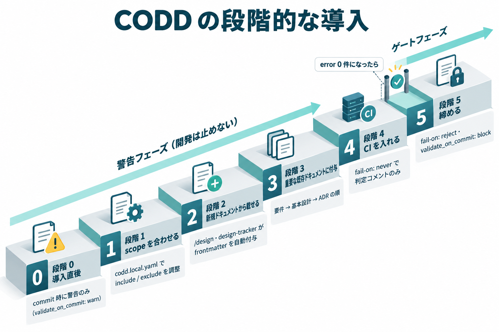

---
codd:
  node_id: "design:codd-guide"
  kind: design
  status: active
  depends_on:
    - id: "design:codd-coherence-layer"
      relation: references
  owner: ai-orchestra
---

# CODD 利用者ガイド

**更新日**: 2026-10-02
導入先プロジェクトで `packages/codd`（ドキュメント整合性レイヤー）を運用するための利用者向けガイド。記法は `codd-frontmatter-policy` ルール、内部実装は [整合性レイヤー設計](../design/codd-coherence-layer.md) を参照する。

---

## 1. これは何か

各ドキュメント先頭の `codd:` frontmatter で依存関係を宣言し、依存グラフを使って次の 3 つを行う。

| 機能       | コマンド / スキル                      | 内容                                                                            |
| ---------- | -------------------------------------- | ------------------------------------------------------------------------------- |
| グラフ構築 | `/codd-scan`                           | scope 内のドキュメントから `.claude/codd/graph.jsonl` を作る                    |
| 整合性検証 | `/codd-validate`                       | リンク切れ・重複・循環・語彙違い（error）、欠落・孤立・drift（warning）を検出   |
| 影響分析   | `/codd-impact`（`codd impact --diff`） | 変更したノードの下流を Green（要追従）/ Amber（要確認）/ Gray（参考）に分類する |

CLI として直接呼ぶ場合は `orchex run codd codd -- <scan|validate|impact|verdict>` を使う。

codd は essential プリセットに含まれるため、`setup essential` の時点で次がすべて導入先に入る。導入先で手を入れるのは基本的に `.claude/config/codd/codd.local.yaml` だけである。

- 設定: `.claude/config/codd/codd.yaml`（SessionStart で同期される。直接編集しない）
- スキル: `codd-scan` / `codd-validate` / `codd-impact`
- ルール: `codd-frontmatter-policy`
- hook: 編集時の scan（既定は無効の opt-in）、commit 時の validate（既定で有効・warn）
- `.gitignore`: `.claude/codd/`（グラフの出力先）

---

## 2. 検査が走るタイミング（図解）



| タイミング   | 仕組み                                          | 設定キー（既定値）                   | 検査対象                                              |
| ------------ | ----------------------------------------------- | ------------------------------------ | ----------------------------------------------------- |
| ファイル編集 | PostToolUse hook（`codd-scan-postedit.py`）     | `hooks.scan_on_edit`（`false`）      | working tree                                          |
| `git commit` | PreToolUse hook（`codd-validate-precommit.py`） | `hooks.validate_on_commit`（`warn`） | **git index のスナップショット**                      |
| PR           | GitHub Actions（`packages/codd/action`）        | action の `fail-on` 入力（`reject`） | validate は scope 全体、impact は merge-base との差分 |
| 手動         | `/codd-validate`・`/codd-impact`                | —                                    | working tree                                          |

- commit 時の検査は、hook 実行時点の git index を検証する（`-a` / `--all` は候補の index を再現して検証する）。未追跡ファイル（`.claude/Plans.md` 等）は対象にならない
- PreToolUse hook はコマンド実行前に動くため、`git add ... && git commit` のような複合コマンドでは同じコマンド内の `git add` は反映されない（注記が表示される）
- 手動実行は working tree を見るため、未追跡の Plans.md も対象になる。手動と commit / CI で結果がずれる原因になる（4 節）

---

## 3. 段階的な導入（推奨）



frontmatter の欠落は warning なので、それだけでは block モードでも commit は止まらない。止まるのは validate error（リンク切れ・重複・循環・語彙違い）があるときで、frontmatter を付け始めると書き間違いで error が出やすい。警告から始め、error を 0 件にしてから締める。

| 段階 | やること                                                                                              | 終わりの目安                        |
| ---- | ----------------------------------------------------------------------------------------------------- | ----------------------------------- |
| 0    | 導入直後。commit 時に validate が走り、error があれば警告を表示する（warning のみなら何も表示しない） | —                                   |
| 1    | `codd.local.yaml` で scope を導入先の構成に合わせる（4 節）                                           | 対象外のファイルが warning に出ない |
| 2    | 新しいドキュメントから載せる。`/design`・`design-tracker`・`task-state` は frontmatter を自動で付ける | 新規の設計書・ADR が graph に載る   |
| 3    | 重要な既存ドキュメント（要件 → 基本設計 → ADR の順）に手で frontmatter を付ける                       | 主要な依存が graph でつながる       |
| 4    | CI に action を入れる。最初は `fail-on: never` で判定コメントだけ出す（6 節）                         | PR に判定が付く                     |
| 5    | `fail-on: reject` と `validate_on_commit: block` に上げる                                             | `/codd-validate` の error が 0 件   |

- warning（`missing_frontmatter` / `orphan` / `drift`）は CI の判定に影響しない。frontmatter の無い既存ドキュメントが残っていても PR はブロックされないため、段階 2〜3 は並行して少しずつ進めてよい
- 既存ドキュメントへの一括付与（バックフィル）の手順は未確定（設計書 §8）。現時点では手作業で付ける

---

## 4. 設定（`codd.local.yaml`）

### マージの規則

`codd.local.yaml` は `codd.yaml` に再帰マージされる（`packages/codd/lib/codd_common.py` の `deep_merge`）。

- **dict は再帰的にマージ**される（`hooks:` や `checks:` は書いたキーだけ上書きされる）
- **リストは丸ごと置き換わる**（`scope.include` を書くと既定の include は全部消える。既定に足したい項目も含めて全部書く）

### 既定 scope の注意点

既定の `scope.include` は ai-orchestra 自身に合わせてある。

| 既定の include           | 導入先での扱い                                                                                                                            |
| ------------------------ | ----------------------------------------------------------------------------------------------------------------------------------------- |
| `docs/**/*.md`           | frontmatter の無い既存ドキュメントはすべて `missing_frontmatter` warning になる                                                           |
| `.claude/rules/*.md`     | orchex が同期する配布ルールには frontmatter が無く、すべて `missing_frontmatter` warning になる。導入先では編集できないので外すことを推奨 |
| `.claude/Plans.md`       | `.gitignore` 対象。手動実行では対象、commit / CI では対象外となり結果がずれる。外すことを推奨                                             |
| `templates/context/*.md` | ai-orchestra 固有。導入先には通常存在しないので外してよい                                                                                 |

### 設定例（最小構成）

```yaml
# .claude/config/codd/codd.local.yaml
scope:
  # リストは置き換えになるため、残したい既定値も含めて全部書く
  include:
    - "docs/**/*.md"
  exclude:
    - "docs/adr/_template.md"
    - "docs/adr/DECISIONS.md"
hooks:
  validate_on_commit: warn # error が 0 件になったら block に上げる
```

### コードとの紐付け（任意）

`code_scope.include`（既定は空）にソースの glob を足すと、ファイル先頭の 1 行注釈（`codd:implements design:...`）から code / test ノードを作れる。ドキュメント側のグラフが固まってから、一部のディレクトリだけ有効にする。記法は設計書 §4.3.1 を参照。

---

## 5. 日々の使い方

| 場面                         | やること                                                                     |
| ---------------------------- | ---------------------------------------------------------------------------- |
| 要件・設計を変える前         | `/codd-impact`（`codd impact --diff main`）で下流の影響を確認する            |
| ドキュメントを書いた・直した | `/codd-validate` で error が出ていないか確認する                             |
| commit 時に警告が出た        | error は直す。warning は内容を見て、必要なら下流ドキュメントを追従させる     |
| PR に `CONDITIONAL` が付いた | Green / Amber の未追従ノードを確認し、追従するか、追従不要の理由を PR に書く |
| PR に `REJECT` が付いた      | validate error（リンク切れ・重複・循環・語彙違い）を直す                     |

PR の判定の意味:

| 判定          | 条件                                                                        |
| ------------- | --------------------------------------------------------------------------- |
| `REJECT`      | validate error が 1 件以上                                                  |
| `CONDITIONAL` | error は 0 件だが、Green / Amber の影響先が未追従、または上流ノードが消えた |
| `APPROVE`     | 上記以外（warning と Gray は参考表示のみ）                                  |

---

## 6. CI の導入

workflow の例と入力一覧は [設計 §4.8.2](../design/codd-coherence-layer.md#482-ci-ガードレールissue-97) を参照する。導入時に押さえる点は次のとおり。

- `actions/checkout` に `fetch-depth: 0`（merge-base の算出に必要）と `persist-credentials: false` を指定する
- private リポジトリでは、読み取り権限のある `github-token` を action に渡す
- **CI が読むのは runner 上にある設定ファイル（通常の checkout ならコミット済みのもの）**
  - action は `config` 入力（既定 `.claude/config/codd/codd.yaml`）を読み、同じディレクトリの `<stem>.local<suffix>`（既定パスなら `codd.local.yaml`）をマージする
  - `codd.yaml` がリポジトリに無いと、action 同梱の既定設定にフォールバックする。このとき導入先の `codd.local.yaml` は読まれない
  - 手元と CI で同じ設定を使うには、`.claude/config/codd/codd.yaml` と `codd.local.yaml` の両方をコミットする

---

## 7. よくあるつまずき

| 症状                                                | 原因と対処                                                                                                                              |
| --------------------------------------------------- | --------------------------------------------------------------------------------------------------------------------------------------- |
| warning が大量に出る                                | frontmatter の無い既存ドキュメントや配布ルール。scope を絞るか、段階 3 で少しずつ付ける                                                 |
| `scope.include` を足したら既定の対象が消えた        | リストは置き換えになる（4 節）。既定値も含めて全部書く                                                                                  |
| 手動の `/codd-validate` と commit / CI で結果が違う | 未追跡の `.claude/Plans.md` が手動実行だけで対象になっている。scope から外す                                                            |
| CI で local の設定が効かない                        | `codd.yaml` / `codd.local.yaml` がコミットされていない（6 節）                                                                          |
| CI が「全履歴が必要」で失敗する                     | `actions/checkout` に `fetch-depth: 0` を指定する                                                                                       |
| hook 自体を止めたい                                 | 実動作だけ止めるなら `hooks.scan_on_edit: false` と `hooks.validate_on_commit: off`。登録ごと外すなら `orchex disable codd --project .` |

---

## 8. さらに詳しく

- 記法: `.claude/rules/codd-frontmatter-policy.md`
- 設計: [整合性レイヤー設計](../design/codd-coherence-layer.md)（配布モデル §4.8、hook §4.8.1、CI §4.8.2）
- 設定キー一覧: [パッケージリファレンス](../reference/packages.md#codd)
