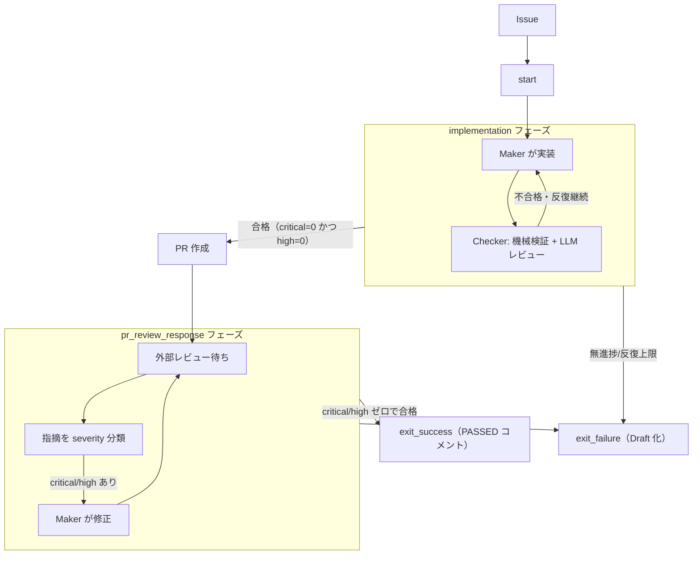
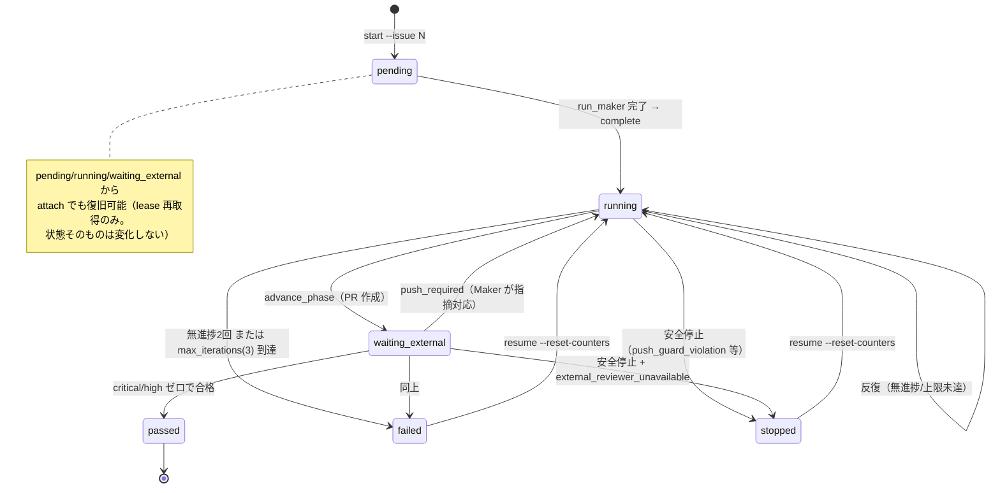
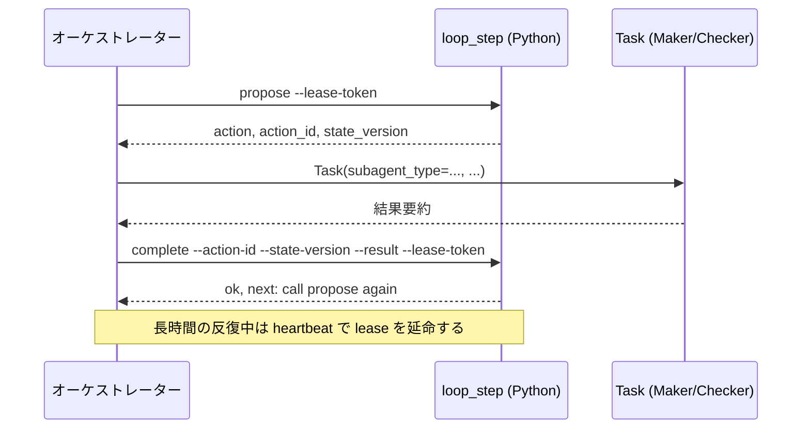
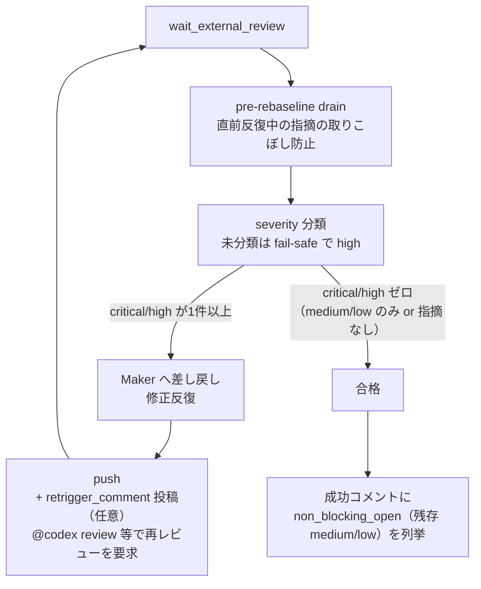
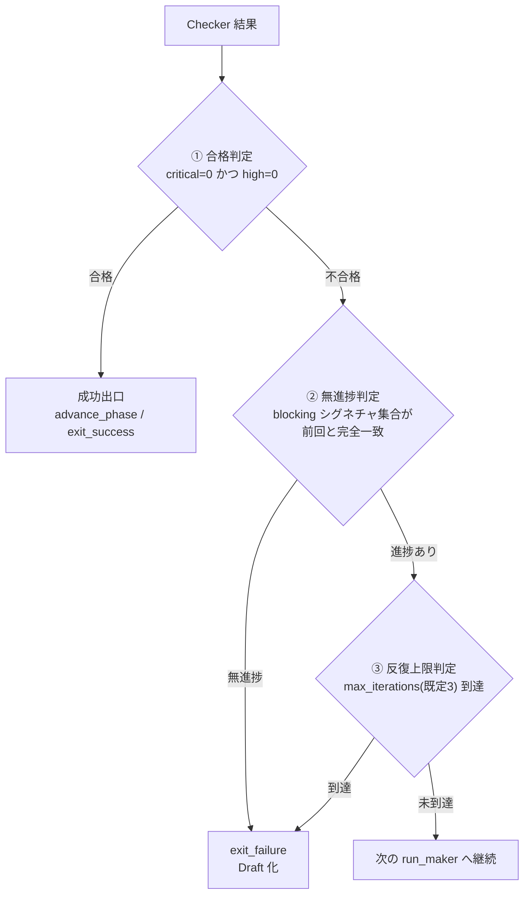

---
codd:
  node_id: "design:loop-harness-guide"
  kind: design
  status: active
  depends_on:
    - id: "design:loop-harness"
      relation: references
    - id: "design:loop-harness-core"
      relation: references
    - id: "design:loop-harness-cli"
      relation: references
    - id: "design:loop-harness-pr-review"
      relation: references
  owner: ai-orchestra
---

# loop-harness 利用者ガイド

**更新日**: 2026-07-15
`/loop-issue` スキル（LP-1）で GitHub Issue を自動消化するための利用者向けガイド。内部実装の詳細は設計書を参照する。

---

## 1. これは何か

`loop-harness` は、GitHub Issue 番号を渡すと、実装 → 機械チェック（テスト/lint）→ LLM レビュー → 修正反復 → PR 作成 → 外部 bot レビュー対応までを自動で回す仕組みである。

- 実装するのは Maker（agent-routing で選定されたサブエージェント）
- 合否を判定するのは Checker（機械検証 + LLM レビューの二層。Critical/High がゼロになるまで反復）
- PR 作成後は外部レビュー bot（Codex 等）の指摘を検知し、Critical/High があれば Maker が対応し再レビューを待つ
- **人間の関与はマージ判断のみ**。ループ自身は auto-merge を行わない

このガイドで扱うのは LP-1（`/loop-issue` スキル、セッション内伴走型）。常駐無人運用の LP-2 は 6 節で触れる制約付きの experimental 機能であり、通常はこのガイドの対象外。

---

## 2. ループの仕組み（図解）

### ① 全体フロー


<details>
<summary>Mermaid ソース（正確なフロー定義）</summary>



</details>

`implementation` フェーズは機械検証（`pytest`/`ruff` 等）と LLM レビュー（`code-reviewer` + パスパターンで追加選定、最大 2 名）の両方が Critical=0・High=0 になるまで、Maker と Checker を交互に反復する。合格すると PR を作成し `pr_review_response` フェーズへ進む。

### ② 状態機械


<details>
<summary>Mermaid ソース（正確な遷移定義）</summary>



</details>

`status` は `pending`（初回 Maker 未実行）/ `running`（反復中）/ `waiting_external`（外部レビュー待ち）/ `passed`（合格）/ `failed`（ガード到達）/ `stopped`（安全停止）の 6 種類。`attach` はクラッシュ・セッション断絶後に別の呼び出し元が lease を再取得して続行する経路（`pending` も対象。以前は `running`/`waiting_external` のみだったが復旧範囲が広がった）、`resume --reset-counters` は `failed`/`stopped` から人間判断でガードカウンタをリセットして再挑戦する経路。両者は対象状態が排他的で混同しない。

### ③ two-phase プロトコル


<details>
<summary>Mermaid ソース（正確なシーケンス定義）</summary>



</details>

`loop_step` は「次に何をすべきか」を決定するだけで、実行そのもの（Task 起動）は常にオーケストレーター側が行う分業になっている。これにより agent-routing / audit 等の既存 hook 基盤をそのまま素通りできる。

### ④ PR レビュー反復


<details>
<summary>Mermaid ソース（正確なフロー定義）</summary>



</details>

外部レビューの合格基準は「unresolved な Critical/High がゼロ」であること。Low/Medium は非ブロッキングであり、対応しなくても合格を妨げない（残存分は成功コメントに一覧として残る）。無進捗判定も Critical/High（blocking）のシグネチャ集合が前回反復と完全一致した場合のみ発生する。

### ⑤ 停止判定



この 3 段階評価とは別に、push 直前のブランチ検証・repo-identity 照合、または他ホストの生存 lease 検知に違反した場合は `exit_failure` ではなく **安全停止（`stopped`）** に遷移する。安全停止ではリポジトリへの書き込み（push/PR 作成・更新）を一切行わず、人間への引き継ぎに徹する。外部レビュアーが利用不可（CodeRabbit のレートリミット等で代替経路も無い場合）と判定されたときも同様に安全停止する。

---

## 3. 前提セットアップ

```bash
orchex install loop-harness --project /path/to/project
```

`loop-harness` は `audit` / `quality-gates` / `git-workflow` / `agent-routing` に依存する（未導入なら合わせて導入される）。

**`pr_review.reviewer_allowlist` の設定は必須**。未設定（またはキー自体が無い、空リスト）の場合、`wait_external_review` の直前で fail-closed に停止する。導入プロジェクトの `.claude/config/loop-harness/loop-harness.local.yaml` に、実際に使う外部レビュー bot を明記する。

```yaml
# .claude/config/loop-harness/loop-harness.local.yaml
pr_review:
  reviewer_allowlist:
    - app_slug: "chatgpt-codex-connector" # GitHub App slug（判明していれば最優先）
      login: "chatgpt-codex-connector[bot]" # フォールバック照合用
      type: "Bot"
      author_association: ["NONE"]
  checkrun_allowlist: [] # 任意。check-run 経由のフォールバック検知を使う場合のみ
  retrigger_comment: "@codex review" # 任意（Issue #274）。GitHub Codex 連携のように push 後に自動で
  # 再レビューしないボットを使う場合、無人運用ではこれを設定しないと再レビューが永久に走らない
```

あわせて、対象リポジトリに外部レビュー bot（Codex の GitHub 連携等）が実際に設定済みであることを確認する。bot が動いていない状態で `/loop-issue` を実行すると、`pr_review_response` フェーズが `pr_review.timeout_seconds`（既定 3600 秒）待った末に無進捗として扱われる。

`pr_review.retrigger_comment` は既定で無効（未設定）。GitHub Codex のように push だけでは自動的に再レビューしないボットを外部レビュアーに使う場合、無人運用（`/loop-issue` を人が張り付かずに回す運用）ではこのキーを設定しないと、Maker が修正 push した後も再レビューが要求されず `pr_review.timeout_seconds` まで無進捗のまま止まってしまう。投稿アカウントを `reviewer_allowlist` に含めないこと（含めた場合も本文一致で除外される）。

---

## 4. 使い方

```text
/loop-issue 42                         # 新規 Issue を開始
/loop-issue --attach <loop_id>         # クラッシュ・セッション断絶後に再接続
/loop-issue --resume <loop_id>         # failed / stopped から人間判断で再挑戦
```

起動後は 2 節の図解どおり、実装 → 機械検証 + LLM レビュー → PR 作成 → 外部レビュー対応まで自動で進行する。進行中、オーケストレーターは Maker/Checker の生出力をメインコンテキストへ転載せず、要約と state/journal 参照だけをやり取りする。

**人間の関与ポイントは PR のマージ判断のみ**。ループは auto-merge を付与しないため、`exit_success`（PASSED コメント）到達後に人間が内容を確認してマージする。Critical/High の指摘は無人反復の中で必ず対応必須（見送り不可）として扱われるため、これらを人間が代わりに見送る運用は設計上想定されていない。

---

## 5. 止まったときの復旧

現在の状態は `loop_status.py` で確認できる。

```bash
python3 packages/loop-harness/scripts/loop_status.py list [--status <phase>] [--json]
python3 packages/loop-harness/scripts/loop_status.py show --loop-id <id> [--journal-lines N] [--full-journal]
```

| 状況 | 復旧方法 |
| --- | --- |
| セッションがクラッシュ・断絶した（`pending`/`running`/`waiting_external` のまま） | `/loop-issue --attach <loop_id>`。`pending` の段階での断絶でも復旧できる |
| ガード到達で正規に `failed`／安全停止で `stopped` になった | 原因を確認・解消したうえで `/loop-issue --resume <loop_id>`（ガードカウンタをリセットして再挑戦） |
| 完了済みループの整理 | `python3 packages/loop-harness/scripts/loop_status.py purge [--force] [--dry-run] [--yes]`。`running`/`waiting_external` は常に保護され、既定では `passed`/`failed` かつ 30 日経過分のみが対象 |
| LP-2 Docker 実行で `ClaudeCredentialError`（`remaining=…s < required=…s`）が出てブローカーが起動しない | トークンの残り有効期間が `lp2.wall_clock_timeout_seconds + 360` 秒未満（既定 7200 秒なら 7560 秒必要）。再ログイン（`claude` → `/login`）またはトークン失効後の再発行で TTL を更新するか、`lp2.wall_clock_timeout_seconds` を local yaml（`lp2:` 配下）で一時的に短縮する（後で戻す）。詳細は本節末尾のサブセクション参照 |
| LP-2 常駐 scheduler の stderr に `docker daemon unavailable; skipping worker spawn/respawn` が出て worker が起動しない | Docker daemon（OrbStack）を起動する。scheduler は daemon 復帰後のポーリングで自動的に spawn を再開する（loop の state は変わらない）。ログイン直後に常発するなら OrbStack の「Start at login」を有効にする |

`exit_failure` で終了した場合、Draft 化された PR と失敗理由を記載した Issue コメントがそのまま残る。内容を確認したうえで手動対応するか、原因を解消してから `resume` する。

### LP-2 Docker 実行時に Claude OAuth トークンの残り時間（TTL）不足で起動しない

LP-2（Docker 完全隔離）は Maker/Checker コンテナに Claude OAuth アクセストークンを注入して実行するが、コンテナ内では**トークンの自動更新（refresh）を行わない**。そのためブローカー起動時に、ループの残り実行時間を安全に賄えるだけの TTL が残っているかを事前チェックしている（`packages/docker-runtime/lib/docker_runtime_credentials.py` の `ClaudeOAuthCredential.assert_minimum_ttl`）。TTL 不足の場合はコンテナを起動せず、以下のエラーで即座に失敗する。

```text
Claude OAuth access token expires too soon for a refresh-less broker run
(remaining=…s < required=…s). Run a normal Claude command to refresh the
token, then retry.
```

このチェックは Maker/Checker（LLM レビューを伴う）実行時のみ働く。機械検証のみの Checker 実行（`start_isolated_network`）はブローカー自体を起動しないため対象外（`packages/loop-harness/lib/loop_docker_broker.py` :224-231）。

必要 TTL は `minimum_ttl_seconds = max_lifetime_seconds + 300`（`TOKEN_TTL_MARGIN_SECONDS`）で、`max_lifetime_seconds = ceil(残り wall-clock 秒) + 60`（`CONTAINER_LIFETIME_MARGIN_SECONDS`、`loop_docker_action.py`）。ループ開始直後（残り = `lp2.wall_clock_timeout_seconds`）で計算すると、既定値 7200 秒のとき **必要 TTL は 7560 秒（2 時間 6 分）** になる。

`lp2.wall_clock_timeout_seconds` の既定値は `packages/loop-harness/config/loop-harness.yaml:16` の `7200`。プロジェクト側で上書きする場合は `<project>/.claude/config/loop-harness/loop-harness.local.yaml` に置くが、この設定はディープマージされるため **`lp2:` の下にネストしないとトップレベルのキーは黙って無視され、既定値 7200 のまま**になる点に注意する。

**残り TTL の確認方法**（トークン本体は出力しない）:

```bash
python3 - <<'EOF'
import json, subprocess, time
raw = subprocess.run(["/usr/bin/security","find-generic-password","-s","Claude Code-credentials","-w"], capture_output=True, text=True, check=True).stdout
exp = json.loads(raw)["claudeAiOauth"]["expiresAt"]
exp = exp / 1000 if exp > 10_000_000_000 else exp
print(int(exp - time.time()), "seconds remaining")
EOF
```

**実測に基づく既知の挙動**（保証ではなく観測結果。実行前に上記コマンドで自分の環境で確認すること）: アクセストークンの有効期間はおおむね 8 時間程度で発行される。トークンがまだ失効していない間は、`claude -p` を含む通常の Claude Code コマンドを実行しても TTL は更新されない（ある計測では `claude -p` 実行後も残り TTL が変化しなかった）。そのため、エラーメッセージにある「通常の Claude コマンドを実行してトークンを更新する」という案内は、失効前の状態には当てはまらない。実際に新しいトークンを得られたのは、(a) 再ログイン（`claude` を起動して `/login`）した場合、または (b) トークンが一度失効してから何らかの Claude コマンドを実行した場合だった。

**残り TTL が不足しているときの対処**:

1. 上記 (a)/(b) のいずれかの方法で新しいトークンを取得し、残り TTL を確認してから再実行する。
2. 一時的に `lp2.wall_clock_timeout_seconds` を local yaml（`lp2:` の下）で短くする（例: 5400 秒）。ただし Maker/Checker に割り当てられる wall-clock 予算そのものが縮むトレードオフがあるため、TTL が回復したら元の値に戻す。

```yaml
# .claude/config/loop-harness/loop-harness.local.yaml
lp2:
  wall_clock_timeout_seconds: 5400 # 一時的な短縮。TTL 回復後に戻すこと
```

---

## 6. 既知の制約

- **LLM レビューは非決定的**。判定が割れるケースは常に安全側（High）に倒す fail-safe 設計になっている
- **外部 bot の応答性・レートリミットに依存**する。bot が利用不可と判定されると `external_reviewer_unavailable` として安全停止し、人間に引き継がれる
- **LP-2（常駐無人運用）は experimental**。Maker/Checker のプロセス隔離が完全ではなく（Issue #211 で対応予定）、push 多層防御は同一 OS ユーザー内の完全性までは保証しない。信頼できるリポジトリでのみ、自己責任で使用すること

---

## 7. さらに詳しく

- [`docs/design/loop-harness.md`](../design/loop-harness.md) — 基本設計（全体アーキテクチャ・ループ定義スキーマ）
- [`docs/design/loop-harness-core.md`](../design/loop-harness-core.md) — 状態機械・ロック等コア詳細設計
- [`docs/design/loop-harness-cli.md`](../design/loop-harness-cli.md) — CLI（`loop_step`/`loop_driver`/`loop_scheduler`/`loop_status`）契約
- [`docs/design/loop-harness-pr-review.md`](../design/loop-harness-pr-review.md) — PR レビュー対応 / `/loop-issue` スキル詳細設計
- [`docs/evaluation/loop-harness.md`](../evaluation/loop-harness.md) — 評価セット
- [`packages/loop-harness/README.md`](../../packages/loop-harness/README.md) — パッケージ構成・config キー一覧
