---
codd:
  node_id: "design:meta-harness-guide"
  kind: design
  status: active
  depends_on:
    - id: "design:meta-harness"
      relation: references
    - id: "design:meta-harness-detailed"
      relation: references
    - id: "design:meta-harness-proposer-routing-unlock"
      relation: references
  owner: ai-orchestra
---

# meta-harness 利用者ガイド

**更新日**: 2026-07-22
`orchex meta` サブコマンド群でハーネス構成（facet / config）を計測・評価・提案・昇格するための
利用者向けガイド。内部実装の詳細は設計書（`design:meta-harness` / `design:meta-harness-detailed`）を参照する。

> 各図は生成画像を主表示とし、正確なフロー定義は `<details>` 内の Mermaid ソースを正とする。

---

## 1. これは何か

`meta-harness` は、**ハーネス構成そのもの**（指示書・ポリシー・facet 合成・ルーティング config）を
候補（candidate）として登録し、隔離環境でシナリオ評価して「品質 vs コスト」の Pareto frontier を
求め、勝った候補を PR 経由で本流へ昇格する仕組みである。arXiv:2603.28052 の population ベース
harness 最適化を、この repo の宣言的 facet/config 面に制約して実装している。

- 候補は **宣言的オーバーレイ**（baseline との差分パッチ）として保存される。任意コードは扱わない。
- 評価は **一時 worktree + Docker コンテナ隔離**で実行され、実 HOME・store・他 worktree を汚染しない。
- 実ファイルへの書き込み経路は **`promote`（PR 経由）のみ**。探索ループは実ファイルを直接編集しない。
- **人間の関与は promotion のマージ判断のみ**。ループ自身は auto-merge を行わない。

段階導入は 3 フェーズ:

| フェーズ | 内容 | 主なサブコマンド |
| --- | --- | --- |
| Phase 1（計測基盤） | 候補登録・評価・frontier 算出 | `init` / `register` / `evaluate` / `frontier` / `status` / `purge` |
| Phase 2（提案と昇格） | proposer 起動・PR 昇格 | `propose` / `promote` |
| Phase 3（自動探索） | ガード付き自動ループ | `loop` |

---

## 2. 全体像（図解）

### ① アーキテクチャ俯瞰

store・evaluator・proposer・promoter・loop と、評価を隔離する Docker + credential broker の関係。

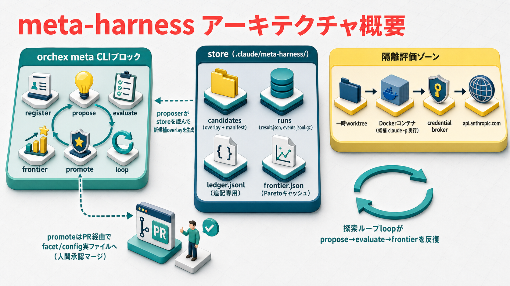

<details>
<summary>Mermaid ソース（正確な関係定義）</summary>

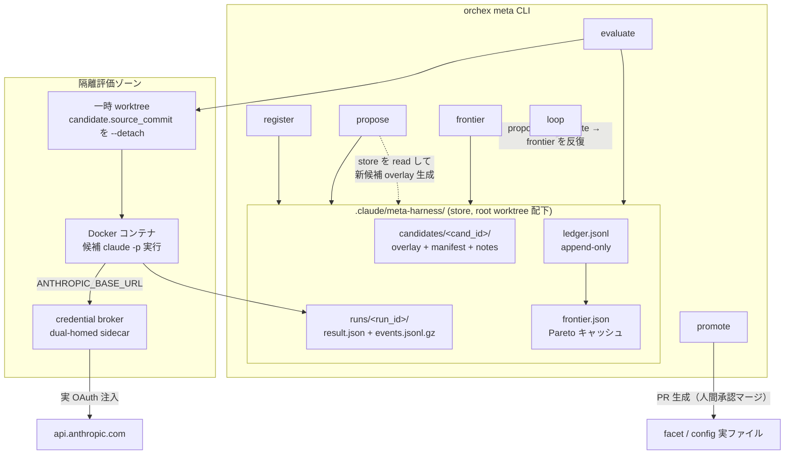

</details>

### ② サブコマンドとフェーズの対応

利用者の入口。9 サブコマンドがどのフェーズに属し、何を入出力するか。

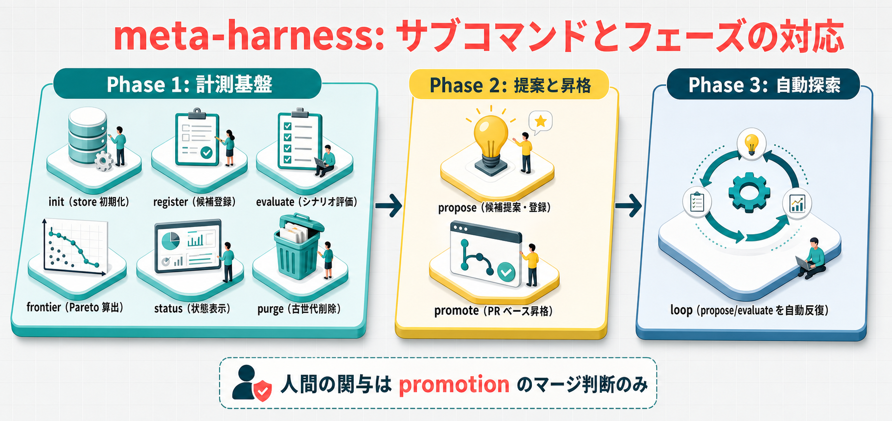

<details>
<summary>Mermaid ソース</summary>

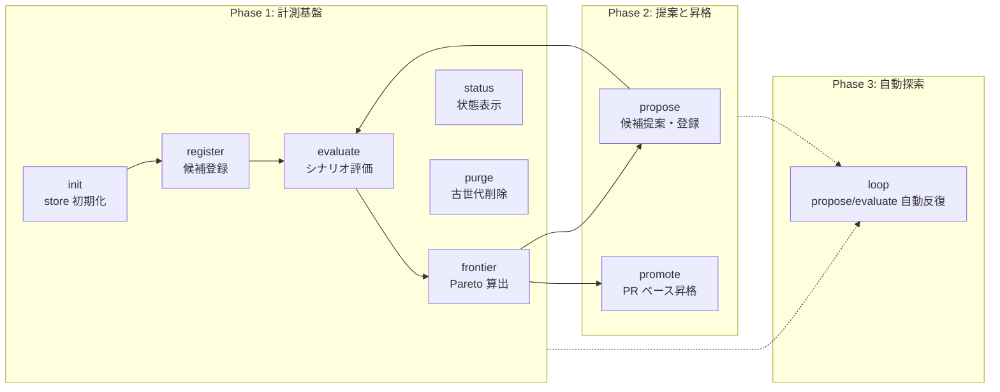

</details>

---

## 3. 候補ライフサイクル

候補の状態は ledger のイベント畳み込みからのみ導出され、`candidate → evaluated → promoted / retired`
の一方向に遷移する。候補・実行結果は immutable で、改訂は新しい `cand_id`（`parent_id` で系譜保持）
として登録する。

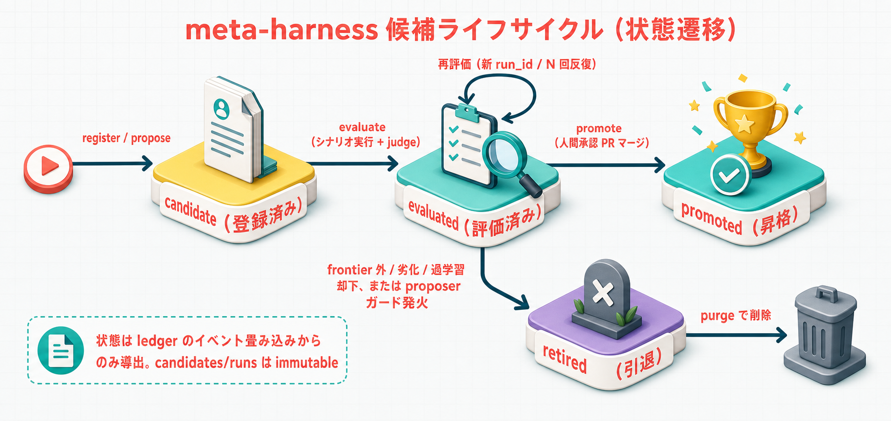

<details>
<summary>Mermaid ソース</summary>

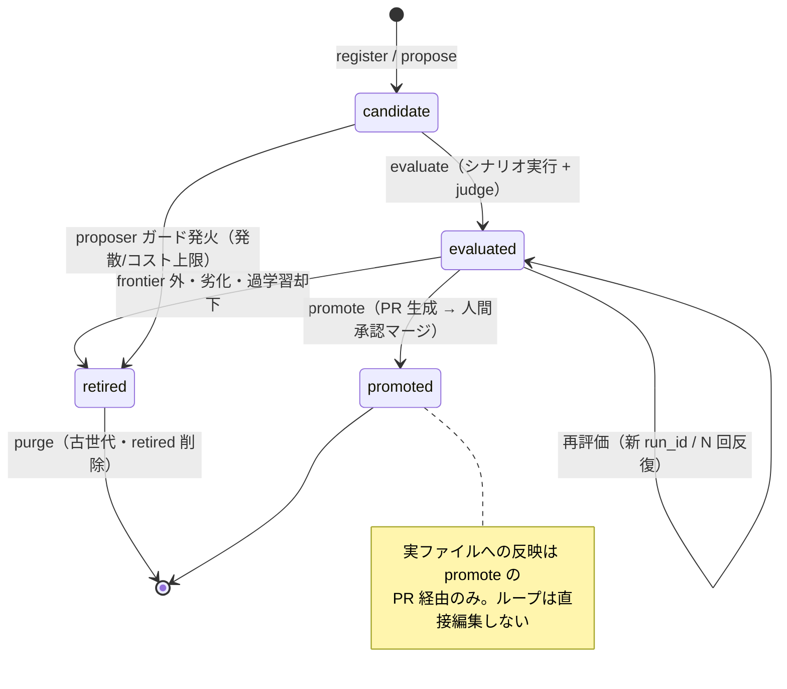

</details>

---

## 4. 評価フロー（evaluate）

`orchex meta evaluate` の 1 実行。worktree 確保 → Docker 隔離実行 → self-report → rubric judge →
反復集計 → Pareto 判定 → ledger 記録。evaluator とシナリオは候補 overlay の適用範囲外に固定され、
hash を run metadata に記録・照合して reward hacking を防ぐ。

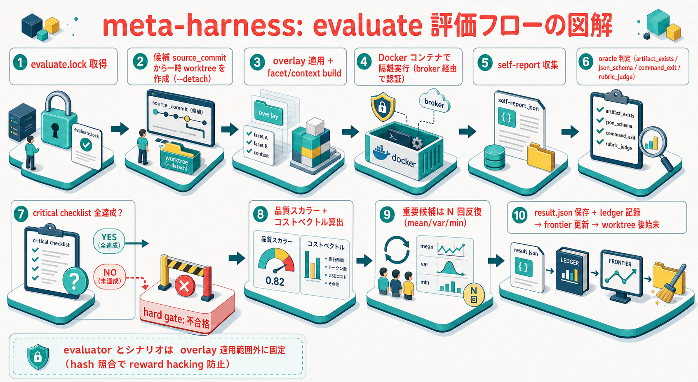

<details>
<summary>Mermaid ソース</summary>

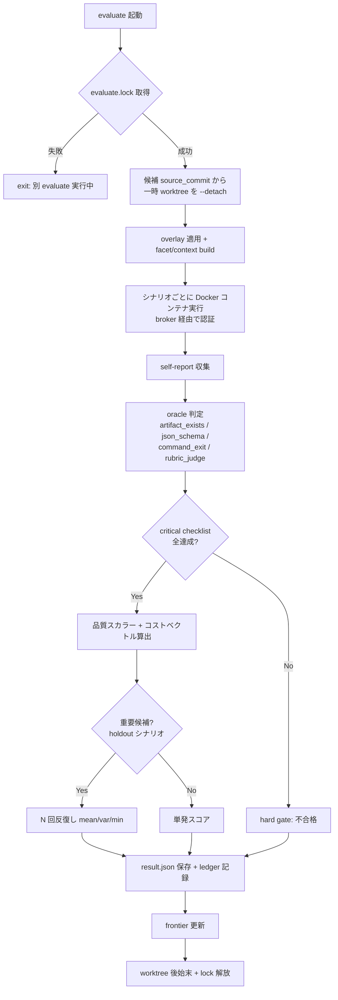

</details>

---

## 5. 隔離実行と credential broker

Phase 3 の自動評価では、候補の hooks / skills が評価対象として意図的に実行される。実 HOME や
資格情報の汚染を防ぐため、候補コンテナ内には**資格情報を一切置かず**、コンテナ外の broker だけが
実 OAuth を保持して `api.anthropic.com` へ転送する（ADR-20260712-035）。


<details>
<summary>Mermaid ソース（シーケンス）</summary>

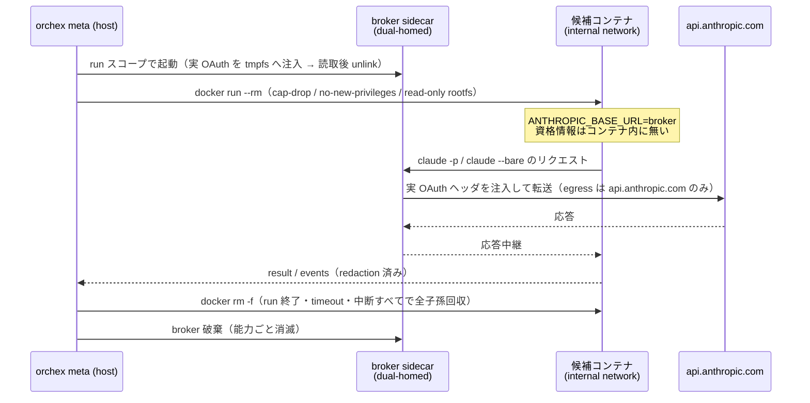

</details>

> **fail-closed**: Docker daemon 不在・イメージ pin 不一致・broker 起動失敗は、非隔離実行へ
> 降格せず **run error** とする（ADR-033 の「名前を設定しただけでは利用可能扱いにしない」を踏襲）。

---

## 6. 探索ループ（loop, Phase 3）

`orchex meta loop` は propose → evaluate → frontier 更新を自動反復する。3 ガード
（発散 / 過学習 / コスト上限）と反復上限で停止し、**promotion は含まない**（昇格は人間が別途 `promote`）。

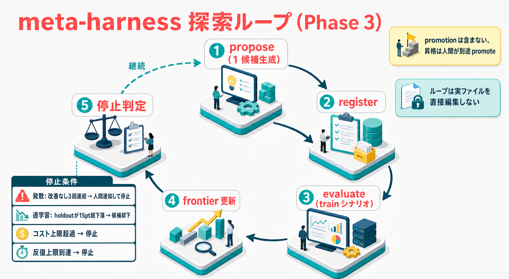

<details>
<summary>Mermaid ソース</summary>

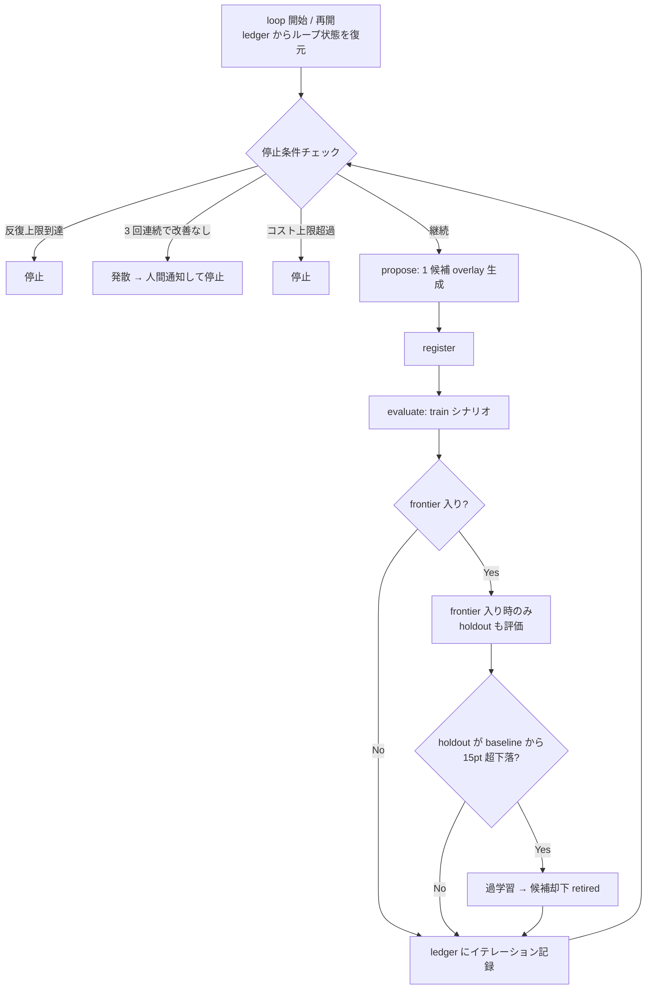

</details>

`routing-config` を対象にする場合、proposer が patch できるキーは per-key の `created_by`
allowlist で制限される（`agents.*.tool` / `antigravity.model` は proposer 可、`codex.model` は
human 限定。ADR-041 → 042、`design:meta-harness-proposer-routing-unlock` 参照）。

---

## 7. 使い方（コマンド早見表）

> config（モデル・sandbox・budget 等）は `packages/meta-harness/config/meta-harness.yaml` と
> `.local` 上書きで解決する（`config-loading.md`）。プレースホルダは config 値で置換する。

```bash
# Phase 1: 計測基盤
orchex meta init                                          # store 一式を初期化
orchex meta register --overlay <dir> --target claude-harness  # 候補を登録（--overlay/--target 必須）
orchex meta evaluate --candidate <cand_id>                # 候補をシナリオ評価（--candidate 必須, Docker 隔離）
orchex meta frontier                                     # Pareto frontier レポート（--target 省略時は既定）
orchex meta status                                       # population / frontier の状態表示
orchex meta purge --keep-generations N                   # 古い世代・retired 候補を削除

# Phase 2: 提案と昇格
orchex meta propose --target claude-harness              # 候補 overlay を提案・登録（--target 必須）
orchex meta promote <cand_id>                            # frontier 候補を PR ベースで昇格（cand_id は位置引数）

# Phase 3: 自動探索
orchex meta loop                                         # propose/evaluate の自動反復（--resume <loop_id> で再開）
```

target の指定（own / skill / routing-config）や各サブコマンドの全フラグは
`orchex meta <sub> --help` と `design:meta-harness-detailed` §6（CLI 仕様）を参照する。

---

## 8. 関連ドキュメント

| ドキュメント | 内容 |
| --- | --- |
| `design:meta-harness` | 基本設計（概要・ストア・evaluator・proposer・promotion・段階導入） |
| `design:meta-harness-detailed` | 詳細設計（schema §1 / evaluator §2 / スコアリング §3 / proposer §11 / promotion §12 / loop §13） |
| `design:meta-harness-proposer-routing-unlock` | routing-config を proposer に段階解放する reward hacking 対策 |
| `req:meta-harness` | 要件定義（FT / 非機能 / 受け入れ基準） |
| `docs/evaluation/meta-harness.md` | 評価セット（EV-NN 観点） |
| ADR-032 / 035 / 041 / 042 / 044 | 機構導入 / Docker 隔離 / routing 解放 / 予算 latch 中立化 |
